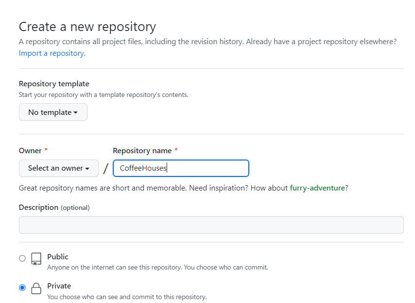
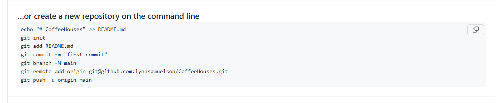
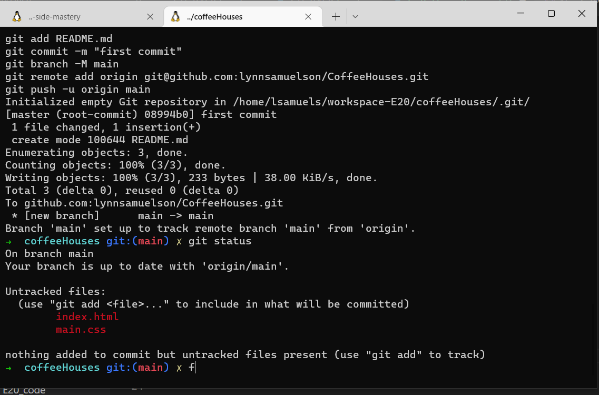
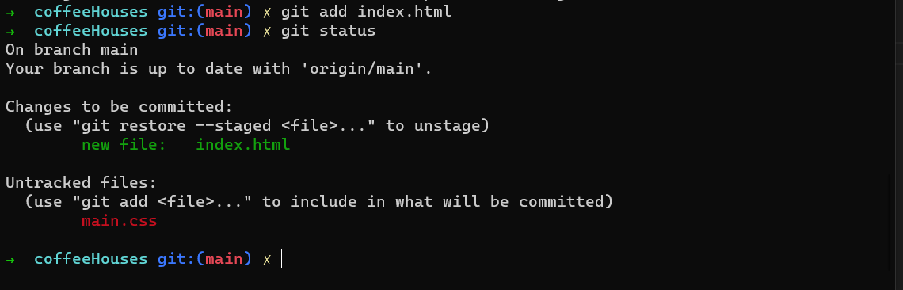
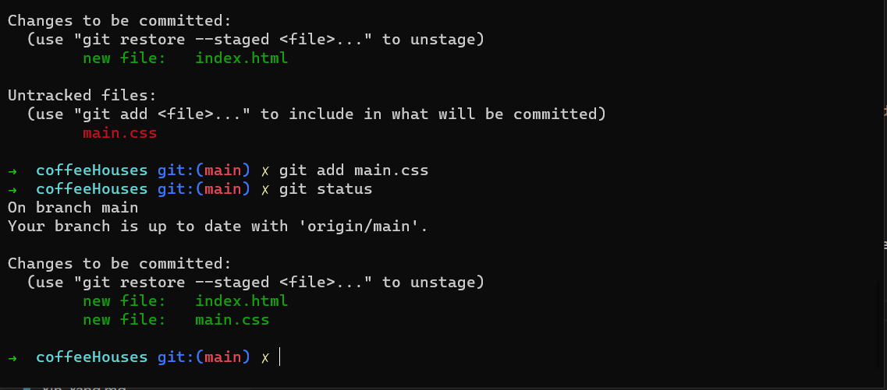
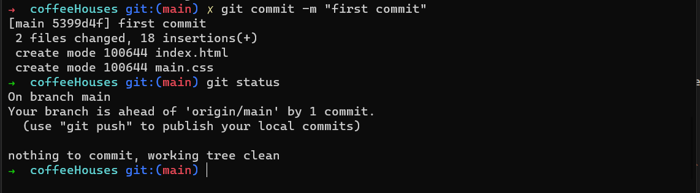

# Coffee House to Github

1. Create a git repository for your coffee house project on Github.
2. Add that git repository to your local project.
3. Upload the code in your local repositry to github.

## Create a git repositrory on Github
1. In Github, click to create a new repository and add a name.  No need to add anything else at this stage.

2. Click the Create Repository button at the bottom of the screen

## Add the Github Repository to local project

1. Copy the `...or create new repository on the command line` code 
2. Navigate to you project (CoffeeHouse) in your terminal
3. Paste this code into the terminal 

Notice your terminal now contains information about the git branch next to the directory name.  Do a git status
and see that the files in your directory are not currently tracked by Git

## Upload your code to Github

- Start tracking your index.html file in git by typing `git add index.html`
- Do a `git status` and confirm the file is staged

- Repeat the above step until all your files are staged.  Remember that you can do a `git status` at any stage to check the status

- commit your changes by typing `git commit -m "first commit"` followed by a `git status` to confrim your changes were committed.

Breakdown of `git commit -m "first commit"`:

- `git commit` is the command that tells git to save the changes as a new version
- `-m` indicates that what comes next is the message related to that commit
-`"first commit"` is the commit message.  This can be any string. "first commit" was used here as an example.

## Upload your code to Github

1. type `git push` in your terminal.
2. Navigate to the `Code` tab on your newly created Github Repo and note that the code is now there.

