# Making Changes To Coffee House

## Coffee House Changes

The steps we will be following are:

1. Create a new branch in your Coffee House project.
1. Make some changes to the code.
1. Commit the changes to the repository on your local computer.
1. Push changes to Github.
1. Merge changes into the main branch with a PR.
1. Update the main branch on your local computer.

## Create a new branch in your Coffee House project

1. In your terminal navigate to your coffee house project directory
1. Type the following command to make sure there are no changes pending.

   ```sh
   git status
   ```

1. Type the follow command replacing <newBranchName> with the name you would like to name your branch.

   ```sh
   `git checkout -b <newBranchName>`
   ```

   It should look like something like this:

   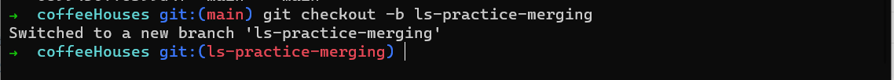

Note: Most teams have a specific way they name their branches referred to as a **_Naming Conventions_**. Some elements you may find in those names are:

- developers name/initials
- a number or alphanumeric related to the work requirements (User Story, Ticket #) from the team's project board.
- a short title for the work being completed.

We will talk more about what you should be naming your branches a little later on. For now, what ever you chose is groovy.

## Make some changes to your code

In this step, make any changes you like. It doesn't have to be a major change since we are practicing with Git and Github. Some suggestions: - Add/Remove a coffee house - change a border of color - add a background-color to you page or coffee house cards

Make sure you save the changes and preview them in the browser.

## Commit the changes to the repository on your local computer

- In your terminal, navigate to the coffee house directory
- Type `git status`. You should see the files you made changes to listed in red in your terminal.
  <br/>
  <br/>

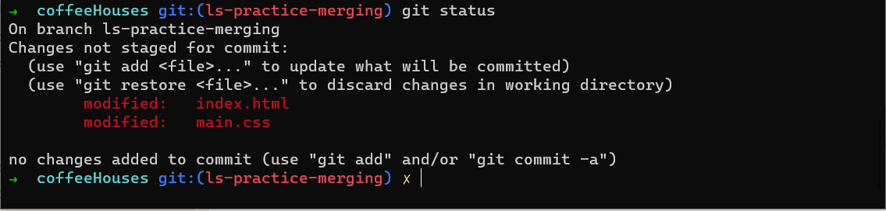
<br/>
<br/>

- Type `git add <file name>` where `<file name>` is the name of the file you want to add. Click enter. This stages your files for commit. **_They are NOT committed yet_**, just in a state of getting ready to be committed. Repeat for each file listed. Do a `git status` in between adding files and you will see that files added are green and those not are red. Only the files that have been staged (the green ones) will be part of the commit.
  <br/>
  <br/>

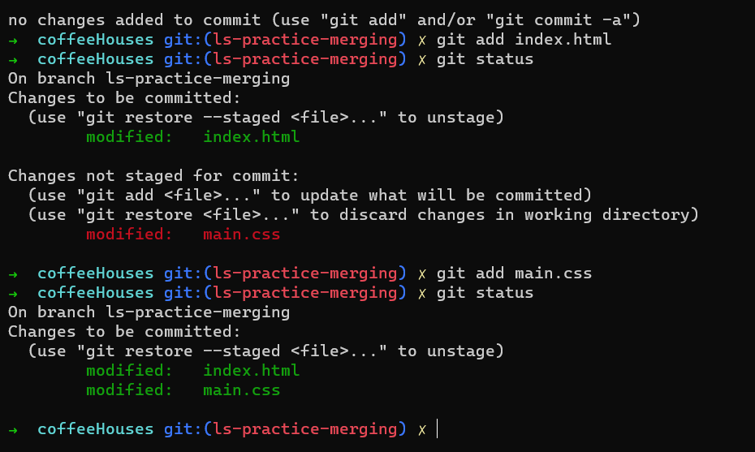

<br/>
<br/>

- Commit your changes by typing `git commit -m "<commit message here>"` where <commit message here> is the message you want for that commit followed by a `git status` to confirm your changes were committed.
  <br/>
  <br/>

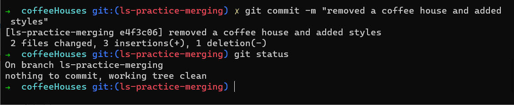
<br/>
<br/>

**Writing A Good Commit Message** : Commit messages are meant to help you and your teammates know what work was done as part of a commit. It's important that you are leaving a meaningful message!

An example of a good commit message for removing a coffee house from your project would be:

```
git commit -m "Removed Barista Parlour from list of coffee houses"
```

## Push those changes to Github.

- Try typing `git push` in your terminal like you did when you set-up the repo. You will see a message that says the branch does not exist upstream. This is because Github does not yet know about the new branch you made. Git gives you a helper command to push a new branch up to Github, example ` git push --set-upstream origin ls-practice-merging`.
- Copy and paste that command into the terminal and press enter.

<br/>

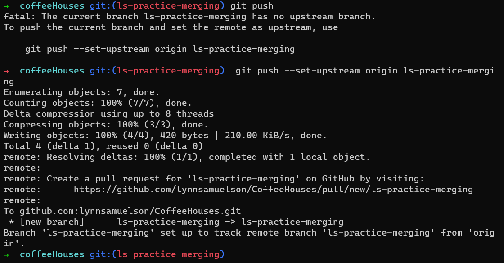

<br/>
<br/>

Congratulations, your new branch is now on Github!

<br/>
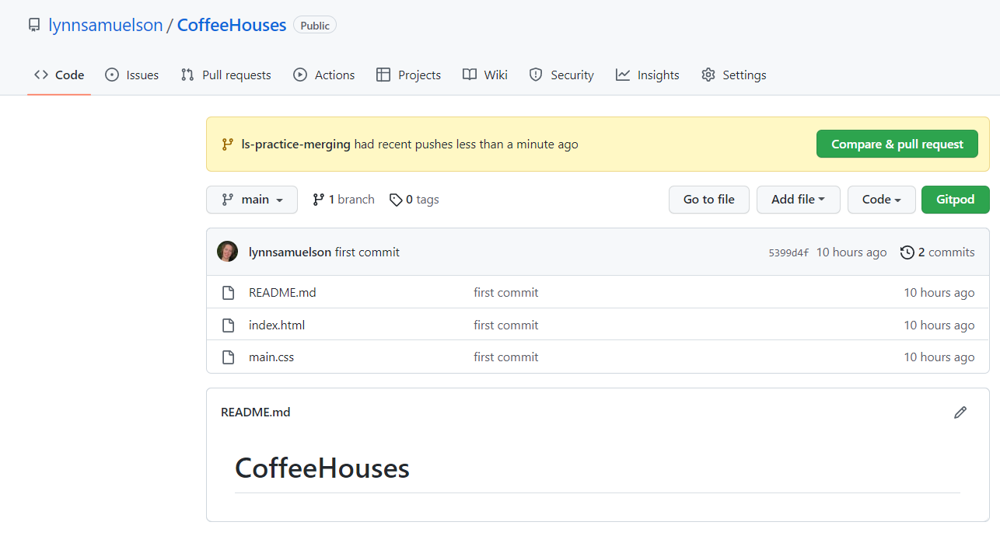

<br/>
<br/>

Let's go check it out, navigate to you repo in Github. Notice that you have a yellow banner with a green button telling you of the recent pushes. Remember, the code is not in your `main` branch yet. It's still in it's own branch.

Take a few minutes to click around on Github and prove to yourself:

- The changes are not shown in the files on the screen (main branch)
- There is a new branch on Github. Look at the dropdown that says "main" on the left just under the yellow banner.
- Use that dropdown to switch to the new branch. Check that your code changes are in that branch.

## Merge changes into the main branch with a PR.

- Click on the green button that says "Compare & pull request". Notice that you can choose which branches to merge with the dropdowns, can add notes to the request for teammates (when working with others).


- Double check that your branch is merging into the main branch and then click the "Create Pull Request" button in the lower right. This will create the PR and route you to it.
- Github will check whether the code can be merged or if there are conflicts (more on this later). Once confirmed that code can merge there will be a green button displayed to "Merge Pull Request".

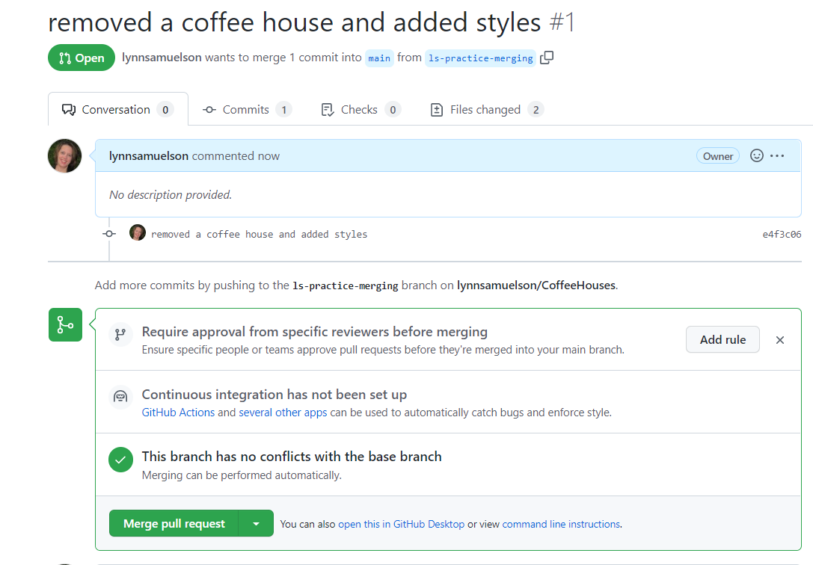

- Before merging, explore the tabs of the PR. In particular, look at the "Files changed" tab. This tab allows users to review code, ask questions and raise issues before code is merged. More on this later.

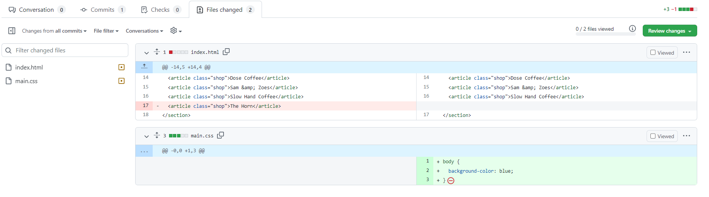

- When you are finished exploring, return to the "Conversation" tab and click the "Merge pull request" button then "Confirm merge" button. The code will merge and you will see a success screen with the option to delete the branch. It is generally good to delete a branch after it has been successfully merged. This helps keep the repository organized.

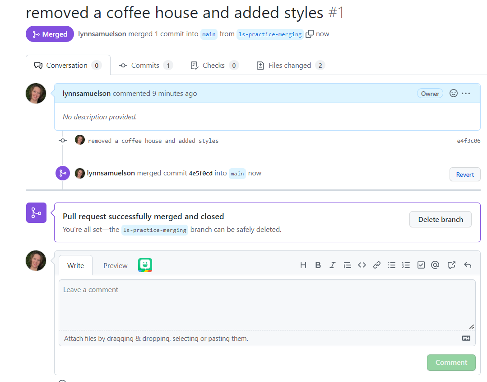

- Delete the branch and navigate back to your code by clicking the "Code" tab in the upper left on the screen. You should now see the code up-to-date on your Github main branch. Your local main branch is not up-to-date yet.

## Update the main branch on your local computer

- Navigate back to your terminal and checkout your main branch by typing `git checkout main`

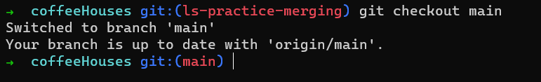

- Pull the current version of main from Github by typing `git pull origin main`

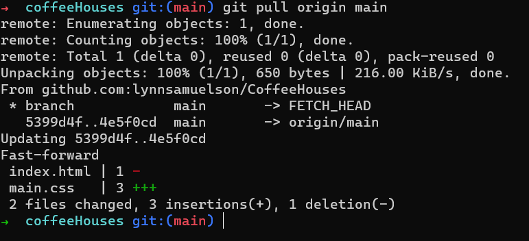

Congratulations, you've completed a Github merge cycle!
