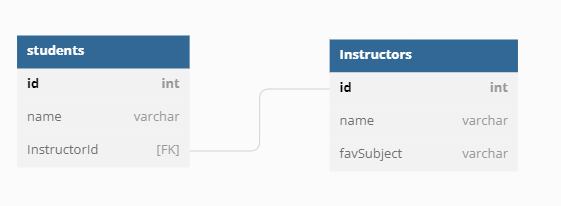

## Intro to Data Relationships

So far our most complicated data structure has consisted of an array of objects.  This works great if you have a single item (or model) that you need to work with.  Most apps have more than one thing they need to work with though.  Let's take a look at how we might relate two different data structures.

Example: A class that consists of 7 students and 2 instructors.

The student are Jon, Tatiana, Joyce, Duly, Chaniece, Cody, Blake.
The instructors are Trevor and Sydney.

Each student is assigned to a instructor at random. 

Based on what we know, we could describe this with an array of objects as such:

```js
const students = [
  {
    id: 1,
    name: "Jon",
    instructor:"Trevor"
  },
  {
    id: 2,
    name:"Tatiana",
    instructor: "Sydney"
  },
  {
    id: 3,
    name: "Joyce",
    instructor:"Trevor"
  },
  {
    id: 4,
    name: "Duly",
    instructor:"Trevor"
  },
  {
    id: 5,
    name: "Chaniece",
    instructor: "Sydney"
  },
  {
    id: 6,
    name: "Cody",
    instructor:"Sydney"
  },
  {
    id: 7,
    name:"Blake",
    instructor:"Sydney"
  }
]
```

This works great for this simplistic example, but what happens if Sydney decides she wants to change her name to the "The Future Dr. Noh".  We need to update 4 places in our array.  Four places isn't bad, but imaging that Sydney is the instructor for thousands of students!

Remember that id property on each object.  This number can be used to identify each student.  What if we could do that with instructors too?

We can. Let's make our array into two arrays.  First, let's start by making an array of objects for the instructors, giving each a unique id.

```js
const instructors = [
  {
    id: 1,
    name: "Trevor"
  },
  {
    id: 2,
    name: "The Future Dr. Noh"
  }
]
```

Now, let's update our students to have the id of the instructor and not the name.

```js
const students = [
  {
    id: 1,
    name: "Jon",
    instructorId: 1
  },
  {
    id: 2,
    name:"Tatiana",
    instructorId: 2
  },
  {
    id: 3,
    name: "Joyce",
    instructorId: 1
  },
  {
    id: 4,
    name: "Duly",
    instructorId: 1
  },
  {
    id: 5,
    name: "Chaniece",
    instructorId: 2
  },
  {
    id: 6,
    name: "Cody",
    instructorId: 2
  },
  {
    id: 7,
    name:"Blake",
    instructorId: 2
  }
]
```

Each student object is linked to an instructor object with the id. Now we only need to change Sydney's name in 1 place! We can also add details to the instructors without needing to update the students. For example we could add a favorite subject to each instructor.
```js
const instructors = [
  {
    id: 1,
    name: "Trevor",
    favSubject: "Array Methods"
  },
  {
    id: 2,
    name: "The Future Dr. Noh",
    favSubject: "APIs"
  }
]
```

Imagine that there are hundreds or thousands for students/instructors in our system.  Looking at the relationship between the student array and the instructor array would not be practical.  This is where we draw models to represent the data.

