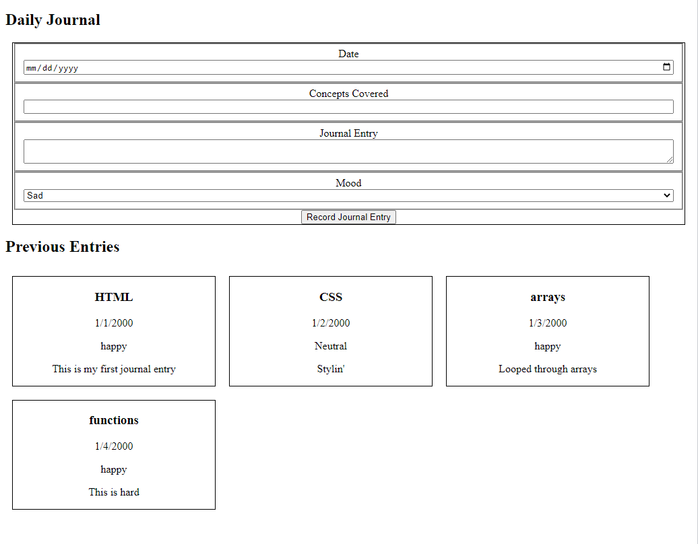

# Daily Journal Part 3

The daily journal currently has HTML, CSS and JavaScript, but the JavaScript is not linked to the HTML.  In this part, we are going to refactor the project a bit to:

1. Display previous journal entries on the screen.
2. Encapsulate our code inside functions.
3. Bring the Journal Entries into the JavaScript file from another source.

### Display Previous journal entries on the screen

Iteration is a great way to show how to display a list of elements on the screen.  We've learned most of the tools to do this including:

- adding to the value of a string using the `+=` of a variable
- string interpolation to include that value a variable represents in the string
- using `document.getElementById` and `.innerHTML` to add a string created in JavaScript to the DOM.

Using these tools and the `<article id="entries"></article>` element you created in Part 1 of this project, create a string of html elements in your `main.js` file and add that string to the DOM.  

The image below shows the most basic example of entries on the page.  Feel free to add as much style as you like to your journal.  



### Encapsulate our code inside functions

While iterating over an array and displaying our data was the visual goal of this week, we also need to refactor some of the code.  In your `main.js` file remove all the code that is not directly related do displaying the journal entries on the screen.  Before starting, make sure you have a working version committed to GitHub and are on a new branch.  

Test your code as needed to make sure you did not accidentally remove an important piece.  

Now use your knowledge of functions to encapsulate your logic into functions that itinerate over your entries and display them on the screen.  Remember functions:

- should each do one thing
- can be invoked from other functions
- can take arguments
- have their own scope and can encapsulate variables and eliminate the need for a global variable.  Global variables can cause security vulnerabilities and inadvertently interfere with other code.  We should avoid using global variables whenever possible.

Using you knowledge of functions, refactor you code to:
- include 2-3 functions 
- only 1 function is invoked in the global scope (others may be invoked inside functions)
- has at least one function that takes in an argument
- separates the logic with functionality.

If you get stuck: 
- Check errors in the console
- Use dev tools to walk through what is going on
- try to get a working solution first and then go back to refactor the code to meet the above requirements
- ask teammate(s) to look at your code and help you
- reach out to instructors with an example of your code

### Bring the Journal Entries into the JavaScript file from another source

In production-ready applications, our journal entries wouldn't be hard-coded into as a variable in JavaScript.  They will come from a database and be delivered through an API or other technology that interacts with the database for us.  For security reasons, the browser should never interact directly with a database! 

The last part of the project this week is to move the journal entries array of objects out of the main JavaScript file and import it from another file.  To do this, follow the below steps:

1. Create a file named `entries.js` and move your journalEntries object to the new file
2. At the bottom of your `entries.js` file, add:
```js
  export const getJournalEntries = () => {
    const copyOfEntries = journalEntries.map(entry => ({...entry}))
    return copyOfEntries
  }
```
3. At the top of your main.js file, add `import {getJournalEntries} from './entries.js'` on it's own line
4. Where you had defined `journalEntries` previously, set that variable equal to `getJournalEntries()`


**IMPORTANT** Once you get steps 1-4 working and at each point you get stuck, talk through (in your head, to your cat, to your non-technical friend/roommate/sibling/parent, to you classmate(s), to your instructor(s), to all of these) as many times as need what is happening with these changes.  

Can you:

- find an array method
- explain what `import` means and what is does
- explain what `export` means and what is does
- find function definitions
  - find an argument in the definition
- find functions being invoked
  - find an argument when invoking a function
  - find where the value of the argument came from
- understand how the data is getting from one file to the other
- understand how the variable holding the entries is getting the data

## Challenges (optional)

Here's some things you can try with your journal AFTER you finish the above.  You do not need to do these in order.  Read through them and pick a challenge you thinks looks interesting.

1. Up to this point, you have had your journal entry form hard-coded in your `index.html` file. Your task for this exercise is update the application to have the form rendered from JavaScript.  
    - create the necessary functions needed
    - provide an interaction with the DOM to render the form
2.  Write a function that takes in the date from the journal entry and returns the day of the week that entry occurred.  Display the day of the week in the journal entry card.  
3.  Create functions to sort your entries by date, mood or topic.  Display on the DOM as you choose.  
4.  Add a side bar (`<aside>` element) listing which moods you were on which days.  
    - List the dates under each mood and/or
    - List the number of times you felt each mood
5. Update your journal entries object to include the boolean 'favorite'.  Update the DOM to highlight your favorite entries.  Some ways include (not exhaustive, be creative):
    - Display the background color on your favorite cards different from the non-favorites
    - Display the favorite entries at the top
    - Display the favorite entries on the sidebar/new view


