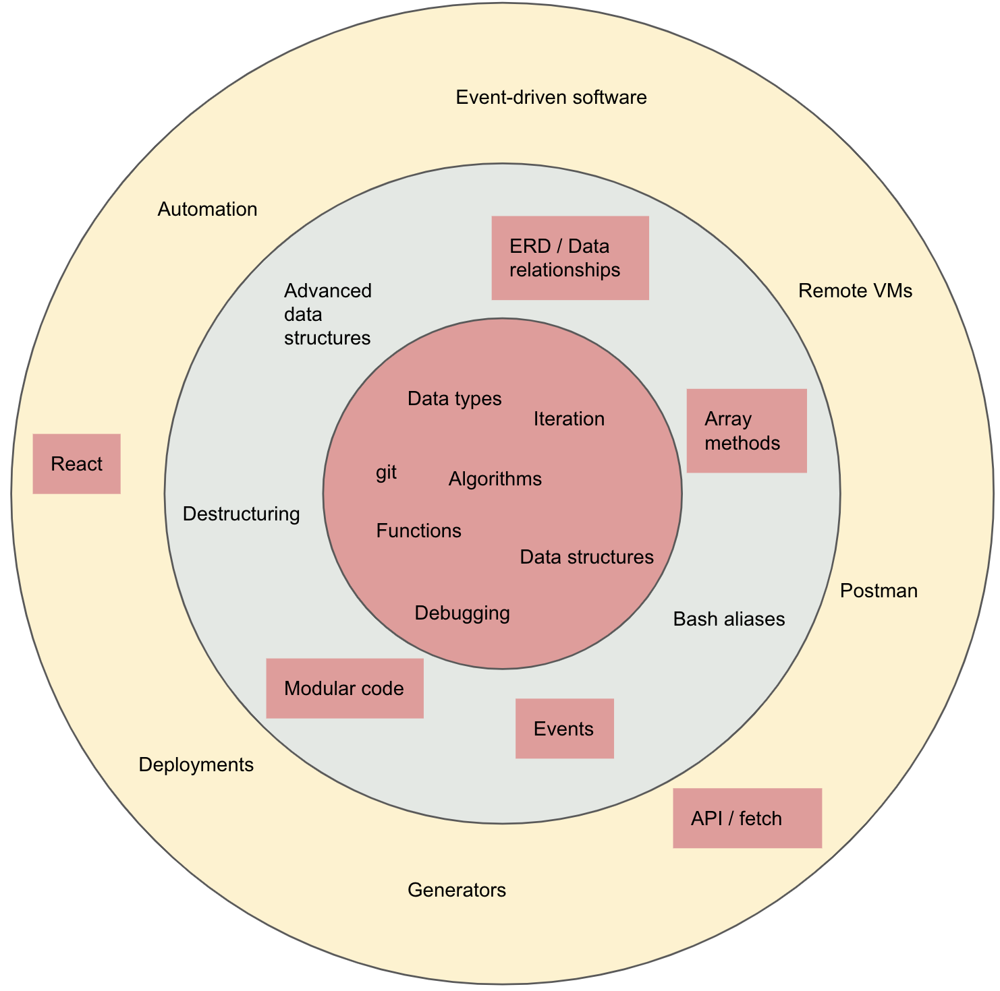

# Welcome to NewForce

Welcome to an experiment in education. Learning software development isn't like learning anything else, so we're not going to treat it like anything else. This is likely going to be a very different experience from your high school chemistry class or your college intro to philosophy.

You must be curious.

You must ask questions.

You must be ok with a serious amount of failing before succeeding.

You must be ok with being uncomfortable.

