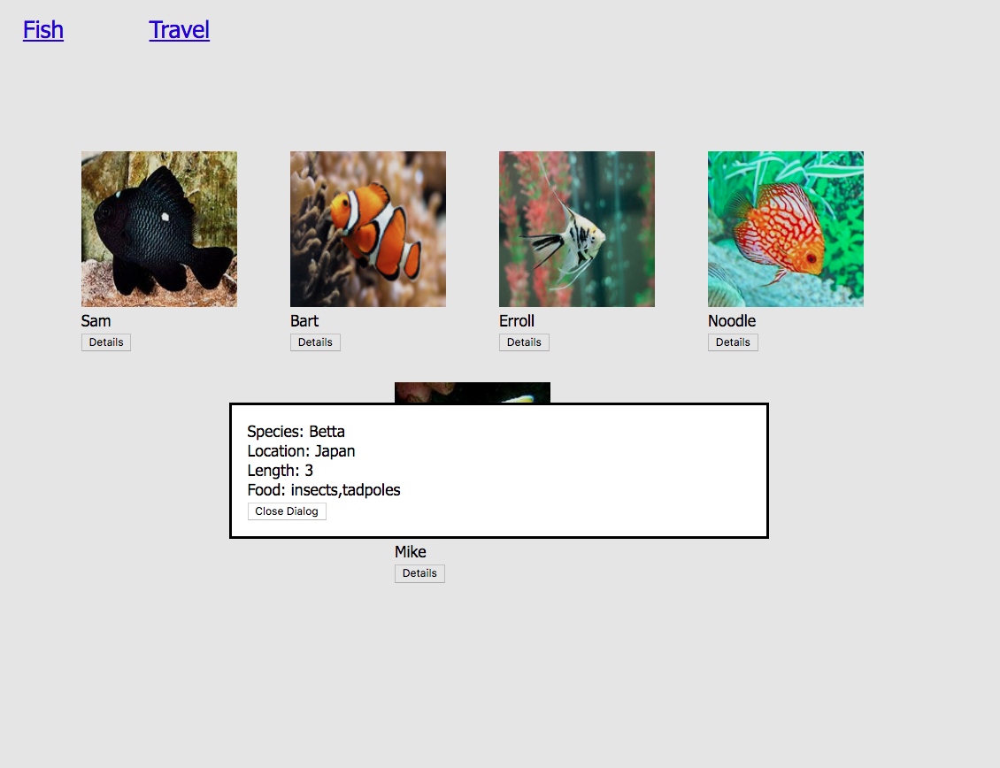

# Martin's Minimal Mockup

> After an "urgent" email from Martin, you have agreed to meet him again at the coffee shop. He has "critical information" to tell you that he "thought he made clear the first time we talked." Just thinking about the email makes you sigh heavily as you pull into a parking spot and then head towards your meeting.
>
> You scan the shop and see Martin in the back furiously scribbling on a legal pad, and head over to meet him. He greets you without smiling, turns his legal pad towards you, and blurts out, "We have a problem with the site."
>
> You blink, and say, "Ok, what's the issue?"
>
> "I said I wanted a nice, clean site and right now I think it's way too 'busy'. Here's what I want."
>
> He takes his pencil and makes a stabbing motion towards the legal pad and says, "There's too much information on the page when it shows up. I was on the 'For the Halibut' web site, and I noticed that they had these buttons I could click on which showed these little windows in the middle of the screen."
>
> "Oh, those are called dialogs," you interject patiently.
>
> He glances at you quickly and nods his head in apparent understanding and continues, "So I'd like to have these 'dialogs', as you call them, show the species, location harvested, and the food they eat show up when the button is clicked."
>
> He points again at his legal pad, "I kind of drew it up for you so that you would know how this all works."
>
> You bristle internally. Hopefully it's not obvious to him. Then you realize that he's not really paying attention to you, as so much that he's lecturing you.
>
> You glance at his mockup.
>
> "See?" he says. "Much more minimal and clean, just like I originally wanted!" He forces a smile as if that wipes away his condescension.



> "I see now," you say as calmly as you can. "I can make those changes today."
>
> "That would be great," Martin says, emphatically. "Send me an email when it's ready to go."

## HTML Dialogs

Implementing a dialog box is a straightforward process in the browser. There is a `<dialog>` element implemented in the Google Chrome browser. It's not fully supported in all browsers yet, but since we're using Chrome, we'll go ahead and use it.

First, each of your fish components needs to have a corresponding `<dialog>`

```html
<!-- Hey look! It's an HTML representation of one of Martin's fish -->
<div class="fish">
    <div>
        
    </div>
    <div class="fish__name">Bart</div>
    <div>
        <button id="button--bart">Details</button>
    </div>

    <dialog class="dialog--fish" id="details--bart">
        <div>Species: Orange Clownfish</div>
        <div>Location: Caribbean</div>
        <div>Length: 3</div>
        <div>Food: Algae, crustaceans</div>

        <button class="button--close" id="close-bart">Close Dialog</button>
    </dialog>
</div>
```

## Modular JavaScript

Just like you have started to do already with CSS by making it modular so that individual files all have code in them that involve a single, specific part of the system, you will be doing the same thing with JavaScript.

1. In your project directory, create a `main.js` file.
1. In your `index.html` file, add the following `<script>` element code right before the closing body tag. The code in this module will have the Single Responsbility of running logic that is needed to display the initial user interface to the user.
    ```html
        <script type="module" src="./main.js"></script>
    </body>
    ```
1. Create another JavaScript module in the directory named `dialogs.js`. This module's Single Responsibility will be to manage the showing and hiding of the dialog windows in the application.
1. Place this code at the top of the `dialogs.js` module. This code requires no modification for now. The function `initializeDetailButtonEvents` has the Single Responsbility of defining event listeners that will be responding to the action of a user clicking on the buttons in the application.
    ```js
    const initializeDetailButtonEvents = () => {
        // CAN'T TOUCH THIS - START
        const allCloseButtons = document.querySelectorAll(".button--close")

        for (const btn of allCloseButtons) {
            btn.addEventListener(
                "click",
                theEvent => {
                    const dialogElement = theEvent.target.parentNode
                    dialogElement.close()
                }
            )
        }
        // CAN'T TOUCH THIS - END


        // You will be writing code below this line

    }
    ```
1. In the code below, you have been provided with the first event listener. When the user clicks on the "Details" button underneath Bart's image, it will show the dialog element you created for Bart in the HTML above. Add one of these for every fish that you created. Replace the CSS selectors in both locations, but nothing else needs to change.
    ```js
    export const initializeDetailButtonEvents = () => {
        // CAN'T TOUCH THIS - START
        const allCloseButtons = document.querySelectorAll(".button--close")

        for (const btn of allCloseButtons) {
            btn.addEventListener(
                "click",
                theEvent => {
                    const dialogElement = theEvent.target.parentNode
                    dialogElement.close()
                }
            )
        }
        // CAN'T TOUCH THIS - END


        // You will be writing code below this line

        // Show Bart's details when the button is clicked
        document.querySelector("#button--bart").addEventListener(
            "click",
            theClickEvent => {
                const theDialog = document.querySelector("#details--bart")
                theDialog.showModal()
            }
        )

    }
    ```
1. Import the function into `main.js` and invoke it.
    ```js
    /**
     *  Import the initializeDetailButtonEvents function
     *  reference and then invoke it
     */
    import { initializeDetailButtonEvents } from './dialogs.js'

    initializeDetailButtonEvents()
    ```

Now refresh your browser and click on Bart's detail button.

> **Tip:** If you dialog isn't working, please see a member of the instruction team before you move on. Moving on without this code working will be wasted time.

You may wonder why you did not just place all of the event listener code in `main.js`. There are two reasons you started this way.

1. The `main.js` module rarely contains any actual logic itself. Its job is to import tools from other modules and invoke them so that the initial UI is rendered to the user.
1. What must happen to present the initial UI to the user will become more complex over time. Putting all of that code in one module not only makes the code harder to read and maintain, but violates [encapsulation](https://stackify.com/oop-concept-for-beginners-what-is-encapsulation/) and the Single Responsibility Principle.

## Dialog All The Things!!

Now you must make all the fish have a button. Modify your aquarium project to...

1. Have a `<dialog>` for each fish and put the corresponding properties in it.
1. Add a new event listener inside the `initializeDetailButtonEvents()` function in `dialogs.js` for each fish's detail button.
1. Once done, verify that all buttons work as intended.

> **Tip:** Make sure you use your debugger and breakpoints if any of your code doesn't work. If you are still uncomfortable with the debugger, see your instruction team for a review.
