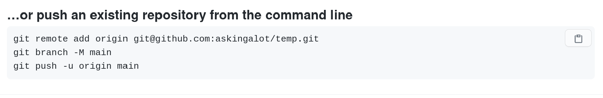

# Chapter 4: Git and Github Basics
#git #github

## Why Are You Learning This?

As a professional developer, you **will** be working on a team. Modern software development is a team sport, not an individual one. Team members need the ability to write code independently, but then merge their individual code together when it's time to release a version of the software.

Git is the tool to allow a developer to work on an independent branch of the code base, and then merge in the work of others.

Github is a tool which allows you to easily share your code with other people, regardless of where they are located.

## Configure Git on Your Machine

You'll need to set a name and email in your global git `config` file. This makes it easy to know who committed those changes!


First use the following command, but instead of typing `Your Github User Name`, enter your Github username for your account.

```sh
git config --global user.name "Your Github User Name"
```

Then use the following command, but instead of typing `email@example.com`, enter the email address you used when you created your Github account.

```sh
git config --global user.email "email@example.com"
```


## Creating a Git Repository for Aquarium

1. Navigate to your project directory
    ```sh
    cd ~/workspace/martins-aquarium
    ```
1. Type in the `git init` command
1. You now have a git repository

The magic is the `.git` directory that gets created when the `git init` command is executed. To see this directory you can use `ls -la`, which shows hidden files and directories. Operating systems will not show files and directories that begin with a period by default. They are considered hidden, or system assets.


## Making Your First Commit

### Workflow to Remember

This is the process you will be following thousands of times while you are here at NSS. You tell git to track changes first, then you commit those changes, and then upload your changes to Github.

```sh
git add --all
git commit -m "Message about commit"
git push origin master
```

### Commit Aquarium

Time to make your first commit on your aquarium project. Make sure you are in `~/workspace/martins-aquarium` and then tell git that you want to track all of your files.

```sh
git add --all
```

```sh
git status
```

Then tell git that you are ready to commit all of your code to the historical records that it keeps about your project.

```sh
git commit -m "My first version of my aquarium code"
```

 > _Beginner Hint!_ If you accidentally type `git commit` and hit enter without the `-m` and the message, you'll be taken to a screen that will make you feel like Alice through the looking glass. If this happens, for now just come see an instructor and we'll get you back to reality safely.


```sh
git status
```

Now you can create a Github repository where you will upload your code.

## Backing Up and Sharing Code on Github

Github is a _software as a service_ (SAAS) that allows you to back up your repository to the cloud and share it with other software developers. Note that it is not the same thing as git, which is an application you are running locally on your machine. Github and git are made to talk to each other, but they are separate entities.

## Pushing to Github

When you are ready to share your code with your teammates, or the general public, you can push your repository to Github. Think of Github as an external drive you plug into your laptop to use as backup. Instead of it backing up the entire hard drive, you will back things up, one project at a time, only when you want to.

The first thing you need to do is create a new repository on Github's platform that you will use to backup the code on your laptop.

### Create Github Repo

1. Log into your Github account.
1. Click the `+` sign in the top right corner.
1. Choose "New repository".
1. In the "Repository name" field, enter in `nss-aquarium`.
1. Scroll down and click the green "Create Repository" button.
1. Copy the repository's connection string.
    
1. Follow the second set of instructions.
    

Now that the code has successfully been backed up, go back to your browser, and refresh the page. You will see that your remote repository backup now has your aquarium HTML, JavaScript and CSS files in it.


## Practice: Backup Exercise

* Create a Github repository for the Congressional Representative exercise, and push up that code.
* Create a Github repository for the Coffee Houses exercise, and push up that code.

When you are done, you should have three new repositories in your Github account.

1. Aquarium
1. Coffee Houses
1. Congressional Representative

> **Tip:** If you have any issues getting your code onto Github, see a member of your instructional team immediately so that you have a backup of your code. Pushing your code to Github is not optional. It's a required part of this program.
