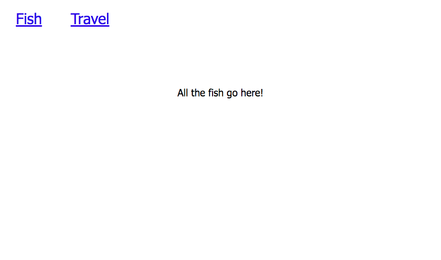
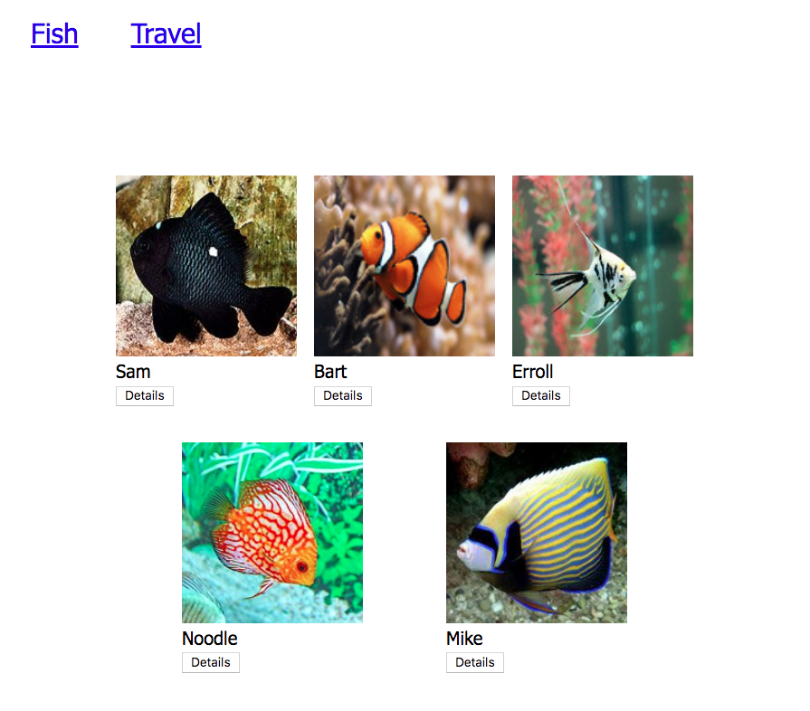

# Automated HTML Representations of Fish

Now that you have a module whose responsibility is to maintain the state of your application, now you need to convert the raw data into HTML representations and render it in the browser. In this chapter you will automate the creation of an HTML list of fish from the objects in the fish collection.

## Vocabulary To Learn
* A function defines a parameter
* Invoke a function with an argument
* ES6 Arrow Function
* Template literals(template string)
* querySelector
* JavaScript Operators `(+=)`, https://www.w3schools.com/js/js_operators.asp

## Function Basics
First, take time to read over: https://javascript.info/function-basics


## Remove Any Hard-Coded Fish HTML

> We will be starting this project with an HTML page that contains a header, nav, and couple of fish. 

[A gist with starter HTML/CSS](https://gist.github.com/brendalong/db3684e349a87b2831a1285df7004401)

Open `index.html` and delete the element containing the fish items and all of the children fish elements.

## Defining the Components

There are two components in this process.

1. Individual fish. This will create an HTML representation of each fish to be rendered in the list container.
1. List of fish. This will create an HTML container element and have instructions for rendering the individual fish component for each fish in the collection.

Since each of these components have a different responsibility, each one should be created in its own module.

### Single Fish Component

> **`scripts/Fish.js`**

```js
/**
 *  Fish which renders individual fish objects as HTML
 */
export const Fish = (fishObj) => {
	return `<article class="fish-card">
				<div></div>
				<h3 class="fish-name">${fishObj.name}</h3>
				<ul>
					<li class="fish-details">${fishObj.species}</li>
					<li class="fish-details">Length: ${fishObj.length} inches</li>
					<li class="fish-details">Found: ${fishObj.location}</li>
					<li class="fish-details">Diet: ${fishObj.diet}</li>
				</ul>
        	</article>`
}
```

### Fish List Component

> **`scripts/FishList.js`**

```js
/**
 *  FishList renders individual fish objects as HTML
 */

// TODO: Import `getFish` from the data module

export const FishList = () => {

    // Get a reference to the `<section class="fishList">` element
    const contentElement = document.querySelector("insert selector here")
    const fishes = getFish()

    // Add to the existing HTML in the content element
    contentElement.innerHTML += `
        All the fish go here!
    `
}
```

## Rendering the List in Main Module

Since we want the fish to be immediately rendered when the page loads, that falls within the responsibility of the `main.js` module. Import the list component into main and invoke the component function.

```js
// Import the FishList here


FishList()
```

Refresh your browser again and you should see something similar on the screen.



Hooray!! Your fish list component got rendered to the browser. Next is to render all the fish.

You will need the `Fish` component function. That function is in the `Fish.js` module, so you will need to import it.

> **`scripts/FishList.js`**

```js
import { Fish } from "./Fish.js"
```

You will write a `for..of` loop to generate all of the individual fish HTML representations.

```js
/**
 *   FishList which renders individual fish objects as HTML
 */

 /** Define the steps that need to be taken
 1. Get the array of Fish
 2. Get a reference to the location on the DOM where you want to display the list of fish
 3. Declare a variable to hold on to generated fish HTML representations
 4. Loop over the array of fish and for each one, invoke the Fish component which returns HTML representation
 5. Finally set the dom equal to the variable containing the fish html representations
 **/


import { getFish } from "./FishData.js"
import { Fish } from "./Fish.js"

export const FishList = () => {

    // Get a reference to the location on the DOM you want to display the list of fish
    const contentElement = document.querySelector(".fishList")
    // Get the fish array
    const fishes = getFish()
    // Declare a variable to hold on to the fish HTML representation
	let fishHTMLRepresentation = "";
    // Loop over the array of fish
	for (const oneThingFromTheSea of fishes) {
		fishHTMLRepresentation += Fish(oneThingFromTheSea);
	}
    // Set the dom equal to the variable containing the fish html representations
    contentElement.innerHTML += `
        ${fishHTMLRepresentation}
    `
}
```

Now refresh your browser again and all of your fish should be back.



## Ok, So, What Just Happened

You may have understood each step as you did it, or you may not have.

You may have understood how all the pieces connect, or you may not have.

With our years of experience introducing beginners to these abstract concepts, we know that somewhere between 90% to 100% of your cohort does not understanding the big picture here. You can make sense of each tree, but you can't understand how the forest works as a single ecosystem that is made up of individual trees.

There are several abstract concepts at play here, and your brain's neural network has not been tuned to understand these complex connections yet. That doesn't mean your mind **can't** do it.

It just can't do it **yet**.

We have also learned that some people like a visualization of how all the pieces work together, so here's one that shows all the components, and what each module exports for use in other modules.


## Practice: Argumentative

Understanding how arguments and parameters work with functions - especially when the functions are defined in a different module that where they are used - is something that is hard to understand. In this practice exercise, you are going to explore this concept.

First, in the following line of code in the **`FishList`** module...

```js
fishHTMLRepresentations += Fish(fish)
```

Remove the fish argument that is being passed to the **`Fish`** component function.

```js
fishHTMLRepresentations += Fish()
```

Refresh your browser. Make sure your developer console is open and you will see the following exception.


The exception tells you exactly where it occurred. Line 8 of the `Fish.js` module (_**Note:** your line number may be different if you have comments or different amounts of whitespace_). If you open that module and go the the line specified, you will see this.

```js
src="${fish.image}"
```

The key term is `'image' of undefined`. Whenever you see an exception like that, look to the left of the property being accessed. In this case, look to the left of `'image'`. You will see the variable `fish`. That's undefined.

Why is it undefined? It's because you removed the argument that you were passing in when you invoked the function. This component function defines a parameter.

```js
const Fish = (fish) => {
```

Since you invoked this function without a corresponding argument...

```js
fishHTMLRepresentations += Fish()
```

Then the parameter never gets assigned a value to reference. Therefore, it's undefined, and you can't access an `.image` property of something that is undefined.

Now put the argument back in when you invoke the component function and it should all work again.


## Practice: Information Organization

In the following exercises, you are going to build modules and components for tips, and locations. You need to separate all of those modules into sub-directories so that you don't end up with dozens of JavaScript files all in one directory. It's confusing.

In the `scripts` directory, create the `fish`, `tips`, and `locations` sub-directories and move all of your current files for automating fish into their `scripts/fish` directory.

This will have the side effect of changing how you import the modules, since their path has changed. You will need to clean up all of your import paths.

## Practice: Automate Martin's Tips

Create a data module, a tip list component, and a tip component to automate the rendering of Martin's fish care tips.

Suggested files to create:

* `scripts/tips/TipData.js`
* `scripts/tips/TipList.js`
* `scripts/tips/Tip.js`

## Practice: Automate Martin's Locations

Create a data module, a location list component, and a location component to automate the rendering of Martin's locations for the location page. Try a different way to iterate through the data. What about `forEach`?

Suggested files to create:

* `scripts/locations/LocationData.js`
* `scripts/locations/LocationList.js`
* `scripts/locations/Location.js`

