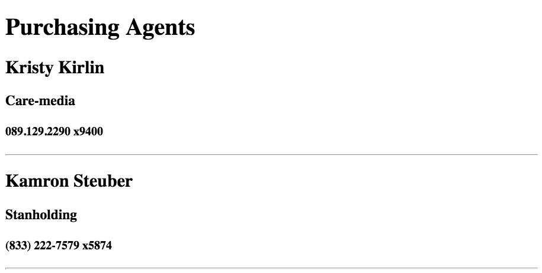

## Converting Existing Data to Another Format

> Doris sidles up next to you after your lunch break, holding a cup of herbal tea. She takes a quick sip, inhales deeply and says, "I love everything you've done so far. This is making a huge difference in everyone's productivity."
>
> You're fairly sure that by _everyone_, she means herself, but you nod, smile and respond, "Thank you. Just glad to be making a difference."
>
> Doris smiles back and says, "Now that I have a list of businesses, I realize that I would also love to have a list of purchasing agents. All by themselves. On a web page like the business names."

To achieve this task for Doris, you still need to iterate the original array of businesses, but all you need is the purchasing agent names. If you can extract those names and put them in their own array, then you can use `forEach()` to display them in the DOM.

The `map()` method is perfect for that. The map method is used for transforming items in one array to a different structure, and storing the new items in another array. Here's how you would do that for art supplies if you wanted an array that only contained the brands that you sell.

> **`SuppliesData.js`**

```js
const supplies = [
    {
        id: 1,
        price: 12.99,
        color: "Red",
        brand: "Bloomfield",
        type: "Paint"
    },
    {
        id: 2,
        price: 75.49,
        color: "Brown",
        brand: "Illinois Art",
        type: "Easel"
    },
    {
        id: 3,
        price: 19.99,
        color: "White",
        brand: "Emerson",
        type: "Oil Paint Canvas"
    }
]

// Create a new array that contains only brand name strings
export const brandNames = supplies.map(supplyObject => {
    return supplyObject.brand
})
```

## Videos With More Examples

You can watch some videos where other developers show you other examples of how to use the `.map()` method on an array.

* [map Array Method | JavaScript Tutorial](https://www.youtube.com/watch?v=P4RAFdZDn3M)
* [JavaScript Array Map](https://www.youtube.com/watch?v=G3BS3sh3D8Q)

## Task: Listing Purchasing Agent Names

Use `map()` to create an array of purchasing agents for companies that purchase from Dotard &amp; Simbleton. Then iterate the array and display each one in element in your HTML file that has a class of `agents`.

```html
<article class="agents">
    <!-- Purchasing agents go here --->
</article>
```

## Task: Listing Purchasing Agent Details

Instead of just returning the purchasing agent object, return a new object that has the full name of the purchasing agent, the company name, and the phone number. The data structure is shown below. Use that new data structure to display the agent with their company and phone number

```js
{
    "fullName": "Kaylee Gutkowski",
    "company": "Highnix",
    "phoneNumber": "235.266.6278"
}
```

#### Example output




