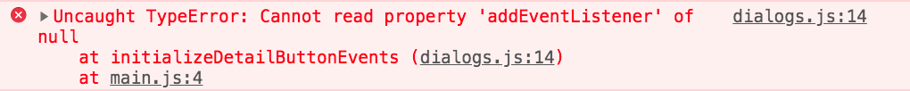
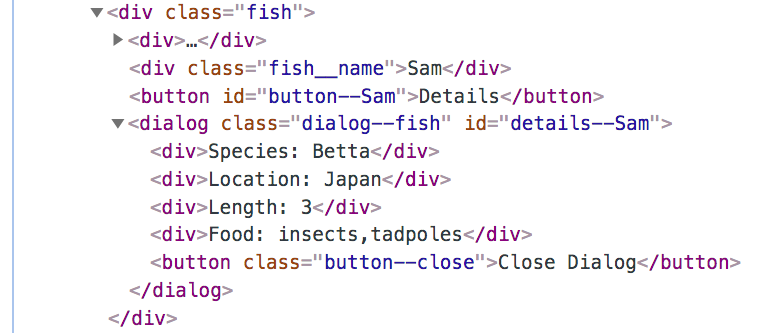

# Dynamic Event Listeners

Now that you have automated the generation of the HTML representations of fish, it's time to get the buttons working again.

Open your `main.js` module and bring back the initialization function that you imported from `dialog.js`.

```js
// initializeDetailButtonEvents()
FishListComponent()
```

Change the order and uncomment the function.

```js
FishListComponent()
initializeDetailButtonEvents()
```

Refresh your browser and look in your developer console. You still get the following exception.



Which seems strange because all of the fish components are rendered to the DOM before you initialize the listeners. Why does the following code fail?

```js
document.querySelector("#button--sam")
```

If you inspect your actual DOM, you will notice that since you now are using `${fish.name}` in the **`FishComponent`** component function to build the HTML...

```js
<button id="button--${fish.name}">Details</button>
```

The `id` no longer has `sam` in it. It now has `Sam` in it. That capital S makes it fail.




## Using the Fish Name to Connect the Dots

```html
<button class="button--Sam">Details</button>
<dialog class="dialog--fish" id="details--Sam">
```

What is the common characters between the `class` of the button and the `id` of the dialog?

It's `Sam`.

Since both elements share a common subset of characters, you can use that commonality to make them work together.

Work together?

Well, yes. When you click the button for Sam, you want the dialog for Sam to become visible.

Here's how you can do that.

> #### `scripts/dialog.js`

```js
document.addEventListener("click", clickEvent => {
    // Get the id of the element that was clicked
    const elementId = clickEvent.target.id

    /*
        If you click on the button for Sam, the elementId
        variable will have the value of `button--Sam`
    */
})
```

You could just modify every event listener, manually, to match the uppercased name of each fish, but then you are back to doing manual work over, and over again if new fish are added or existing ones are removed. You need to write code that automatically handles the user clicking on **ANY** of the detail buttons.

CSS is a powerful tool, and the selectors you can use have many interesting combinations. For example, you can use CSS selectors to get a reference to any `<div>` element whose `class` attribute starts with "fish" by using `^=` in the selector.

```js
/*
    The following selector will match all these elements
    because their class attribute values all start with the
    string of "fish".

        <div class="fish"></div>
        <div class="fish__name"></div>
        <div class="fish__image"></div>
*/
document.querySelectorAll("div[class^='fish']")
```

So you can use that to get a reference to every detail button.

1. The element is `button`
1. Each one has an `id` attribute
1. Each `id` attribute value starts with "button--"

```js
const allDetailButtons = document.querySelectorAll("button[id^='button--']")
```

Then you can iterate that collection of HTML elements and attach an event listener to each one. Below you will see another type of selector called the [adjacent sibling selector](https://css-tricks.com/child-and-sibling-selectors/) which uses the `+` sign. In this case, you will be selecting the dialog element that directly follows the button the user clicked on.

```js
    // Get a reference to all buttons that start with "button--"
    const allDetailButtons = document.querySelectorAll("button[id^='button--']")

    // Add an event listener to each one
    for (const btn of allDetailButtons) {
        btn.addEventListener(
            "click",
            theEvent => {
                const dialogSiblingSelector = `#${theEvent.target.id}+dialog`
                const theDialog = document.querySelector(dialogSiblingSelector)
                theDialog.showModal()
            }
        )
    }
```