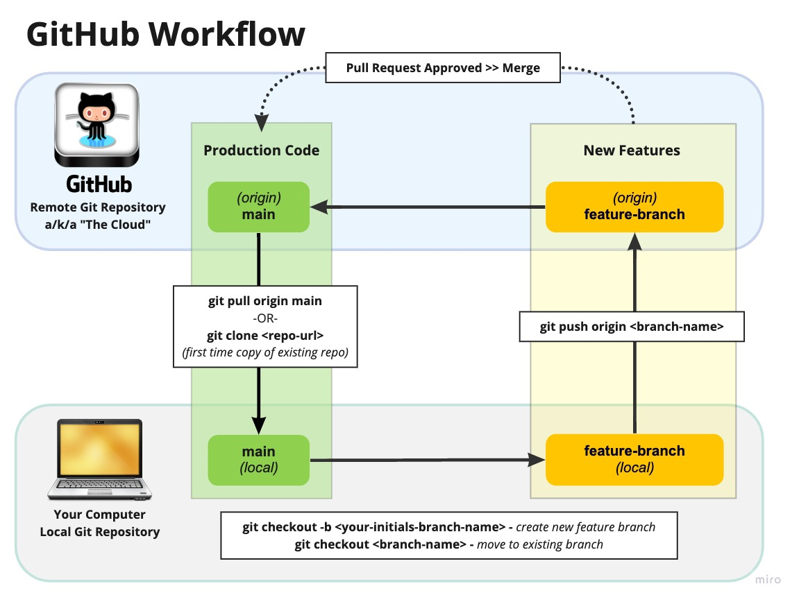
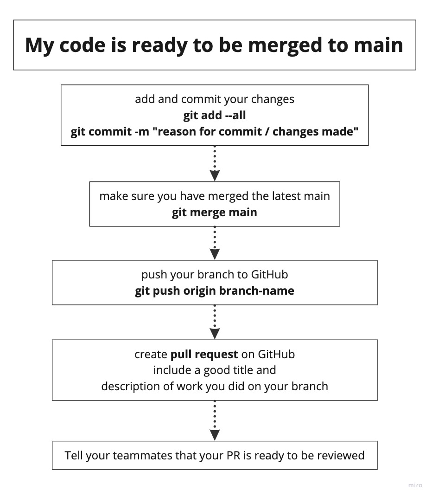
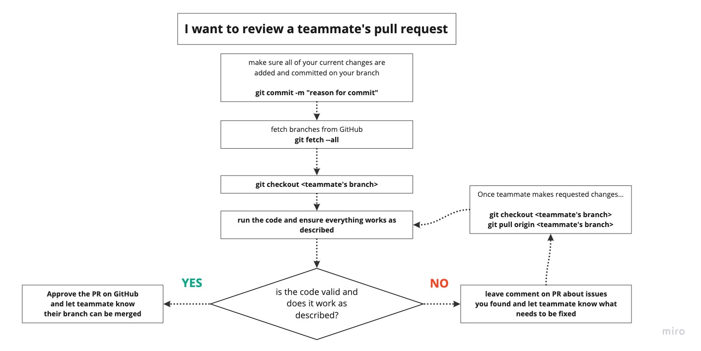
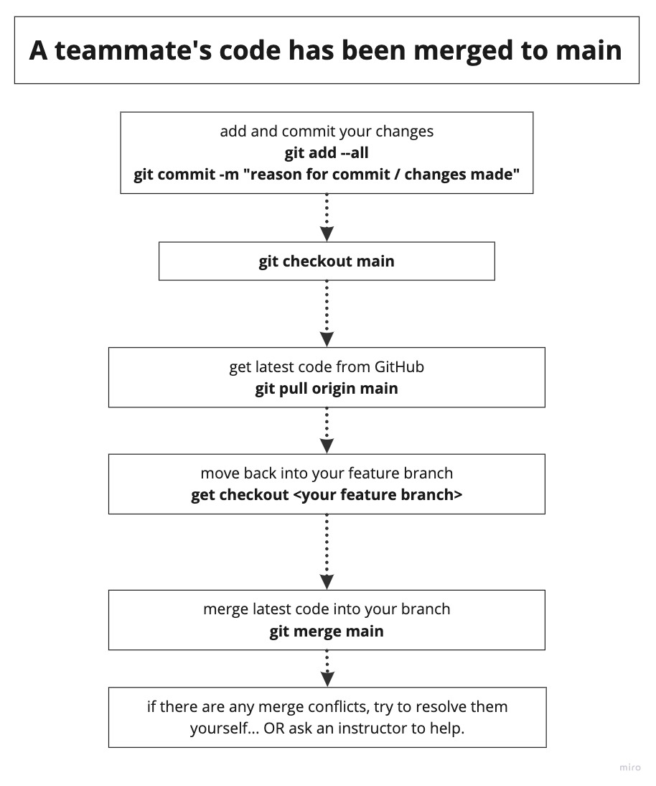

# The Github Workflow

Your instruction team will show you the Github workflow. They will demonstrate how to work on an independent branch of code, push the code to Github for a teammate to review, and then get the code merged into the default branch - now called the `main` branch (previously called `master` branch).

The checklist below is for you. You will use it during the practice exercise, and you will use it for your first few group projects until you learn it by heart.

## Vocabulary To Learn
* GitHub vs. Git
* VCS (version control software)
* Clone vs. Fork
* Branch
* Git actions: init, checkout, status, add, commit, push, pull, merge, fetch
* GitHub PR

## Group Project Github Workflow

> **Tip:** The curly braces below should not be typed by you. They indicate where to place your own value.

Everyone will create a fish for the aquarium website.
1. Everyone clone the same repository
1. Each person create a branch
    ```sh
    git checkout -b {your initials}-fish
    ```
1. Add your fish component to the HTML
1. Check status of your branch
```sh
    git status
```
1. Add, commit, push branch
    ```sh
    git add --all
    git commit -m "Added Herbert the goldfish"
    git push origin {your initials}-fish
    ```
1. When you feel your work is complete, go to Github and create a Pull Request (PR)
1. Teammate decides to verify your PR and fetches your branch
    ```sh
    git fetch --all
    git checkout {your initials}-fish
    ```
1. Teammate runs code in browser to verify it works
1. Teammate approves PR by giving you a thumbs up 👍
1. Your merge your branch on Github by visiting your Pull Request page and clicking the big, green button.
1. Teammates pull `main` when they feel like it but before they submit their PR
    ```sh
    git checkout main
    git pull origin main
    git checkout {their initials}-fish
    ```
1. When another teammate is ready to submit a pull request, they merge main into their branch, and push.
    ```sh
    git merge main
    # Fix merge conflicts, if any
    ```
1. Repeat steps 4-9

## NSS Git / GitHub Rules of Engagement
1. Always follow the one-way road
1. No "broken code" on `main` branch
1. No console.logs or debugger statements on `main` branch
1. Once a branch is merged, it is dead. No more coding on dead branch. Create a new branch for a new feature.
1. No changes made on GitHub. Everything is done local.
1. Use meaningful branch names.
1. Make meaningful commit messages.


## Visual Workflow of Github







