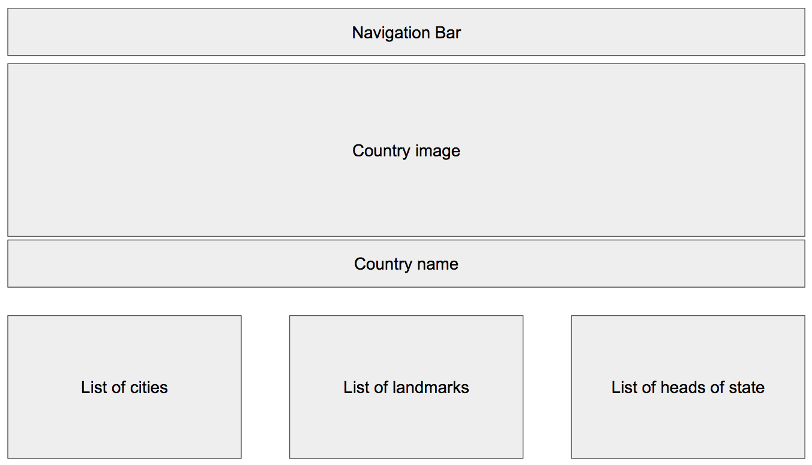

# Hello, World

## Goal

Your team is going to build a travel brochure site. Each of you will pick a country that you have always wanted to visit and build a page with the following components.

1. An appealing image header. It could be a city or landmark in that country.
1. The name of the country as part of the header.
1. A list of cities that you would like to visit in the country.
1. A list of landmarks that you would like to visit in the country.
1. A list of heads of state. You can pick your favorites.

## Setup

1. Everyone clone the repository with `git clone {connection string}`
1. Everyone immediately create their first feature branch with `git checkout -b {initials-feature}`

## Requirements

## User Experience

1. Your team must decide on a consistent experience across all pages. Fonts, color scheme, layout, and structure.

