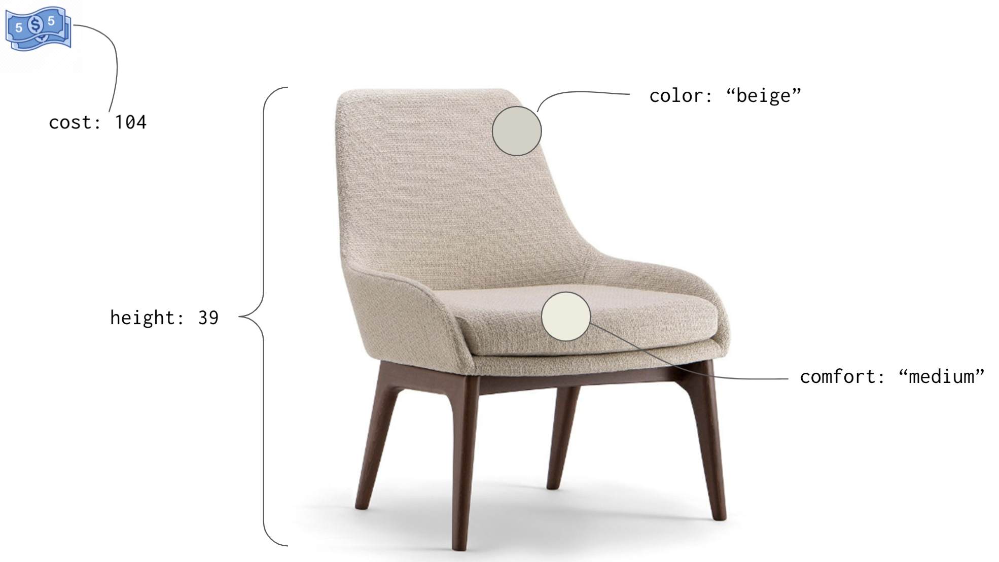

# Project: Fish in my Aquarium

Let's build a couple HTML pages whose user will be an avid rare fish collector who maintains a sophisticated tank in his home. His name is Martin. Martin meets you at a local coffee shop and explains what he needs to have on his web site.

> "So nice to meet you finally after all of those emails. Please, grab a chair," says Martin. He uses his leather loafer to gently nudge a chair slightly away from the table. He subtly waves his hand towards the chair in invitation.
>
> You smile, pull the chair and out and start to slide your computer bag from your shoulder.
>
> "Thanks, Martin."
>
> You put your bag on the floor next to the chair and put your cup of coffee in the middle of the table, not far from Martin's. You note briefly that Martin got the largest size that the coffee shop offers, and it appears to be a latte.
>
> "I'm glad to be able to help you build a site to track your amazing fish. When you sent me that email the other day listing all the ones that you have collected, I spent all night researching them. It was fascinating!" you exclaim.
>
> Martin smiles widely, obviously pleased that you appreciate his achievements with his hobby.
>
> You continue to pull your notebook and a pen out of your bag, and ask, "So you said that you wanted multiple sections on your site - one that lists the fish you currently own, and another one that lists all the places that you've visited to collect the fish..."
>
> "Harvest the fish," Martin interjects with a forced smile.
>
> "Sorry, where you harvested the fish." You restrain an eye roll.
>
> You shift in your seat because the hard, wooden chairs are already becoming uncomfortable, and continue, "Is there anything you've thought of based on the example sites I sent you?"
>
> Martin leans forward and put his hands on the table, "Actually yes. On the _'Fish Upon A Star'_ site, they had this content on the right side of the list of fish that explained the process of keeping the tank clean and the water at the right salinity and temperature. I'd love to have that so I can put my thoughts in there."
>
> You take notes as he talks and make sure that you jot down the you will need an `<aside>` element on that page.
>
> "All the sites had a navigation bar at the top. I'd like to have a navigation bar. Were you planning on having a navigation bar?" It's clear the way Martin places an emphasis on _navigation bar_ that he's proud that he knows what that's called.
>
> You smile slightly and say, "For you, I don't think it's needed since all the information is going to be on one page."
>
> Martin frowns quickly, but recovers and says, "Hm, I suppose. Well, just make it look clean and minimal. Maybe when there is more information in the future, I can have you add another page and then I can have a _navigation bar_."
>
> _"Martin's been doing a little research on web stuff,"_ you think as you pointedly write down 'Nav bar in future?' in your notes.
>
> He patiently waits for you to finish jotting down these important notes, and then says, "Lastly, the _'Buoys and Gills'_ site had a part that listed travel tips for people who love to scuba and harvest fish. On the page that lists all of the out-of-the-way places I've visited, I would like to provide a few quotes to help people."
>
> "Where would you like that to appear?" you ask briskly.
>
> Martin responds, "Right above the list of locations."
>
> You note that in your journal, then ask, "Ok, I just want to make sure I get this right for you. The details of each fish should include the image, the species, its length, what you named the fish, where you harvested it, and what it eats... is that all correct?"
>
> "That sure is," he says confidently and leans back in his chair with his arms behind his head.
>
> "Perfect!" you exclaim and then ask him if there's anything else he can think of now.
>
> "No, I think that's enough to go on for now. Just make sure it's tasteful, since I'm fairly sure that I'll get lots of visitors to the site."
>
> _"Of course you will,"_ you think as you smile and say, "I'll make sure all those people have a great experience on your site."
>
> You both shake hands and you head back home to start work on the site.

## Goal

Use `index.html` to build a web page that lists fish, quotes, harvesting locations, and fish/tank care tips on the right side of the page. You will accomplish it by first decomposing the site into smaller components. You will be using your wireframing tool that you signed up for in the previous chapter.

If you want to start with [pencil and paper](https://alessiobresciani.com/digital-marketing/use-pen-and-paper-wireframe-tools-to-create-incredible-user-experiences/), that's also perfectly fine.

The more time you spend in the design stage, the less code you need to write.

## Developer Vocabulary

> **Vocabulary:** Imagine a chair. Now imagine that you have to write a poem or other paper about the chair you have in your mind. How would you describe it? It could be a tall, white chair. It could be uncomfortable. You could say when you purchased it. When you describe something, you often list its properties. A property of something is just a specific feature of that thing. In the short description above, here are the properties of the chair you were imagining.
>   1. Height
>   1. Color
>   1. Comfort level
>   1. Date of purchase

## Planning

### Low Fidelity Wireframe

1. What are the visual components that make up the user interface _(e.g. fish list)_?
1. Construct a wireframe for the layout of the site.

### Data Design

1. What are the properties of each fish that you will be representing in your HTML?
1. What are the properties of the fish care tips that Martin wants on the side?
1. What are the properties of the locations Martin has visited?

### Style and Layout Design

1. What should be the class names for component?
    1. For example, `locations` for the container element for all locations, `locations__header` for the header, and `location` for each individual card.
1. Which semantic tags should you use?
    1. You can be as creative as you like.
    1. There are very few hard rules when it comes to semantic tags. Refer to the image in chapter 2 for guidance.
