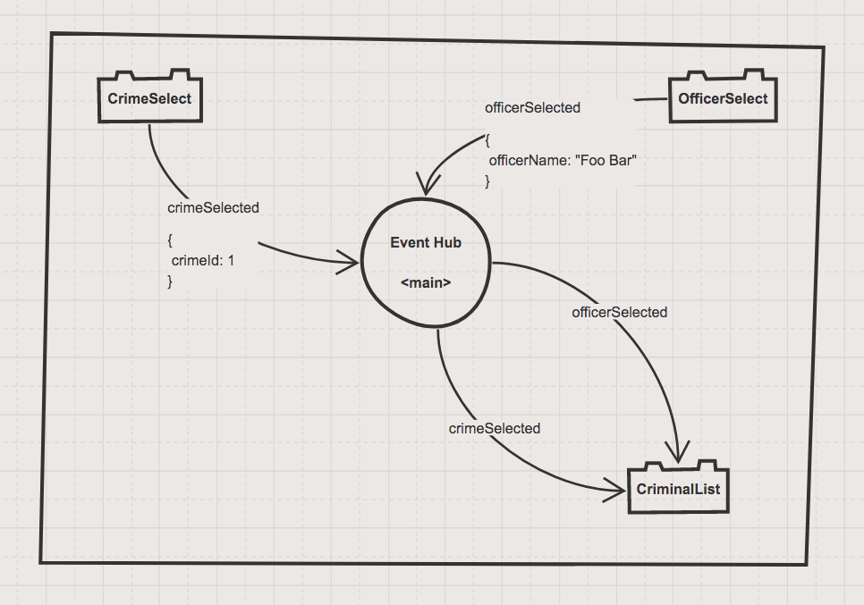
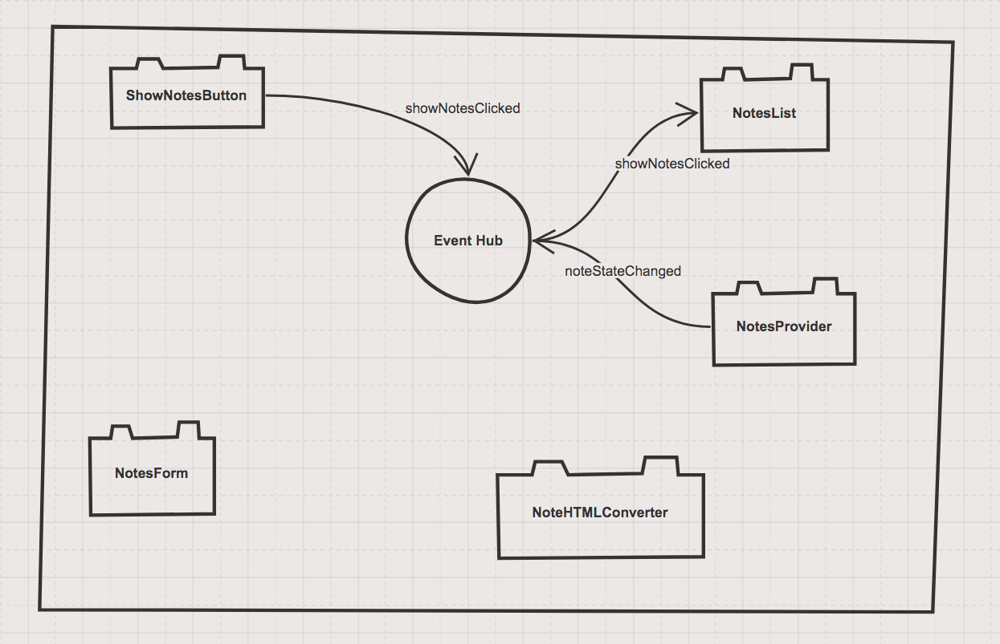

# Week 4 Notes

## Day 1

o Assign Component Decoupling Scrimba tutorials in the morning.

o Live coded chapter 4 at 10:30

o Lab time all afternoon

* Having students watch the YouTube video and the Scrimba tutorials before live-coding made a noticeable difference. They had some inkling of the vocabulary already and had seen it in action. Their questions, while still basic, were relevant and used the right terms.
* Students all initially went into their own rooms for quiet, focused time to play around with the code.
* By mid-afternoon, small groups started to form again to discuss and share knowledge.

### Session Video

[Introduction to Custom Events](https://drive.google.com/file/d/1Tt40TL9gxZmecEWkVMxAHkHXVjrTupV8/view?usp=sharing)

## Day 2

o Make students focus on State Fair at 9:30

o Arresting officers at 14:45

* I started the day answering questions in the main room. That lasted about 30 minutes, then I sent them off for more lab time. Told everyone to focus on doing State Fair to have laser-focused practice with custom events.
* By the end of the day, the 19 of the 26 students had completed the non-challege chapters. Three more were making progress. 8 of them had completed the challenge chapter.
* At 14:45 I live-coded Arresting Officers chapter and it was immediately obvious who hadn't started State Fair like I had asked them to. Those students asked very basic questions about syntax and implementation. After just a few of those questions, I told everyone - again - to do State Fair and that I was going to focus on the rest of the implementation of Arresting Officers.
* 🌟🌟🌟 Make sure you have sketchboard.io the **entire** time you cover this chapter. Draw a dependency graph between components, and then draw an event flow diagram to visualize the custom events.🌟🌟🌟

### Session Video

[Using custom events for Officer select](https://drive.google.com/file/d/1W_3AV5QkftaZEgBr6Xz4mTRv6E9qxzOe/view?usp=sharing)

## Day 3

o Notes API chapter at 9:15

* Live-coding Notes API took just under two hours, with two 10-minute breaks during that time.
* 🌟🌟🌟 Make sure you have sketchboard.io the **entire** time you cover this chapter. Draw a dependency graph between components, and then draw an event flow diagram to visualize the custom events.🌟🌟🌟

### Session Video

[Notes API and json-server](https://drive.google.com/file/d/1CnEUF1PORCSh8hMC1_ba21nEnLebyCmi/view?usp=sharing)

## Day 4

o Implementation of `noteStateChanged` custom event at 13:00

* Lab time all morning
* After lunch, I live-coded how to use the `noteStateChanged` custom event that is dispatched by the data provider so that every time a new note is entered by a detective, it immediately shows up the notes list component.
* At 14:30, we popped into every breakout room and had a quick check in with everyone.

[Data providers dispatching state change events](https://drive.google.com/file/d/1U6xQB3JS-2MOWHW_XZkPfcweo1lAqBmv/view?usp=sharing)

## Day 5

o Horrible childhood picture contest at 9:15

* Lab time all day after contest.
* Had Kristen, James, and I split up the students and we went to everyone's breakout room to see if they had achieved the following things...
    1. Saving notes in Glassdale
    1. Saving entries in Daily Journal
    1. Full Package Ticket in State Fair project
* Students, with a couple exceptions were either fully caught up with those items, or were very close to finishing them.
* Since everyone was caught up, I called them into the main session at the end of the day for a cheerleading session, telling them how proud I was of their progress, etc. I told them that on Monday, their job was to try to implement chapters 8 and 9, and that I would live-code them on Tuesday.

