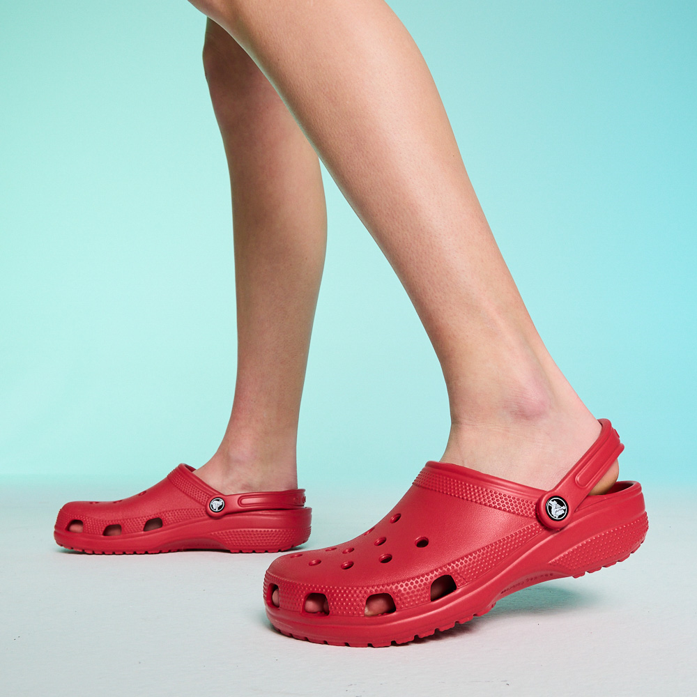

# Chuegy Crocs



> **_Hey sis_**, I’m looking for a someone to fix this application of mine. Low key just threw it together myself thinking I was the CEO of code.
>
> > Big yikes. It’s giving… broken. I really just wanted a smol app to give me a detailed list of my croc collection.
>
> This ain’t it, chief. I took the L after the flips. Can you give this a glow up for me? Thanks fam.

## Here's what I was trying to do:

```
ALL CROCS:
---------------------------------
        White and Yellow Classic Pokemon Classic Clog
        Black and Purple Taco Bell Mellow Slide
        Black and Multicolor Bistro Graphic Classic Clog
        Silver Classic Metallic Classic Clog
        Multicolor Printed Camo Classic Clog
        Yellow Bumble Bee Classic Boot
        Red Sonic the Hedgehog Classic Clog
        Pink and Multicolor Lisa Frank Unicorn Classic Clog
        Brown Western Classic Boot
        White Neo Puff Boot
        Blue and Purple Out of this World Slide
        Black Classic Cozzzy Slide
        Multicolor Mega Crush Realtree Crush Sandal
        Pink Hotpink Mega Crush Sandal
        White Bayaband Flip
        Multicolor Animal Print Flip
        Black Winter Puff Boot

STYLES:
---------------------------------
FLIP CROCS:
        Bayaband
        Animal Print

PUFF BOOTS:
        Neo
        Winter

CRUSH SANDALS:
        Mega Crush Realtree
        Hotpink Mega

CLASSIC CLOGS:
        Classic Pokemon
        Bistro Graphic
        Classic Metallic
        Printed Camo
        Sonic the Hedgehog
        Lisa Frank Unicorn

CLASSIC BOOTS:
        Bumble Bee
        Western

SLIDES:
        Taco Bell Mellow
        Out of this World
        Classic Cozzzy
```

### Bonus!

Can you modularize this code??
