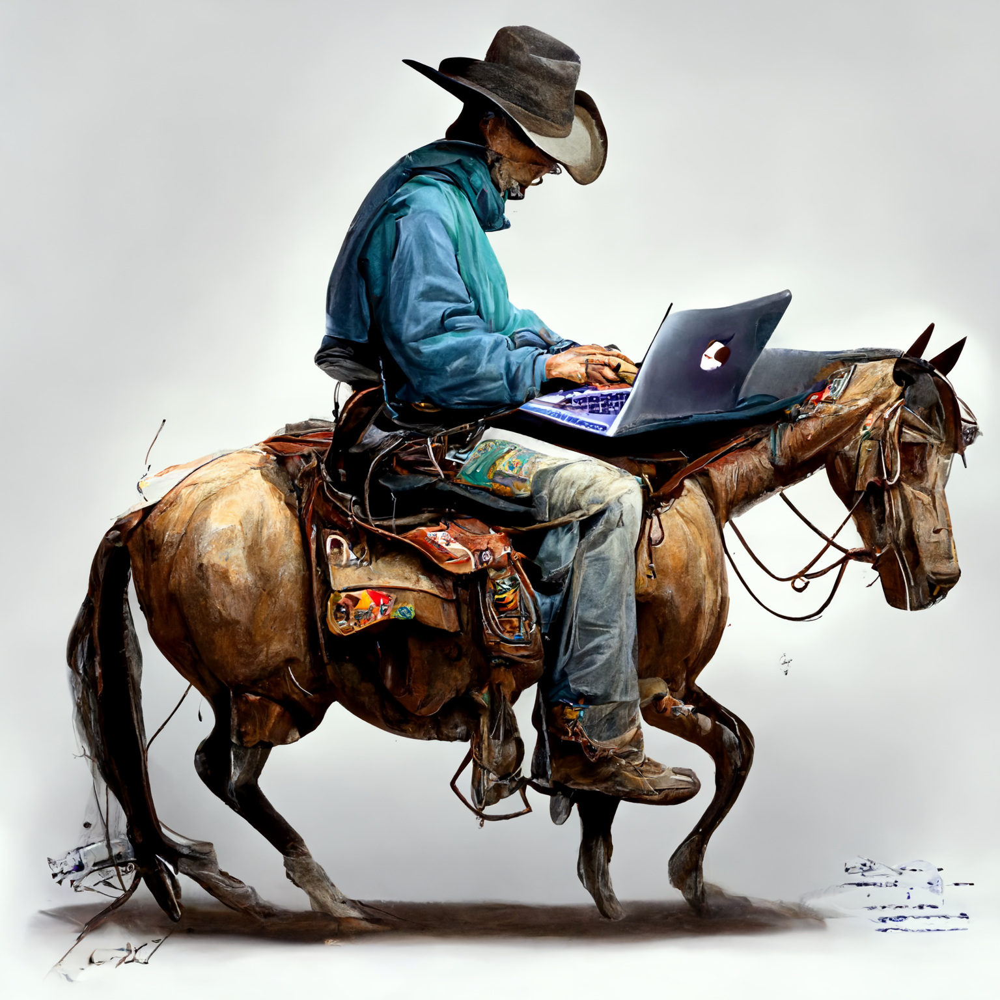

# Welcome to Bug Wrangler Ranch



This first self-assessment is for you to hone several Core Skills that you need as a software developer.

Taking your time now to be thorough, reflective, patient and curious will give you the foundation to be successful throughout the rest of this course and your career.

If you rush this, or think of it as a test to be "passed", then you will already be on the wrong path.

## Description

Slim Jenkins offers a vacation package for people who have always wanted to join a cattle driving team across the American Midwest.

He calls it the **Kansas Slim's Cattle Adventure**.

People join a team of experienced drovers who will train them in the basics of herding cattle and driving them across hundreds of miles to their destination at Old Red's Ranch.

Unfortunately, someone gained access to the code that produces an outline of the adventure to the paying customers, so Slim has hired you to examine and fix the code.

## Learning Objectives

Here are your learning objectives for this self-assessment.

1. Able to use the debugger to step through existing code to discover root causes of bugs.
2. Demonstrate learning efficiency by researching concepts you haven't seen before using your peers, instructors, and the World Wide Web as resources.
3. Awareness of when you need help, and then seeking it out.
4. Drawing a dependency graph for a project.
5. Drawing a sequence diagram for a project.
6. Attention to detail.

## Vocabulary and Learning Review

You will discuss your challenges and learning growth with an instructor when you have done the following steps. Your instructional team will ensure that your vocabulary is solid so that you can impress hiring managers when you are interviewing.

> _Remember, everything we do is to help you be successful getting a job and producing at a high level when hired._

* Produced a dependency graph for the project
* Drawn a sequence diagram for the algorithm of the project
* Discovered all of the errors
* Done your best to try to fix them

## Example Output

If you are able to fix all of the bugs, you will output similar to what is below.

```sh
************************************************
**  K A N S A S   S L I M ' S   C A T T L E   **
************************************************

\|/         (__)
     '------(oo)
       ||   (__)               \|/
       ||w--||     \|/
   \|/
            \|/                     (__)
                             '------(oo)
                               ||   (__)
                               ||w--||     \|/

You will be accompanying 5 drovers as they drive 50 cattle to Old Red's Ranch for grazing

The herd is made of up the following types of cattle:
Ankole-Watusi,Brown Swiss,Brown Swiss,American Angus,Brown Swiss,
Ankina,American Angus,Ankina,Brown Swiss,Ankole-Watusi,Brown Swiss,
Brown Swiss,American Angus,Ankina,Ankole-Watusi,Brown Swiss,Brown Swiss,
Ankina,Brown Swiss,Ankina,Ankole-Watusi,Brown Swiss,Brown Swiss,
Ankole-Watusi,American Angus,Brown Swiss,American Angus,Ankole-Watusi,
Ankole-Watusi,American Angus,Ankina,Ankina,Ankina,Ankole-Watusi,
American Angus,Brown Swiss,American Angus,Brown Swiss,American Angus,
American Angus,Ankina,Brown Swiss,American Angus,Ankina,Brown Swiss,
American Angus,Ankole-Watusi,Ankina,American Angus,Brown Swiss

Here is the team of drovers you will be joining
        * Melvyn Hethron
        * Yancy Gresley
        * Willabella Attarge
        * Ynes Gyenes
        * Farlie Spere


Your journey will take you through the wildness of the American Midwest and across the following terrain
        * forest
        * plain
        * river
        * mountain
```