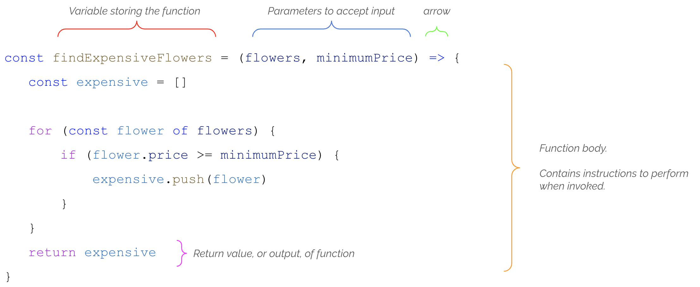

# Functions

Functions are the heart and soul of JavaScript developers. Everything that a modern application does is done in a function. An application can have hundreds, possibly thousands, of tasks that it must perform to solve a problem or provide a service to humans. Each one of those tasks is in a function.

**You can think of a function as a container for code that completes a specific task.**

Functions are the first major hurdle of learning software development. One of the main reasons is that you need to understand the difference between a function definition and running the function.

It is not sequential, which is how most humans consume and understand text and instructions. The key to understanding is seeing them used in many different contexts.

Beginners often ask questions like the following.

> "How many possible functions are there? Can I just memorize them all?
>
> "When do I need to write a function?

The answer to the first question is that it is the wrong question - because there are an infinite variety of functions. The reason for this is the answer to the second question. You write functions when you need some code to run to help solve your problem.

The key is understanding the problem, and then knowing the algorithm to solve it before you write any code.

## Anatomy of a Function

Think of functions like minions that work for you. Each minion is designated a specific task that makes up your life.

* Buy groceries
* Pay bills
* Prepare meals
* Do math stuff when you don't want to (_which, if we're being honest, is most of the time_)
* Take the car to the repair shop

## Functions for Beginners

Many students in the past have found the [JavaScript Functions: Explain Like I'm Five](https://dev.to/sumusiriwardana/javascript-functions-explain-like-i-m-five-5009) article a helpful resource to understand the basics. Read it now. Read it tomorrow. Keep coming back to this entire chapter over and over again to keep reinforcing your vocabulary and basic concepts.

It's difficult to express how critically important it is for you to understand functions before you try any further concepts in this course like events, asynchronous code, modules, forms, and component-based applications. Functions are the foundation of all of those concepts.

