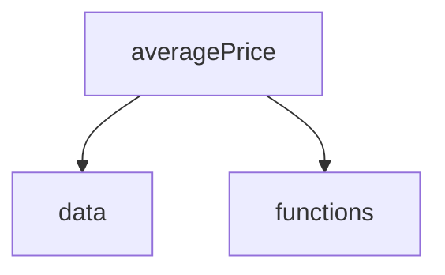

# Visual Layout for a Project

As a beginner, your working memory is incapable of storing much information about these projects that you are working on. Very senior developers, whose brains have highly mature and sophisticated neural connections built up after years of training can visualize complex patterns quickly.

You cannot.

Even senior developers have a limit to their working memory.

This is why professional developers use graphs to visually represent how a project, a database, or a complex cloud-based system is structured and how the data flows. Humans are able to quickly understand complex system if there is a visual that gives you the overall picture.

## Dependency Graph

Your first visual is a dependency graph. This shows how modules are depdendant upon other modules in the project and can give you a quick reference of how the data and logic flows through the system.

This is a simple project for drawing dependencies. The main module imports things from the data module, and it also imports things from the functions module.

data does import anything from functions. Functions does not import anything from data. Neither functions not data import anything from properties.

## Sequence Diagram for Detailed Algorithm Visualizations

One of your four Core Skills is [algoritmic thinking](https://www.wikihow.com/Think-Algorithmically). A person who cannot think algorithmically cannot be a high value software developer.

A detailed way to visualize an algorithm for a problem is with a **Sequence Diagram**. This type of diagram shows all of the actors _(i.e. Properties, Data, and Functions)_ but also shows the interactions between them, and the precise order in which those operations happen. It also visualizes when data is iterated and what happens during iteration.

It is a visualization of your algorithmic thinking.

### Favorite Tools of Learners Past

1. The [sequencediagram.org](https://sequencediagram.org/) site is a wonderful cloud-based option to build your sequence diagram.
2. The [draw.io VS Code Extension](https://marketplace.visualstudio.com/items?itemName=hediet.vscode-drawio) allows you to have a local file in your project that contains your diagram.

### Example Diagram

