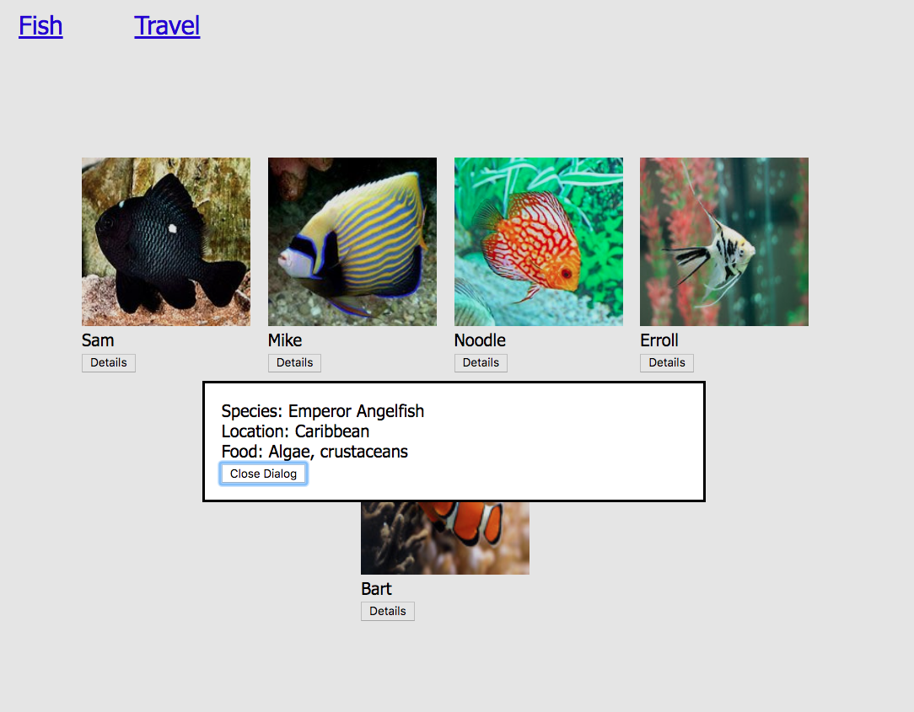

# Martin's Minimal Mockup

> After an "urgent" email from Martin, you have agreed to meet him again at the coffee shop. He has "critical information" to show you that he "thought he made clear the first time we talked." Just thinking about the email makes you sigh heavily as you pull into a parking spot and then head towards your meeting.
>
> You can the shop and see Martin in the back furiously scribbling on a legal pad, and head over to meet him. He greets you without smiling and turns his legal pad towards you, and blurts out, "We have a problem with the site."
>
> You blink, and say, "Ok, what's the issue?"
>
> "I said I wanted a nice, clean site and right now I think it's way too 'busy'. Here's what I want."
>
> He takes his pencil and makes a stabbing motion towards the legal pad and says, "There's too much information on the page when it shows up. I was on the 'For the Halibut' web site and I noticed that they had these buttons that I could click on which showed these little windows in the middle of the screen."
>
> "Oh, those are called dialogs," you interject patiently.
>
> He glances at you quickly and nods his head in apparent understanding and continues, "So I'd like to have these 'dialogs', as you call them, show the species, location harvested, and the food they eat show up when the button is clicked."
>
> He points again at his legal pad, "I kind of drew it up for you so that you would know how this all works."
>
> You bristle internally. Hopefully it's not obvious to him. Then you realize that he's not really paying attention to you, as so much as he's lecturing you.
>
> You glance at his mockup.
>
> "See?" he says. "Much more minimal and clean, just like I originally wanted!" He forces a smile as if that wipes away his condescension.



> "I see now," you say as calmly as you can. "I can make those changes today."
>
> "That would be great," Martin says, emphatically. "Send me an email when it's ready to go."

## HTML Dialogs

Implementing a dialog box is a straightforward process in the browser. There is a `<dialog>` element implemented in the Google Chrome browser. It's not fully supported in all browsers yet, but since we're using Chrome, we'll go ahead and use it.

First, each of your fish components needs to have a corresponding `<dialog>`

```html
<!-- Hey look! It's an HTML representation of one of Martin's fish -->
<div class="fish">
    <div>
        
    </div>
    <div class="fish__name">Bart</div>
    <div>
        <button id="button--bart">Details</button>
    </div>

    <dialog class="dialog--fish" id="details--bart">
        <div>Species: Orange Clownfish</div>
        <div>Location: Caribbean</div>
        <div>Food: Algae, crustaceans</div>

        <button class="button--close" id="close-bart">Close Dialog</button>
    </dialog>
</div>
```

Create a new JavaScript module named `dialogs.js` whose Single Responsibility will be to manage the showing and hiding of the digalog windows in the application.

Place this code at the top of the file. This code requires no modification if you create all the dialog elements with the code above.

```js
const allDialogs = document.querySelectorAll(".dialog--fish")
const allCloseButtons = document.querySelectorAll(".button--close")

for (const btn of allCloseButtons) {
    btn.addEventListener(
        "click",
        theEvent => {
            for (const dialog of allDialogs) {
                dialog.close()
            }
        }
    )
}
```

Next, create a function whose Single Responsbility is to define event listeners. These are listening for the event in the browser of a user clicking on one of the button.

```js
const initializeDetailButtonEvents = () => {
}
```

Add one of these for every fish that you create. Replace the CSS selector, but nothing else needs to change. Here's the first event listner. When the user clicks on the "Details" button underneath Bart's image, it will show the dialog element you created for Bart in the HTML above.

```js
const initializeDetailButtonEvents = () => {

    // Show Bart's details when the button is clicked
    document.querySelector("#button--bart").addEventListener(
        "click",
        theClickEvent => {
            const theDialog = document.querySelector("#details--bart")
            theDialog.showModal()
        }
    )

}
```

Lastly, you need to export this function, so that the main module can import it and invoke it. Place this code at the very bottom of the `dialogs.js` file.

```js
export default initializeDetailButtonEvents
```

Now import the function into `main.js` and invoke it.

```js
/**
 *  Import the initializeDetailButtonEvents function
 *  reference and then invoke it
 */
import initializeDetailButtonEvents from './dialogs.js'

initializeDetailButtonEvents()
```

Now refresh your browser and click on Bart's detail button.