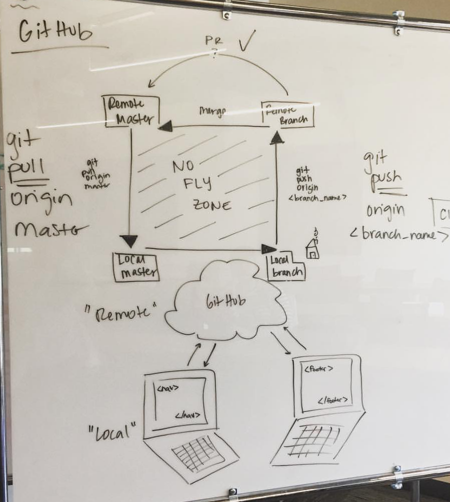

# The Github Workflow for Team Development



## Step One

Everyone must clone the boilerplate repository that your instruction team provided.

## Step Two

> **Note:** For all group projects except the first one.

If the repository does not have a `.gitignore` file already in it, one person on your team must create a `.gitignore` file before you start any work on any feature. Once the file is created on the `master` branch, that teammate should add, commit, and push up to Github with `git push origin master`.


## Step Three

Once you have a `.gitignore` file on `master` branch, you should start planning your project based on the guidelines from your instruction team. Once everyone has decided on what feature they will start working on, each teammate will create a feature branch with the following command.

```
git checkout -b properlyNamedFeatureBranch
```

## Workflow Overview

While you are working on a feature, you commit to a branch, never to master. Once you are certain that your work is complete, you need to submit your work to the team to be approved. Having at least one more person look at your code before it is merged into the master branch achieves several goals.

1. Catch common syntax errors.
1. Provides a different perspective that can strengthen the code if enhancements are suggested.
1. Allows other teammates to have a greater knowledge of system.

Github enables you to share your code with your teammates for approval, and get it merged into the master branch.

## Push your Work

Push your branch to Github.

```sh
git push origin newBranchName
```

## Create a Pull Request

To create a pull request, follow these steps.

1. Click the _Pull Requests_ tab on your Github project.
1. Click the _New Pull Request_ button.
1. Select your branch to compare to master.
1. Provide an explanation for your pull request.
1. Provide steps that your teammate can use to test it.
1. Submit Pull Request.


## Review and Approval

Your teammate will review your code, provide comments or suggestions if necessary. Once you and your teammate are happy with the code, you will receive a thumbs up.

If you are reviewing another teammate's code, you will pull down their branch.

```sh
git fetch --all
git checkout theirBranch
```

Then follow the steps that they provided to test the code.

## Merging

After your pull request is approved, you can open it on Github and click the merge button.


## A Few Tips

### Merge master into your current branch
If you are on a branch and a teammate created something you need, you can pull down master and then merge the master into your branch to get access to that new code.

```sh
git add .
git commit -m "commit message"
git checkout master
git pull origin master
git checkout NAMEOFYOURBRANCH
git merge master
```

### Tracked files follow you.
If you are working on two branches (maybe a style branch and a feature branch), your tracked files will follow you, branch to branch. To avoid that, make sure to add/commit before you check out to a different branch.

### Fetch vs. Pull
When a teammate needs you to check their branch, you need to get that branch's changes to your local machine -
```sh
git fetch --all
git checkout BRANCHNAME
```
If a teammate makes changes on that branch and pushes them back up to Github, you already have their branch on your local machine. You just need to get their updated changes -
```sh
git pull origin BRANCHNAME
```
