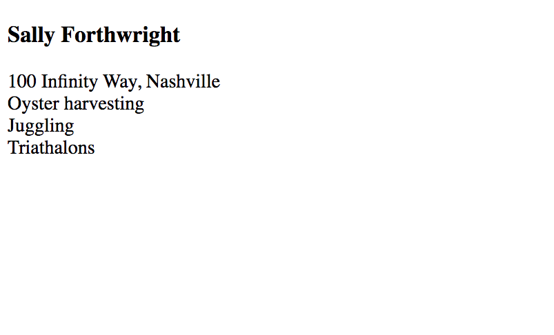

# HTML Components

## Why Are You Learning This?

Thinking of applications and web page as a collection of independent components is the foundation of modern web applications that you use all the time.

* Snapchat
* Instagram
* Twitter
* Facebook
* Etsy
* Pinterest

All of these applications are written by teams of software developers who define the individual components that are used throughout their application. They then write each component seperately and then compose them in interesting ways and make them work together.

## Visual Review of Semantic Elements

What is a component and how do HTML elements apply to the concept? Look at the image below to see an overview of semantic HTML elements and how they are intended to be used together.


## CSS Naming Conventions

Styling components intelligently can be handled through naming your classes according to the component name. One popular convention is the [BEM method](http://getbem.com/introduction/).

If you were creating an HTML component that represents you, here's an example of how the code would look using HTML semantic elements and BEM class names.

```html
<main>
    <!-- Parent biography component -->
    <article class="bio">

        <!-- Child biography component -->
        <section class="bio__name">
            <h1>Sally Forthwright</h1>
        </section>

        <!-- Child biography component -->
        <section class="bio__address">
            100 Infinity Way, Nashville
        </section>

        <!-- Child biography component -->
        <section class="bio__interests">
            <div class="interest">
                Oyster harvesting
            </div>
            <div class="interest">
                Juggling
            </div>
            <div class="interest">
                Triathalons
            </div>
        </section>

    </article>
</main>
```

Each of those components can be styled individually with a clear, concise name that also provides some semantic context when looking at the CSS file. Before you style them, all you have is structure as some very basic, default styles that the browser applies to your elements.



Now you can style any HTML component with a class of `interest` and they will all look the same.

```css
.interest {
    border: 1px dotted crimson;
    padding: 1em;
    margin: 0.5em;
}
```


## Grid Layout with Flexbox

Flexbox is a tool that you can use in CSS to take the structure of your HTML and apply interesting layouts for it. One of the most common layout type is a grid, and it's straightforward to do with Flex.

Unfortunately, these Flexbox properties are hard to remember, so you should come back to this chapter and review them whenever you need to use Flexbox to make a grid layout.

You want those three interest to be all in the same row instead of each one being an entire row all by itself. The first thing you need to do is apply a style to the component in which all of those interests are contained. In your case, it's the `<section class="bio__interests">` component.

```css
.bio__interests {
    display: flex;  /* Display the child items in a Flex layout */
}
```


The `display: flex` property on a parent component immediately creates a row and puts all of the child elements in it. However, you're not quite done.

Add some more interests for Sally.

```html
<div class="interest">
    Killing ants
</div>
<div class="interest">
    Melting stuff
</div>
<div class="interest">
    Coloring
</div>
<div class="interest">
    Sleeping
</div>
<div class="interest">
    Singing
</div>
```


The default behavior is to put **all** child components into a single row, so you eventually run out of room if there are too many. You need to tell the browser that you want it to figure out how many can fit in a row, and when there's no more room, to create a new row.

```css
.bio__interests {
    display: flex;
    flex-wrap: wrap;  /* Let the rows wrap if there are too many */
}
```


Close, but you may not like that the rows are not aligned. The browser stops at figuring out how many will fit in the row. You have to provide the instructions for how to align them.

```css
.bio__interests {
    display: flex;
    flex-wrap: wrap;
    justify-content: space-evenly; /* Evenly space the child elements */
}
```


Sooooooo close, but the boxes aren't all the same size which is distracting noise to the human brain. We find it much more pleasing when things line up evenly.

```css
.interest {
    flex-basis: 16%;  /* Make each child element the same width */
    border: 1px dotted crimson;
    padding: 1em;
    margin: 0.5em;
}
```


The final touch is to center align the text in each of the interest boxes.

```css
.interest {
    flex-basis: 16%;
    border: 1px dotted crimson;
    padding: 1em;
    margin: 0.5em;
    text-align: center; /* Center align the text in the boxes */
}
```


## Project: Fish in my Aquarium

Let's build a couple HTML pages whose user will be an avid rare fish collector who maintains a sophisticated tank in his home. His name is Martin. Martin meets you at a local coffee and explains what he needs to have on his web site.

> "So nice to meet you finally after all of those emails. Please, grab a chair," says Martin. He uses his leather loafer to gently nudge a chair slightly away from the table. He subtly waves his hand towards the chair in invitation.
>
> You smile, pull the chair and out and start to slide your computer bag from your shoulder.
>
> "Thanks, Martin."
>
> You put your bag on the floor next to the chair and put your cup of coffee in the middle of the table, not far from Martin's. You note briefly that Martin got the largest size that the coffee shop offer, and it appears to be a latte.
>
> "I'm glad to be able to help you build a site to track your amazing fish. When you sent me that email the other day listing all the ones that you have collected, I spent all night researching them. It was fascinating!" you exclaim.
>
> Martin smiles widely, obviously pleased that you appreciate his achievements with his hobby.
>
> You continue to pull your notebook and a pen out of your bag, and ask, "So you said that you wanted two different pages for this site, one that lists the fish you currently own, and another one that lists all the places that you've visited to collect the fish..."
>
> "Harvest the fish," Martin interjects with a forced smile.
>
> "Sorry, where you harvested the fish." You restrain an eye roll.
>
> You shift in your seat because the hard, wooden chairs are already becoming uncomfortable, and continue, "Is there anything you've thought of based on the example sites I sent you?"
>
> Martin leans forward and put his hands on the table, "Actually yes. On the _'Fish Upon A Star'_ site, they had this content on the right side of the list of fish that explained the process of keeping the tank clean and the water at the right salinity and temperature. I'd love to have that so I can put my thoughts in there."
>
> You take notes as he talks and make sure that you jot down the you will need an `<aside>` element on that page.
>
> "All the sites had a navigation bar at the top. I'd like to have a navigation bar. Were you planning on having a navigation bar?" It's clear the way Martin places an emphasis on _navigation bar_ that he's proud that he knows what that's called.
>
> You smile slightly and say, "Oh absolutely. Any web site that has more than one page would definitely need one of those."
>
> Martin smiles smugly and says, "I thought so. Just make it look clean and minimal."
>
> _"Martin's been doing a little research on web stuff,"_ you think as you pointedly write down 'Must have nav bar' in your notes.
>
> He patiently waits for you to finish jotting down these important notes, and then says, "Lastly, the _'Buoys and Gills'_ site had a part that listed travel tips for people who love to scuba and harvest fish. On the page that lists all of the out-of-the-way places I've visited, I would like to provide a few quotes to help people."
>
> "Where would you like that to appear?" you ask briskly.
>
> Martin responds, "Right under the navigation bar, and before the list of locations."
>
> You note that in your journal, and ask Martin if there's anything else he'd like to be added.
>
> "No, I think that's enough to go on for now. Just make sure it's tasteful, since I'm fairly sure that I'll get lots of visitors to the site."
>
> _"Of course you will,"_ you think as you smile and say, "I'll make sure all those people have a great experience on your site."
>
> You both shake hands and you head back home to start work on the site.

### Discussion Points

1. What are the components?
2. What should be the class names for each?
3. Which semantic tags should we use?
4. How can we use Flexbox to build a better layout of fish and locations?

### Time to Build

Your instruction team will lead the class through the construction of the this site. You may follow along, or you can just close your computer and watch what gets built and offer your suggestions.


## Additional References

1. [CSS Tricks - BEM](https://css-tricks.com/bem-101/)
1. [Introduction to BEM - A front-end methodology](https://www.youtube.com/watch?v=IO-4Z32O--c)

## Practice: Congressional Representative

You're going to create an HTML component to represent a political candidate. Specifically, the representative of your Congressional district. Visit the GovTrack site link below, enter in your home address, and you'll find basic information about your representative.

[GovTrack - Congressional District Map](https://www.govtrack.us/congress/members/map)

1. In your HTML, create an `article` tag that will serve as your main representative component. Give the element a unique identifier.
1. In this component, create a sub-component for basic information using the `section` tag. In this section create elements for the representative's image, name, district info, and political affiliation.
1. Beneath the basic information, you will create a sub-component, using a `section` tag, to list any committees the candidate is serving on.
1. The last component will hold links to any legislation that your representative has enacted.

Make sure you use good BEM-style class names for each element in your components. Put a comment above each component explaining what it is.

## Practice: Coffee Houses of Nashville

> The learning objective for this practice exercise is to use `display:flex` on two elements, and then add additional CSS properties to achieve a desired layout.

```html
<header class="pageHeader">Coffee Houses of Nashville</header>

<article class="list">
  <section class="shop">The Jam</section>
  <section class="shop">The Well</section>
  <section class="shop">Red Bicycle</section>
  <section class="shop">Crema</section>
  <section class="shop">Frothy Monkey</section>
  <section class="shop">8th &amp; Roast</section>
  <section class="shop">Bongo Java</section>
  <section class="shop">Flatrock</section>
  <section class="shop">Fido</section>
  <section class="shop">Steadfast Coffee</section>
  <section class="shop">Dose Coffee</section>
  <section class="shop">Sam &amp; Zoes</section>
  <section class="shop">Slow Hand Coffee</section>
  <section class="shop">The Horn</section>
</article>
```

From that HTML, use Flexbox to achieve this layout. You don't need to add the border. It's been added in this example to highlight the alignment and spacing you're shooting for.


## Congressional Representative UI/UX Challenge

**This is an optional challenge once you meet the requirements above. Make a new GitHub branch for this challenge.**

> UX CONCEPT: Web pages should be designed in such a way that they are easy to scan.

How to improve scannability?
* Create visual hierarchies. What is the most important information on the page? What is supportive information? Can you use bulleted lists?
* Use universally accepted conventions: These may include logo/tagline position, buttons/links, social networking options, etc.
* Break a page into clearly defined sections.
* Make it obvious what’s clickable.

Review the page you just created. Based on the items above, identify some opportunities to improve the UI/UX. Refactor your page to improve the usability. You may add semantic tags, content, and styles.

Background color - if you add a background color/image, ensure the copy (text color) has good contrast and is legible.


## Coffee Houses UI/UX Challenge
**This is an optional challenge once you meet MVP. Make a new Github branch for this challenge.**

Creating visual hierarchies
1. Add an address, phone number, and website link to each coffee house (you may use mock/fake data)
2. Using semantic HTML and CSS, style each coffee house component with the goals of easy scannability. At a minimum, you will emphasize the name of each shop and make the website link clearly clickable.

Background color - if you add a background color/image, ensure the copy (text color) has good contrast and is legible.

