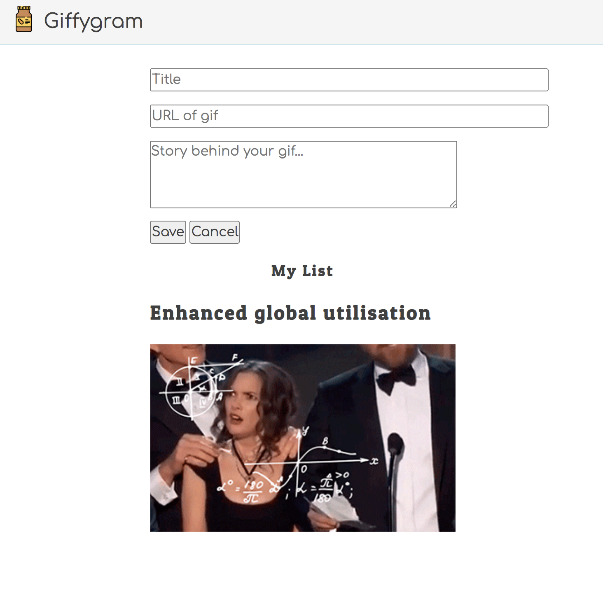

# Giffygram: Social Animation Platform

Perhaps you've used other social media platforms that allow users to share beautiful pictures with each other. An opportunity that you've discovered is that none of these platforms specialize in Gif animation images. You went to some angel investors and convinced them that you have a solid business plan and that people around the world have been craving an app for sharing only gifs.

## Minimum Viable Product (MVP)

MVP is an acronym that you are going to hear many times here at NSS and when you are working as a professional. Very briefly, MVP is "Minimum Viable Product". The absolute minimal amount of features needed for an application to be put in the hands of users to get feedback.

Here are some example MVP features.

* Authentication
* Creating a resource
* Viewing the resources
* Organizing resources

If you build those, you can have people use it. They can start providing you with feedback and additional feature requests while you are building the features that you want to add, but weren't needed for MVP.

You will be guided through creating the components for this application, how to think about how they work together to make a good user experience, and how to manage the state of the entire application along with the individual components.

Here's the MVP that you will be building for Giffygram.



## Setup for Giffygram in the Terminal

Now it is time to set up the initial directories for your application code. With `mkdir` and `cd` create the following directory structure.

```sh
mkdir -p ~/workspace/giffygram/src/scripts
```

The `~` character represents your home directory. You can quickly go to your home directory by typing in `cd` and pressing enter.

The `-p` flag will create nested directories, but only if they don't exist already.