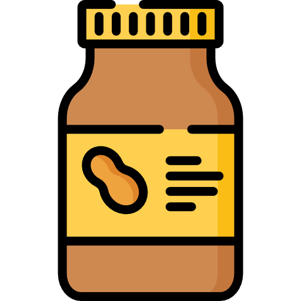

# Navigation Bar Component


## Learning Objectives
You should be able to:
* demonstrate how to import a function from one module to another
* explain what data type a function returns
* identify where a string is injected


## Setup

1. Be in the `giffygram/src` directory and run these commands
    ```sh
    mkdir images
    mkdir scripts/nav
    touch scripts/nav/NavBar.js
  
    ```

1. Right-click the image below and save it in `src/images` directory.

    

1. Right-click the image below and save it in `src/images` directory.

    

1. Copy and paste the following code into the `NavBar.js` file.
    ```js
    export const NavBar = () => {
        return `
            <nav class="navigation">
                <div class="navigation__item navigation__icon">
                    
                </div>
                <div class="navigation__item navigation__name">
                    Giffygram
                </div>
                <div class="navigation__item navigation__search">
                    <input type="text" id="postSearch" placeholder="Search posts..." />
                </div>
                <div class="navigation__item navigation__message">
                    
                </div>
                <div class="navigation__item navigation__logout">
                    <button id="logout" class="fakeLink">Logout</button>
                </div>
            </nav>
        `
    }
    ```
## Include Additional Components

1. Open `main.js` file
1. Import the `NavBar.js` file

Include a function that returns the NavBar.
```js
const showNavBar = () => {
    //Get a reference to the location on the DOM where the nav will display
    const navElement = document.querySelector("nav");
	navElement.innerHTML = NavBar();
}
```

Within startGiffyGram function, invoke `showNavBar`
```js
  showNavBar();
  showPostList();
```


## <h3 id="Giffy-Practice">Practice: Footer</h3>

Create a footer component for your application that contains copyright information. Render it below the `PostList` component.

Look in the `styles/footer.css` file to see a style that you can apply to your footer element.