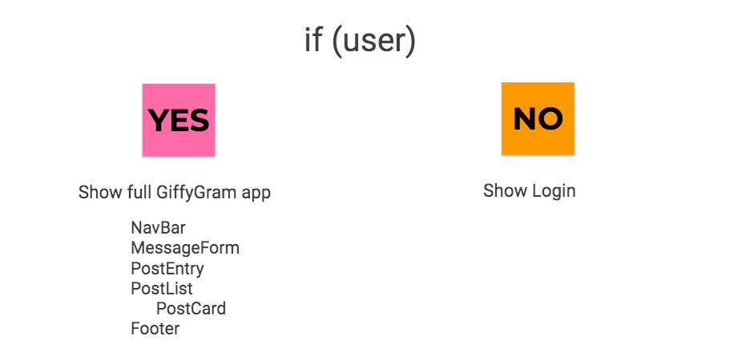

# Posts List and Cards

## Learning Objectives
You should be able to:

* describe how functions get exported and imported into different modules
* differentiate between assignment with a single `=` and appending with `+=`

Our application is going to have two main display paths depending on the existance of a user.



Our full app will be displayed from the GiffyGram component. Later we will create the login component.

Consider what we did in Martin's Aquarium to display the fish. We needed a FishList component and a Fish (card) component. GiffyGram will import the list. The list will display the cards.

### Create the HTML Representation of a single post

> #### `src/scripts/feed/Post.js
```js

  export const Post = (postObject) => {
    return `
      <section class="post">
        <header>
            <h2 class="post__title">${postObject.title}</h2>
        </header>
        
      </section>
    `
  }
```

The list will need access to the `getAllPosts` method from the `DataManager.js` module. It will also need the `Post.js` you just created.

> #### `src/scripts/feed/PostList.js
```js
import { getAllPosts } from "./../../store/index.js";
import { Post } from "./Post.js";

export const PostList = () => {
  //where does the getAllPost function come from?
  const allPosts = getAllPosts();

  //Declare a variable to hold on to post HTML representations
  let giffyGramHTML = "";
  //Loop over the array of posts and for each one, invoke the Post component which returns HTML representation
  for (const postObject of allPosts) {
    //what is a postObject?
    giffyGramHTML += Post(postObject)
  }
  //finally return the built up block of HTML to GiffyGram
  // What kind of data is being returned?
  return giffyGramHTML;
}


```


> #### `giffygram/src/scripts/GiffyGram.js`

```js
// Can you explain what is being imported here?
import { PostList } from "./PostList.js"

// This function is being exported. What module is importing it?
export const GiffyGram = () => {

    return PostList();
}
```

Refactor `main.js` to invoke the GiffyGram function.

> src/scripts/main.js
```js
/**
 * Main logic module for what should happen on initial page load for Giffygram
 */


// Can you explain what is being imported?
import { GiffyGram } from "./GiffyGram.js"

//Get a reference to the location on the DOM where the app will display
const applicationElement = document.querySelector(".giffygram")

/*
    This function performs one, specific task.

    1. Can you explain what that task is?
    2. Are you defining the function here or invoking it?
*/
const renderApp = () => {
    applicationElement.innerHTML = GiffyGram()
}

// Are you defining the function here or invoking it?
renderApp()
```

Start your Web server with the serve command in the terminal. Make sure you are in the giffygram/src directory when you do it. View your app in the browser.


## Displaying More Properties as HTML

In the next couple chapters, you will see more comprehensive code for displaying the properties of a Post as HTML, but you are encouraged to give it a shot first.

Open `src/scripts/feed/Post.js` and add more HTML structure, and interpolate the `description`, `timestamp`, and/or the `userId` property in it.