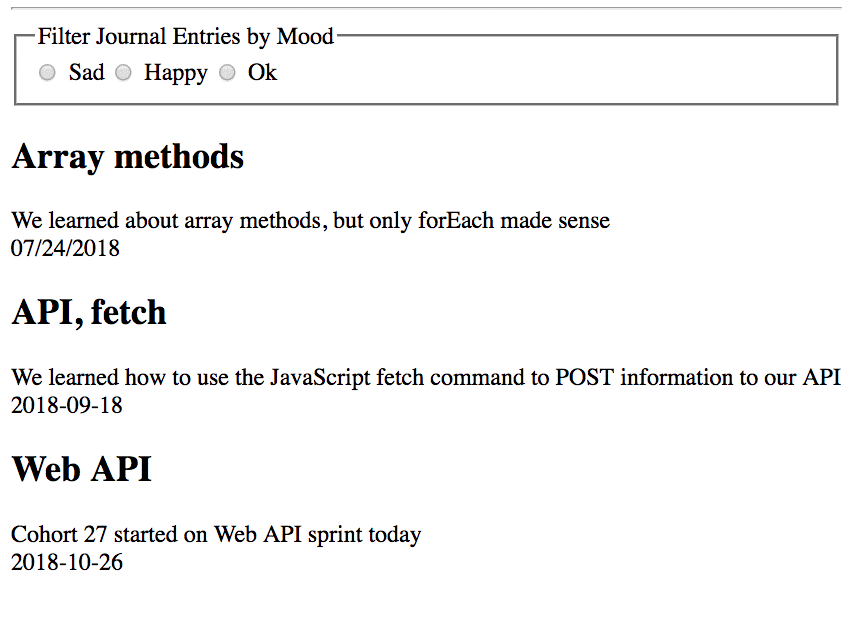

# Daily Journal

The learning objective for this chapter is to use radio buttons, apply your knowledge of event listeners, the `filter()` method on an array, and the `find()` method on an array to show journal entries that match a certain mood.

> **Warning:** This part of Daily Journal development will  stretch your understanding of how each of the components can be used together in a non-sequential way. If you get frustrated by not being able to **immediately** see how it all works, that's natural and normal. See your instruction team.

## Mood Radio Buttons

Using `<fieldset>`, `<legend>`, `<input type="radio">`, and `<label>` HTML components, construct a set of radio buttons for selecting one of the moods. It's important that each of the radio buttons has the same value for the `name` attribute, but each should a different value for the `value` attribute.

Before you go to the instruction team for help on this section, make sure you use the [Mozilla Developer Network article](https://developer.mozilla.org/en-US/docs/Web/HTML/Element/input/radio) on radio buttons as a reference first.


## Filter Bar Component

The fieldset that has the sad, happy, and ok radio buttons in it is a component. If you haven't set it up as one yet, it is time to make a **`FilterBar`** component. This component will set up the container for the radio buttons. It should then, in turn render a **`MoodFilters`** component. Here's an example.

> #### `daily-journal/scripts/filter/FilterBar.js`

```js
import MoodFilter from "./MoodFilter.js"

/*
 You need to make a new HTML element with a class of
 `filters` in index.html
*/
const contentTarget = document.querySelector(".filters")

const FilterBar = () => {
    render = () => {
        contentTarget.innerHTML = `
            ${MoodFilter()}
        `
    }

    render()
}
```

> #### `daily-journal/scripts/filter/MoodFilter.js`

```js
const MoodFilter = () => {
    return `
        <fieldset class="fieldset">
            <label for="journalDate">Mood for the day</label>
            <select name="mood" id="mood">
                <option value="sad">Sad</option>
                <option value="ok">Ok</option>
                <option value="happy">Happy</option>
            </select>
        </fieldset>
        `
}

export default MoodFilter
```

## Add Event Listeners

Each one of the radio buttons needs to have a click event listener attached to it. When any of them are clicked, then the only articles that should appear are the ones with the corresponding mood.



Now, you could attach the event listeners to each individually. You could also use the `document.getElementsByName()` method, and a `forEach()` to add them more dynamically.

To get the selected mood, you need to look at the value property of the radio button that was clicked. When you click on any DOM element, that element becomes the `target` of the click event. You can access the element, and its value with the code below.

```js
eventHub.addEventListener("click", event => {
    if (event.target.name === "moodFilter") {
        const mood = event.target.value
    }
})
```

## Filtering the Journal Entries

Once you have successfully retrieved the value of `ok`, `happy`, or `sad` based on which radio button was clicked, you need to filter all of the journal entries. The most straightforward way of doing this is to invoke the `useEntries()` method from your **`EntryProvider`** component. Then use the `filter()` array method to extract only the entries that have the same mood as the one the user clicked on.

Once you have filtered the entries by mood, invoke the function that renders the HTML representations to the DOM and pass it the filtered array of entries.

