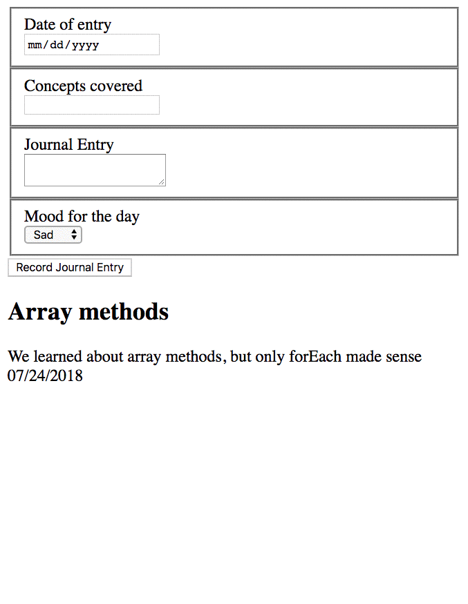

# Daily Journal

The learning objective for this chapter is to apply your knowledge of event listeners, and querying the DOM to make your daily journal form work and save entries to your API. You will also use `fetch` to make a POST request to your API, while using a factory function to generate the object that will be saved.

## Saving Entries




## Using POST Method to Create Resources

Now you must use `fetch` to create your journal entry in the API. The default method is GET, so you've never had to specify and configuration options with your `fetch` statements before. However, with POST, you need to configure the request.

1. Add new function named `saveJournalEntry` to your data provider module. It should take the entry object as a parameter.
1. In the function, use the `fetch()` function to perform a POST request.
    ```js
    // Use `fetch` with the POST method to add your entry to your API
    return fetch("fill this in with the URL to your API posts resource", {
        method: "POST",
        headers: {
            "Content-Type": "application/json"
        },
        body: JSON.stringify(newJournalEntry)
    })
    ```

## Saving New Journal Entry Process


1. In your **`JournalForm`** component module listen for the click on the **Record Journal Entry** button at the bottom of your form.
1. Use `document.querySelector` to select your input fields.
1. Use the `.value` property on the input field elements to get the text that you typed/chose.
1. Build a new object representation of a journal entry. Make sure the keys are consistent with the existing objects in your API.
1. Invoke the save function that you created in your provider component above.
1. Then call the function that reprents the list of journal entries


## Challenges

> **Note:** Challenges are optional and often ask you to do things that were not covered in class. Please research the topic first before coming to your instructions team for guidance. If/when you hit a roadblock, then they will provide guidance.

### Challenge: Advanced Form Validation

Add the following validation code to your journal entry form fields.

1. Pick a maximum length for concepts field and provide visual feedback _(e.g. alert box, or putting text in a blank div)_ if you type in a string that is longer than that maximum.
1. Test that the concept and entry fields contain no curse words. You can use regular expressions for that.
