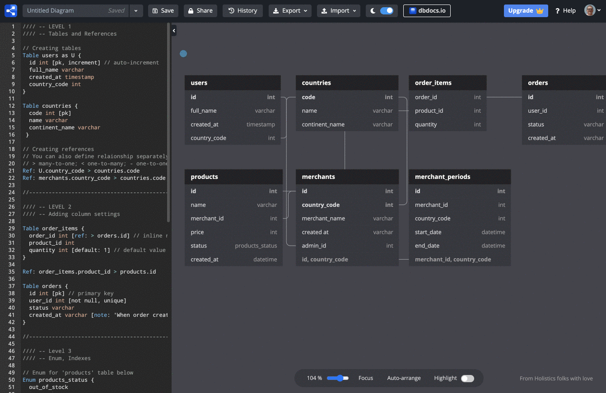

# Entity Relationship Diagrams

In this chapter, you will be working with the dbdiagram.io site's diagramming tool, so visit that site and register an account. Then open their diagramming tool.

## Videos to Watch Before Class

### Databases and Normalization

1. [Database Tutorial for Beginners](https://www.youtube.com/watch?v=wR0jg0eQsZA)
1. [Basic Concept of Database Normalization - Simple Explanation for Beginners](https://www.youtube.com/watch?v=xoTyrdT9SZI)

### Entity Relationship Diagrams

1. [Entity Relationship Diagram (ERD) Tutorial - Part 1](https://www.youtube.com/watch?v=QpdhBUYk7Kk)
1. [Entity Relationship Diagram (ERD) Tutorial - Part 2](https://www.youtube.com/watch?v=-CuY5ADwn24)

## Posts, Users, and Likes Visualization

In the previous few chapters, you created three different colletions in your data store module.

1. Users
1. Posts
1. Likes

There are relationships between these entities, and those relationships are established by using the primary key _(the `id` property)_ from an object in one collection and storing it as a foreign key on an object in another collection _(e.g. the `userId` property on a Post object)_.

You are going to visualize these relationships with [dbdiagram](https://dbdiagram.io/). If you didn't do it during initial installations and setup of your computer, go to that site and now register an account.

Your instruction team will walk you through how to use dbdiagram to make an ERD for the data you currently have in Giffygram. To start, go to the dbdiagram app and create a new ERD.

Paste the following code into the bar on the left and see your first, simple ERD. You and your instructors will build on this for the rest of the relationships.

```html
Table Users {
    id int pk
    name varchar
    email varchar
    password varchar
}

Table Posts {
    id int
    userId int
    title varchar
    imageURL varchar
    description varchar
    timestamp date
}

Table UserLikes {
    id int
    userId int
    postId int
}

Ref: "Users"."id" < "Posts"."userId"
Ref: "Users"."id" < "UserLikes"."userId"
Ref: "Posts"."id" < "UserLikes"."postId"
```


