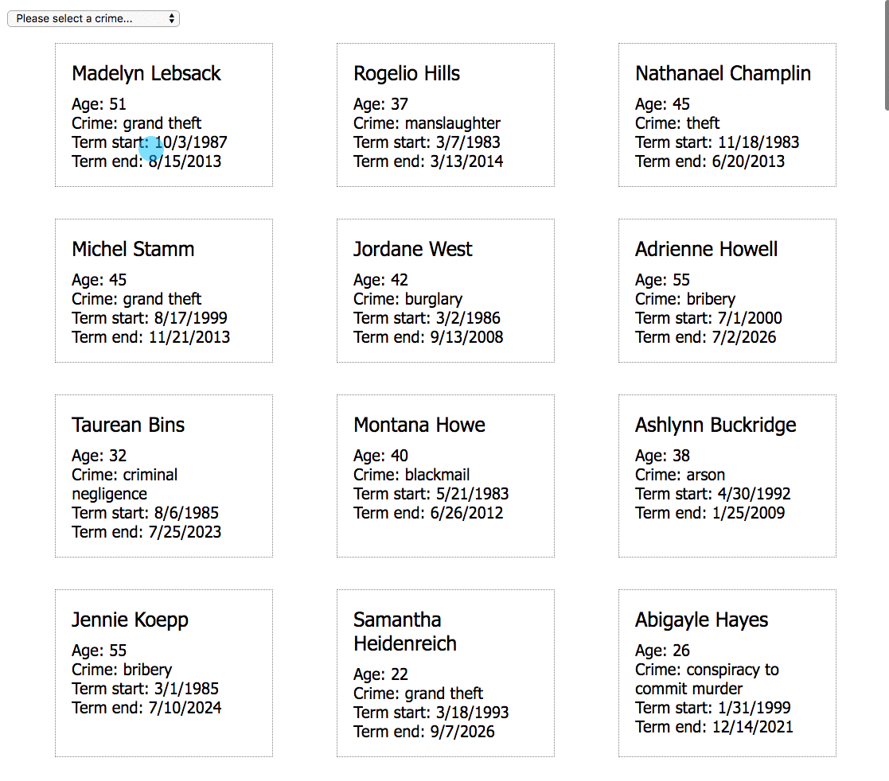

# Who Likely Done It?

## Introduction

> A few days have passed since you got your initial list of criminals showing up and Maggie seemed very pleased with that start. You have been reviewing the case file and taking some notes, but this morning, Maggie wants to talk about how to move forward.
>
> "You've been doing this a while, and you know as well as I do that people who commit crimes are, more often than not, the ones who commit it again in the future." Maggie flips through some pages in a file she has sitting on her desk, and then looks at you.
>
> "Take Gerald McReiny here," and she turns the file around so you can see him. "I nabbed him for theft back is 2001. He did two years in the state pen, and then 8 months after that, we had a rash of stolen property in a section of town that wasn't far from where he was staying."
>
> Maggie leans back and says, "It took us a whole week to review all of the files for past offenders to filter it down to a list of likely suspects." She raises her eyebrows at you, and pauses.
>
> "Ah, gotcha. If I could provide a way to look at only those criminals who committed a crime in the past, we could cut that work down to just a couple minutes instead of a week," you say happily.
>
> "Exactly!" Maggie exclaims.
>
> "See if you can get that working and then show me what you've got when it's done".
>
> You head on back to your desk to get to work.

## Goal

In this chapter, you are going to be implementing a `<select>` element so that you have a drop-down element on the screen that lists all of the crimes that have been committed by criminals in the past. Once the user selects a crime, then the only criminals that will be rendered are the ones that have committed that crime.



The Glassdale PD API has a resource that gives you a collection of all possible crimes that have been committed.

http://criminals.glassdale.us/crimes

You need to create two, new components in your application

1. The **`ConvictionProvider`** component will `fetch` those crimes an export a `useConvictions()` method for other components to import.
1. The **`ConvictionSelect`** component, which will invoke `useConvictions()` and then iterate that collection to fill out the dropdown in the browser.

## Conviction Data Provider

The **`ConvictionProvider`** component will follow the same structure as your **`CriminalProvider`** component.

```js
let convictions = []

export const useConvictions = () => convictions

export const getConvictions = () => {
    // Load database state into application state with a fetch().
    // Make sure the last `then()` sets the local `convictions` variable
    // to what is in the response from the API.
}
```


## Starter Code

> **`glassdale/scripts/convictions/ConvictionSelect.js`**

```js
/*
 *   ConvictionSelect component that renders a select HTML element
 *   which lists all convictions in the Glassdale PD API
 */
import { useConvictions } from "./ConvictionProvider.js"

// Get a reference to the DOM element where the <select> will be rendered
const contentTarget = document.querySelector(".filters__crime")

// Component function that renders the HTML representation
const ConvictionSelect = () => {
    // Get all con
    const convictions = useConvictions()

    const render = convictionsCollection => {
        contentTarget.innerHTML = `
            <select class="dropdown" id="crimeSelect">
                <option value="0">Please select a crime...</option>

                Use interpolation here to invoke the map() method on
                the convictionsCollection

            </select>
        `
    }

    render(convictions)
}

export default ConvictionSelect
```

