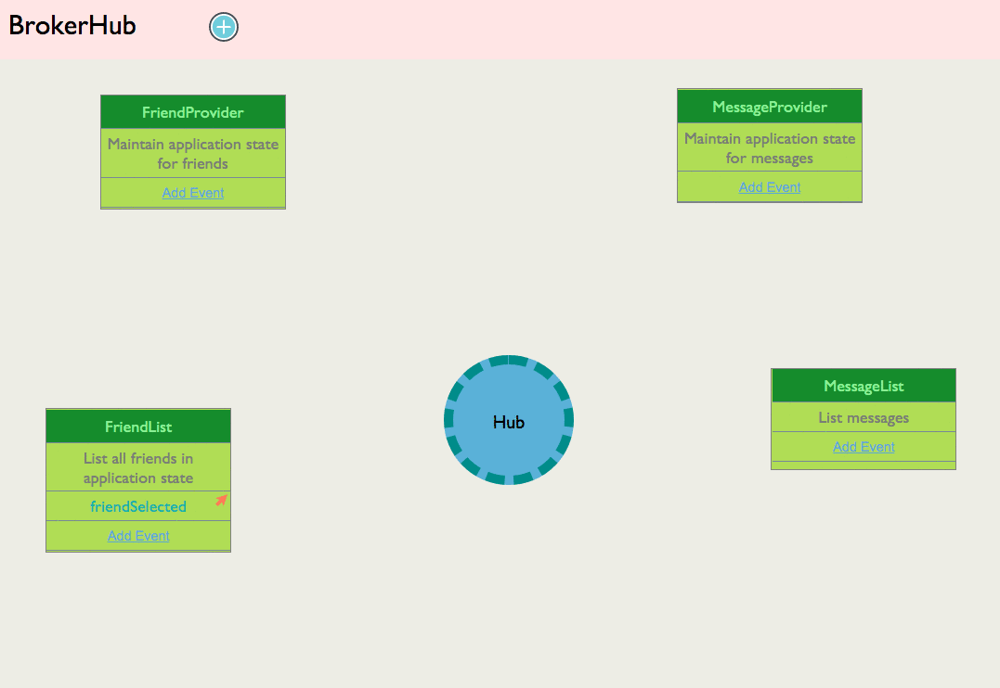

# A Discussion about Loose Coupling

The concept of _coupling_ in complex software is an important factor. Coupling is defined most generally as how many components know about the existence of each other and how restrictive the interactions are.

The higher that number, the higher your overall coupling is in an application. You want that number to be as low as possible.

---

Please watch the [Component Coupling](https://www.youtube.com/watch?v=lUrgx6UIsWk) video to learn more vocabulary, and get a high-level overview of what coupling means. There are terms and acronyms that you won't recognize in this video so ignore those, but the scenarios are real and the explanations are clear.

---

## Interactive Workshop

Below, there are instructions for installing an example application on your machine that you can use to play around with JavaScript components and explore the concept of coupled components.

You can also explore this concept by watching two interactive workshops about component coupling on scrimba.com. They cover the example application below.

* [Decoupling Components in JavaScript - Part 1](https://scrimba.com/p/p4Kwxcx/cvwpqVSK)
* [Decoupling Components in JavaScript - Part 2](https://scrimba.com/p/p4Kwxcx/cmpRQ8Hb)

## Text Message Reading Application

You'll make millions. No one has ever come up with such a brilliant idea as allowing people to read _all_ of their text messages in ONE, GIANT, LIST.

### Install Application

Run the following command in your terminal.

```sh
/bin/bash -c "$(curl -fsSL https://raw.githubusercontent.com/nashville-software-school/client-side-mastery/cohort-42/book-2-glassdale-pd/chapters/scripts/basic-messages-install.sh)"
```

Then change directory to the application and start the web server.

```sh
cd ~/workspace/message-list
serve
```

Open Chrome to view your list of messages.

### Theme Buttons Module

The people in marketing and design had this "brilliant" idea that if you let people customize the background of the message list, they would be "more engaged" and "easily retained". Of course, you realize quickly that this is a ridiculous idea, but you get paid to implement technical solution things responsibly and ethically - not make product decisions.

Refactor your index.html file with the following addition.

> #### `index.html`

```html
<main class="container">
    <div class="messages"></div>
    <div class="themes"></div>
</main>
```

Add the following file to your application.

> #### `scripts/themes/ThemeButtons.js`

```js
const contentTarget = document.querySelector(".themes")

export const ThemeButtons = () => {
    contentTarget.innerHTML = `
        <button class="themeButton" id="themeButton--red">Red</button>
        <button class="themeButton" id="themeButton--purple">Purple</button>
        <button class="themeButton" id="themeButton--blue">Blue</button>
        <button class="themeButton" id="themeButton--green">Green</button>
    `
}
```

Then update `main.js` to render your new buttons.

> #### `scripts/main.js`

```js
import { MessageList } from "./messages/MessageList.js"
import { ThemeButtons } from "./theme/ThemeButtons.js"

MessageList()
ThemeButtons()
```

### Message List Responds to Button Clicks

Your message list now needs to respond to a user action. When one of the buttons is clicked, the background color of the message list needs to change.

Copy pasta the following code to the very bottom of your message list module.

> #### `scripts/messages/MessageList.js`

```js
/*
    Color the messages when one of the buttons in the ThemeButtons
    component is clicked.
*/
document.querySelector(".themes").addEventListener("click", e => {
    const idOfClickedElement = e.target.id

    if (idOfClickedElement.startsWith("themeButton--")) {
        const [prefix, color] = idOfClickedElement.split("--")
        contentTarget.classList = []
        contentTarget.classList.add(color)
    }
})
```

Unfortunately, the **`MessageList`** and **`ThemeButtons`** are now tightly coupled. What couples them?

1. **`MessageList`** assumes of the existence of the DOM element with `themes` class name.
1. It also assume that there are buttons in that element that will emit a browser-generated "click" event.
1. It assume that the buttons have a `class` attribute value that can be split on "--".

Ok... so what? Why is this bad?

### Refactor Causes Double the Work

Imagine the scenario in which the developer who originally authored the **`ThemeButtons`** component wants to do a minor refactor. She realized that her class names don't comform with the team standard.

1. Change the **`ThemeButtons`** component so that the `id` attribute value of each button starts with `btnTheme--` instead of `themeButton--`.
1. Refresh the browser
1. Click on any of your buttons

The application doesn't work now.

A refactor of the class names in one component should **never** affect the functionality of another component. In this scenario, both component need to be refactored to keep the application working.

### Avoid Coupling When Possible

Professional developers want to avoid that. This is one of the underlying principles to the Single Responsibility Principle. Any change to a component's functionality should only require changes to that component, and no others.

## Event Based Programming

One common way around this problem is to have the components talk to each other in an agreed-upon format. Think of the components as a bunch of old friends gathering at a party. They can talk to each other and let everyone at the party know what happens to them.

Now, when one component talks, not every other component has to listen. When you are at a party, there are a few key people, or a few key topics you want to catch up with. So you choose to listen to only the things that are _important_ to you, and you choose to **not** listen to people/subjects that are not important to you.

You can do the same thing in your application. Components can broadcast custom messages, and other components that care about certain kinds of messages can listen for them. In JavaScript, you can use something called a Custom Event.

In your application, your components will use a common system for talking to each other. That will be the only type of coupling between components: a shared language. Components will be self-contained and will control everything that happens to them and simply dispatch messages in the agreed-upon format to an agreed-upon location.

In this application, the agreed-upon location will be the top-most DOM element.

```html
<main class="container">
```

That is going to be the event hub because it's the element in which all components will be children of.

## Creating Loosely Coupled Components

### A Color was Chosen

The first step in this process is to have the theme buttons component have control over what happens with itself, and also control what information it wants to share with other components.

Replace what's currently in the file with the following code. Your instruction team will walk through this code with you.

> #### `scripts/themes/ThemeButtons.js`

```js
const eventHub = document.querySelector(".container")
const contentTarget = document.querySelector(".themes")

// Listen for browser generated click event in this component
eventHub.addEventListener("click", clickEvent => {

    // Make sure it was one of the color buttons
    if (clickEvent.target.id.startsWith("btnTheme--")) {

        // Get the chosen color
        const [prefix, chosenColor] = clickEvent.target.id.split("--")

        /*
            Create a new custom event, with a good name, and
            add a property to the `detail` object that specifies
            which color was chosen
        */
        const colorChosenEvent = new CustomEvent("colorChosen", {
            detail: {
                color: chosenColor
            }
        })

        eventHub.dispatchEvent(colorChosenEvent)
    }
})

export const ThemeButtons = () => {
    contentTarget.innerHTML = `
        <button class="btnTheme" id="btnTheme--red">Red</button>
        <button class="btnTheme" id="btnTheme--purple">Purple</button>
        <button class="btnTheme" id="btnTheme--blue">Blue</button>
        <button class="btnTheme" id="btnTheme--green">Green</button>
    `
}
```

Now refactor your message list component. It is going to listen for your custom event. Remove the current code that listens for the "click" event that's at the buttom of the file. Then add the following code.

```js
/*
    Color the messages when one of the buttons in the ThemeButtons
    component is clicked.
*/
const eventHub = document.querySelector(".container")

eventHub.addEventListener("colorChosen", event => {
    const color = event.detail.color

    contentTarget.classList = []
    contentTarget.classList.add(color)
})
```

Now the only thing that connects the two components is the custom message. Neither is aware that the other component exists at all, or it's internal implementation.


## Practice: Filtering Messages with Custom Events

Ok, so after releasing the software to the public, no one really wants to see all of their messages in one, giant list. They would much rather see a list of their friends, choose one, and then see the message from that friend.


### Install Application

Run the following command in your terminal.

```sh
/bin/bash -c "$(curl -fsSL https://raw.githubusercontent.com/nashville-software-school/client-side-mastery/cohort-42/book-2-glassdale-pd/chapters/scripts/filter-messages-install.sh)"
```

This creates a new directory in workspace named `message-filter`. Change to that directory and start your web server.

```sh
cd ~/workspace/message-filter
serve
```

### Filtering Messages

Currently the two component are coupled. The message list component is targeting a DOM element rendered by the friend list component, and is listening for a browser-generated event emitted by that component.

Any changes to the friend list component's implementation will break the message list.

### Refactor With Custom Message

Time to refactor the application to that the **`FriendList`** component dispatches a custom event named `friendSelected`. The event should have a data payload in the `detail` object that provides information about which friend was selected.

> #### `scripts/friends/FriendList.js`

```js
// Listen for a browser-generated change event
eventHub.addEventListener("change", changeEvent => {

    // If the change event was generated by the radio buttons...
    if (changeEvent.target.classList.contains("friend")) {
        const selectedFriend = changeEvent.target.value

        // Generate a new custom message that a friend was selected
        const message = new CustomEvent("friendSelected", {
            detail: {
                friend: selectedFriend
            }
        })

        // Dispatch custom message to event hub
        eventHub.dispatchEvent(message)
    }
})
```

Then the message list component can listen for that event. It no longer is coupled to the friend list component. This means that the friend list component can change **anything** about its own implementation - class names, HTML elements, structure - and it will have no impact on the message list component. As long as it dispatches the agreed-upon event with the correct data, the application will keep working.

> #### `scripts/messages/MessageList.js`

```js
eventHub.addEventListener("friendSelected", event => {
    const friendName = event.detail.friend
    const messages = getMessagesByFriend(friendName)
    render(messages)
})
```


## Visualization




## Reminder: This is Hard

Thinking about components talking to each other using custom messages is a large cognitive leap. Your brain needs to build a fairly complex mental model to understand how the signal flow of information works in a system like this.

You are not going to get this right away. It requires practice, conversations with your teammates &amp; instructors, and trying it in different contexts.

## Next Steps

There is an entire project in this book called [State Fair](./SF_SETUP.md) where you can practice custom events to keep your components decoupled.

In the next chapter you will try this out with the Glassdale Cold Case application you are building. In the previous chapter, you built a dropdown element that lists crimes. You will have that component dispatch a custom message to an Event Hub, and the criminal list component will listen for that event and then behave how it chooses.
