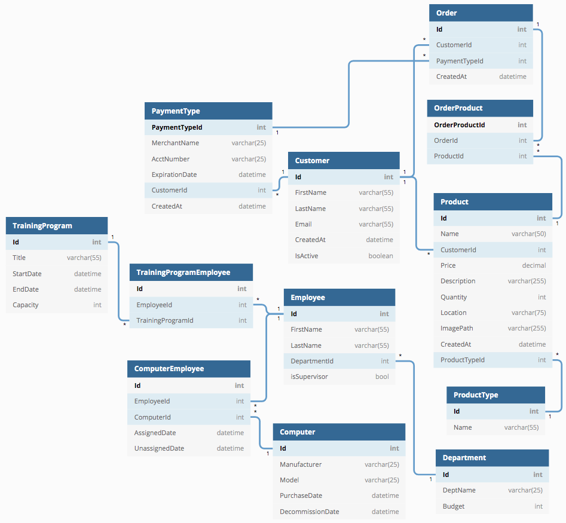
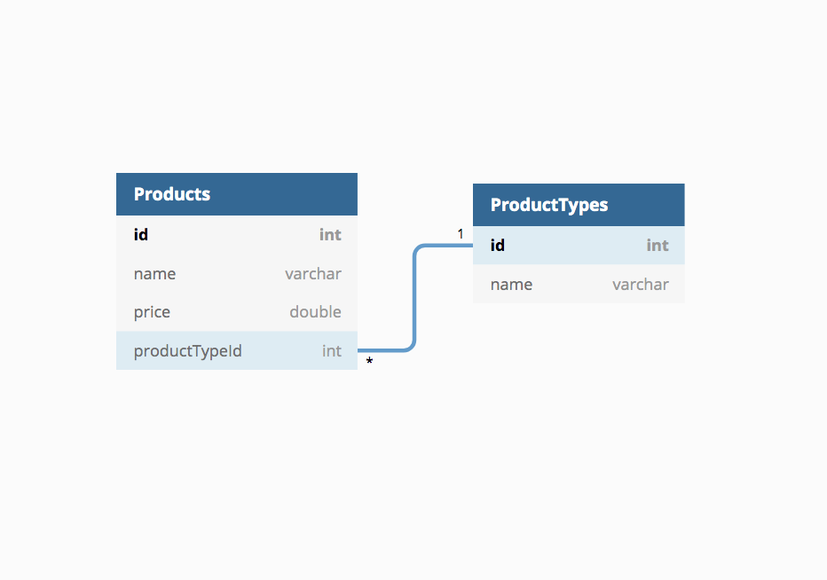
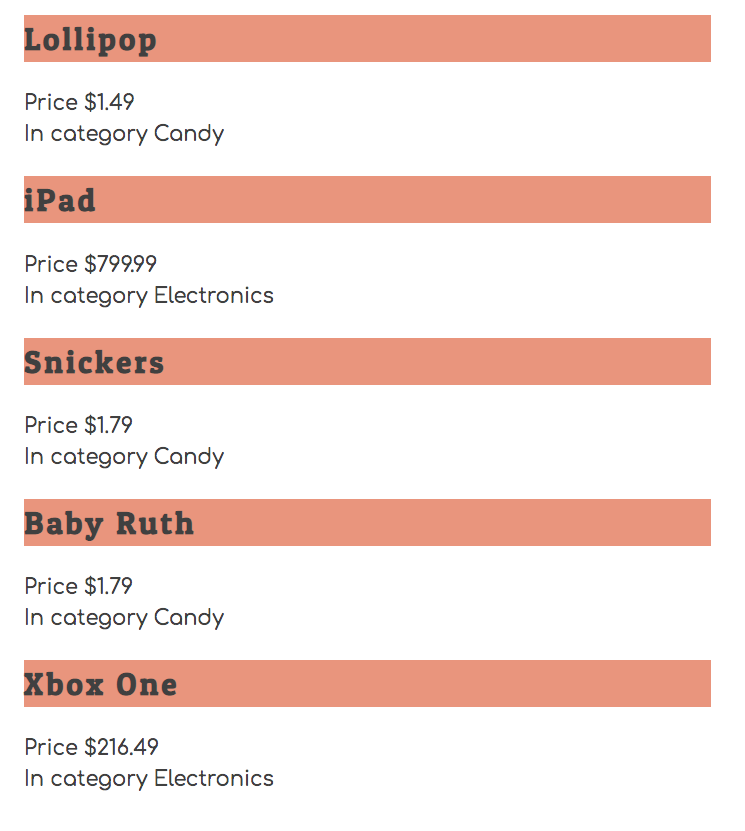

# Joining Data in Separate Objects

## Why Are You Learning This?

Properly structured and normalized databases can save a development team, and an entire business, hundreds of hours and millions of dollars over a pooly designed one. The database design is, by far, the most important thing to get right in an application because it is also is the hardest to change, and those changes affect everything about the application.


## Visualizing Relationships Between Data Sets

Entity Relationship Diagrams are used to visualize the relationships in a database. As human, we are visual creatures, and the ERD is the only way for us to understand a large, complex database made of thousands, millions, or billions of points of data.



## 1 -> &infin; (one to many) Relationships

Imagine that you are building an application that is an online marketplace. People can sell products in all kinds of categories.

### Data Structures

Here's a sample JSON file for your API for products being sold in the Candy and Electronics categories.

> ##### `database.json`

```json
{
    "productTypes": [
        { "id": 1, "name": "Candy" },
        { "id": 2, "name": "Electronics" }
    ],
    "products": [
        { "id": 1, "name": "Lollipop", "price": 1.49, "productTypeId": 1 },
        { "id": 2, "name": "iPad", "price": 799.99, "productTypeId": 2 },
        { "id": 3, "name": "Snickers", "price": 1.79, "productTypeId": 1 },
        { "id": 4, "name": "Baby Ruth", "price": 1.79, "productTypeId": 1 },
        { "id": 5, "name": "Xbox One", "price": 216.49, "productTypeId": 2 }
    ]
}
```

### Visualizing Product and Product Type Relationship

This ERD is the visualization of the data above. It shows how a single product type id can be stored in the products table multiple times.



## Joining the Data for HTML Representations

The data is separated in the database, but when you want to display HTML representations of the products to the user, you need to pull in the name of the product type from the other table. You don't want tell the user that a Baby Ruth's category is `1`.

## Setup

Open a new terminal window, copy pasta the following command into the terminal and hit enter to run it. It will create a basic file structure for you and create some starter code in the `~/workspace/marketplace` directory.

```sh
/bin/bash -c "$(curl -fsSL https://raw.githubusercontent.com/nashville-software-school/client-side-mastery/cohort-39/book-2-glassdale-pd/chapters/scripts/marketplace-install.sh)"
```

Then run the following command in your terminal to change directory to the project directory.

```sh
cd ~/workspace/marketplace
```

## Starting the API

In your current terminal, run the following commands to start json-server and get the API running.

```sh
cd api
json-server -p 8088 -w database.json
```

## Starting the File Server

Start a new terminal, then run the following commands to start the web server.

```sh
cd ~/workspace/marketplace
serve -l 8080
```
## Viewing the Marketplace

Visit http://localhost:8080 and you should see the following HTML output.



## Review of Important Code

Open the `ProductList.js` module and you can review how to take two different arrays of data and use the array methods of `.map()` and `.find()` to effectively join the objects in the two arrays to display a single HTML representation.

```js
// Get a reference to both arrays
const products = useProducts()
const productTypes = useProductTypes()

// Iterate the array of products with .map()
const arrayOfProductHTMLRepresentations = products.map(product => {

    /*
        Find the type for this product by using the .find()
        method on the product type array
    */
    const type = productTypes.find(type => type.id === product.productTypeId)

    // Build HTML representation of a product
    const html = Product(product, type)

    return html
})

const stringOfAllRepresentations = arrayOfProductHTMLRepresentations.join("")

contentTarget.innerHTML = stringOfAllRepresentations
```