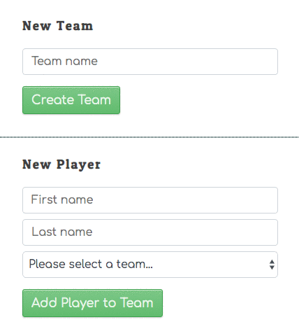
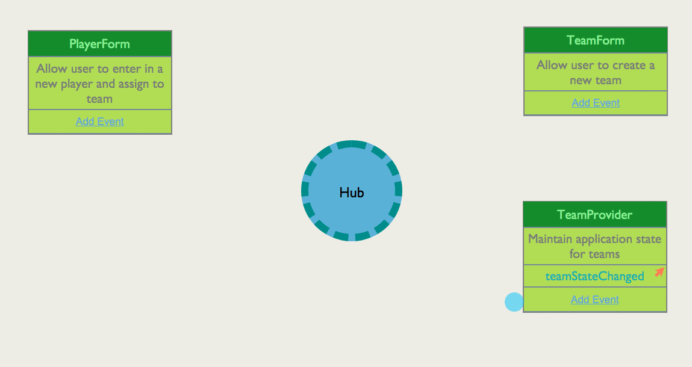

# Adding Teams and Players

In this chapter, you will be implementing two `<form>` elements. One to create a team, and one to create a player and assign the player to a team. You will use data providers and custom events so that the player form can immediately re-render when there is a change in the state of the team data.

## Sample User Interface

## Event Flow

