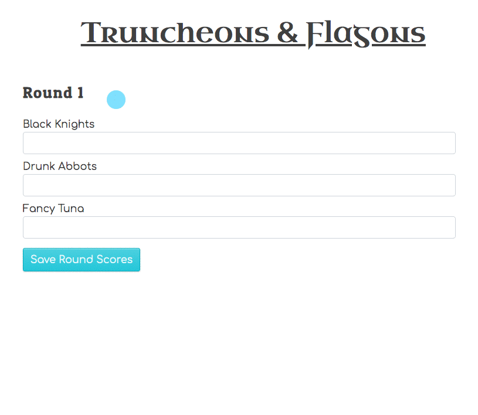

# Recording Round Scores

There are three rounds of scores to record. In the round score form component, let the user enter in the score of each team for every round.

The total number of points entered cannot exceed 3.

When the user saves a round scores, display the form again unless it is the final round.

Once the score for all three rounds have been recorded, display which team is the winner.

