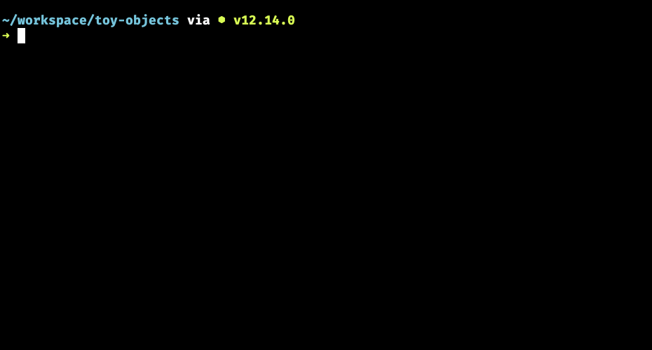
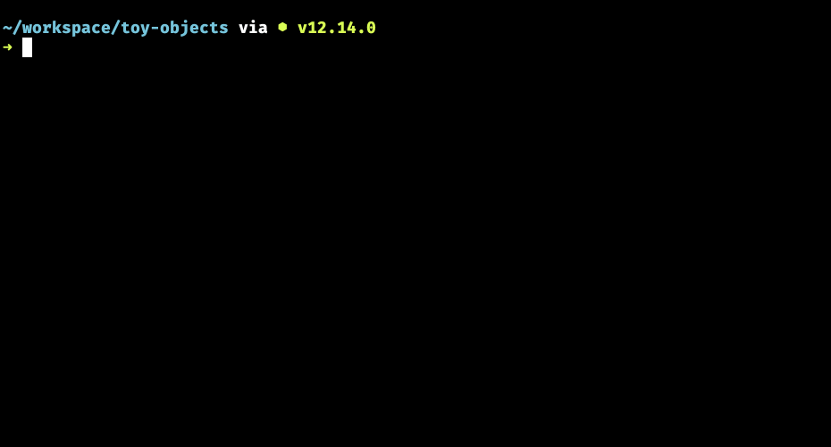

# Toy Collection

In this chapter, you will build an array filled with objects. Each item in the array will be one of your toys.

## Learning Objectives

* You should be able to define an array that contains multiple objects.
* You should be able to explain that objects defined directly in an array do not need to be assigned to variables.
* You should be able to demonstrate that you can create an array of objects using the correct syntax.

## Objects in Arrays

In the previous chapters, you created multiple objects and assigned each one to its own variable to be used later.

```js
const iPhone = {
    maker: "Apple",
    operatingSystem: "iOS",
    price: 900,
    weight: 1.2
}

const galaxy = {
    maker: "Samsung",
    operatingSystem: "Android",
    price: 600,
    weight: 1.4
}
```

Now you are going to put both of those objects into an array, rather than being discrete variables. Here's how you would put those phone objects into an array as one, large data structure.

```js
const phones = [
    {
        id: 1,
        name: "iPhone",
        maker: "Apple",
        operatingSystem: "iOS",
        price: 900,
        weight: 1.2
    },
    {
        id: 2,
        name: "Galaxy",
        maker: "Samsung",
        operatingSystem: "Android",
        price: 600,
        weight: 1.4
    }
]
```

Notice that the individual variables for each phone are gone. Now the **entire array of phones** is assigned to a single variable named, shockingly, `phones`. Naming the variable whose value is an array should always be plural. If you have an array of farm animals, call the variable `animals`, or even more descriptively, `farmAnimals`.

You get the point.

One thing you might do as a beginner is forget to put a comma between the two objects. Look at the array above again and notice that there is a comma after the first closing curly brace, and before the second opening one.

```js
[
    {

    },  <-- Don't forget this comma
    {

    },  <-- Or this one
    {

    }   <-- Don't need one at the end
]
```

## Practice: Array of Toy Objects

Open your `leonids-toys.js` file again in Visual Studio Code, and re-write it so that the toy objects you created are all contained within a single array. Make sure you assign the array to a variable named `toys`.

After you rewrite the code, put `console.log(toys)` at the end of the code.

```js
const toys = [
    // Add your objects here
]

console.log(toys)
```

To see if you got the syntax correct, open your terminal and navigate to the directory where your code file is located.

```sh
cd ~/workspace/toy-objects
```

Then run the following command to see the fruits of your labor.

```sh
node leonids-toys.js
```

If your syntax is correct, you should see your array of objects immediately displayed in the terminal.



If you syntax is incorrect, you will see a lot of gibberish that won't make much, if any, sense. If this happens, check your syntax again, but if you can't make it work, talk to a teammate or an instructor.




