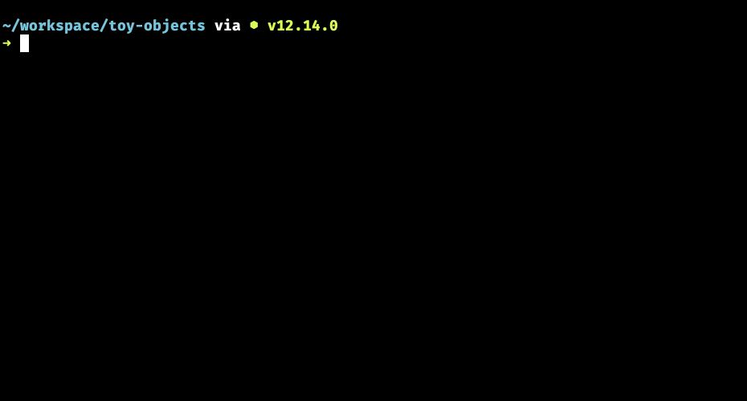

# Displaying the Toy Catalog

## String Interpolation

A quick reminder about string interpolation if you saw it in the pre-work. Otherwise, this is an introduction to string interpolation.

String interpolation is available in most high level languages like JavaScript, Python and C#. It allows you to easily build a long string with the value of variables injected into specific locations.

Here's a simple example first.

```js
const age = 27
const name = "Melissa Bell"

const interpolatedString = `${name} is ${age} years old`
console.log(interpolatedString)
```


Note that the string is built with the backtick character. That's not a single quote at the beginning and end of the string. You can find the backtick character above the TAB key on your keyboard.

Then you use `${}` to place the value of any variable into the string.

The above code would output the following string.

```txt
Melissa Bell is 27 years old
```

## Phone Catalog String

Say you want to display the string `"The Apple, Inc. iPhone costs 900 dollars."`

All of that data is currently contained in the object representation you have been using in the previous chapters.

```js
{
    id: 1,
    name: "iPhone",
    maker: "Apple, Inc.",
    operatingSystem: "iOS",
    price: 900,
    weight: 1.2
}
```

Here's how you could display that sentence for every phone in the array.

```js
for (const phone of phones) {
    console.log(`The ${phone.maker} ${phone.name} costs ${phone.price} dollars.`)
}
```


## Iterate Leonid's Toy Catalog

Your job is to display a simple catalog for Leonid's toys. Use string interpolation, dot notation to access object properties and your `for..of` loop to display it.

At this point, we're going to assume that you have properties like `name`, `price`, and `color`. Using those as an example, when you run `node leonids-toys.js` in the terminal, you could display this.



You may have different properties, so use whatever properties you have to build a sample string to be used in the bare bones, terminal-based catalog.