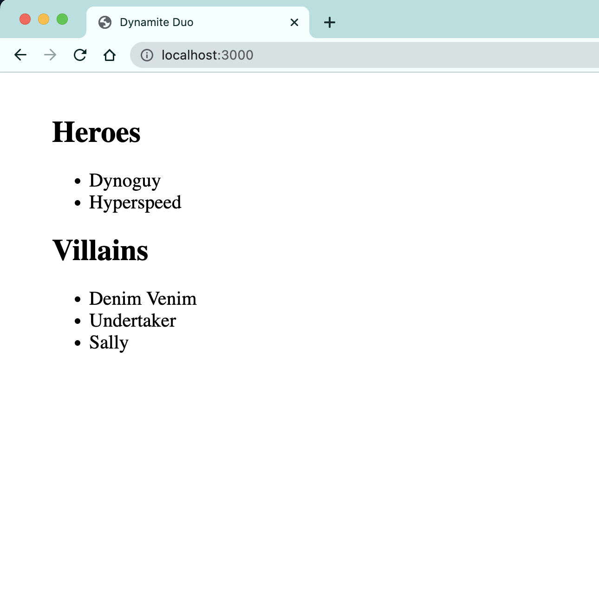

# Intro to InnerHTML

The goals is to take that single HTML string that contains the 2 smaller chunks of HTML generated by **HeroList** and **VillainList** and dynamically update the DOM with it.

It will replace the existing `<h1>The Dynamite Duo</h1>` that you manually typed in earlier in the project.

This is accomplished by using the `.innerHTML` property of any HTML element.

You can watch a brief video that shows how the `.innerHTML` and `.textContent` properties of HTML elements work.


[](https://www.youtube.com/watch?v=1UsllDMhvN4)


## Updating Your DOM

Place this line of code at the very end of your `main.js` module. It takes the whole HTML string that you built and assigns it to the `.innerHTML` property of the `<main>` element that you got a reference to earlier in the code.

```js
theExistingMainElement.innerHTML = theWholeEnchilada
```

Refresh your browser and you will see the new, dynamically created HTML get injected into the DOM.


