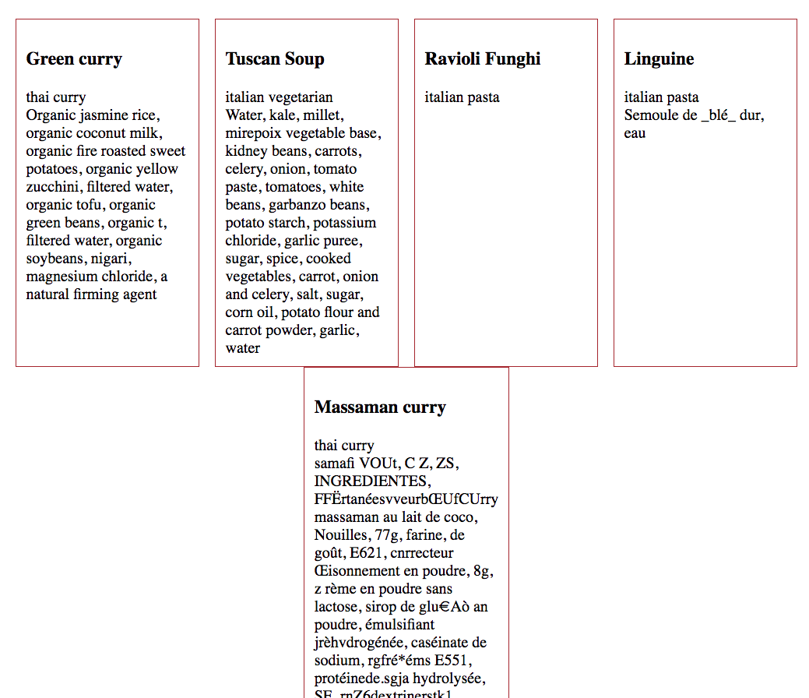

# Fetch your Data

## Why are you Learning This?

Companies all over the world provide access to their data so that software developers can build interesting solutions for their customers. You, as a developer, can request their raw data, but use it however you like.

For example, the [Merriam-Webster](https://dictionaryapi.com/) dictionary and thesaurus is available for software developers who may be building a tool for children to work on their spelling and vocabulary skills.

Another source of data is the [Air quality and pollution API](https://www.airvisual.com/air-pollution-data-api). Software developers who work for non-profits that monitor industrial pollution, or government agencies who regulate industry would find this data very useful for building custom software.

In this chapter, you will be learning how to use the `fetch` statement to make requests for data that live on the World Wide Web somewhere.

## Reference

The [fetch API](https://developer.mozilla.org/en-US/docs/Web/API/Fetch_API/Using_Fetch) is a recent addition to native JavaScript that software developers use to interact with data on the Web. There is also a maintained list on Github of [all public, free APIs](https://github.com/toddmotto/public-apis) for software developers to use.

## Setup

You're going to use the food API that you set up in the last chapter.

1. Make sure your API is running. If you need to review, go back to the last chapter for the command.
1. Make a new sub-directory in your project named `src`. This directory will hold your application code.
    ```sh
    mkdir -p ~/workspace/javascript/exercises/food-api/src
    cd $_
    touch index.html
    mkdir scripts
    touch scripts/foodapi.js
    ```
1. Create the boilerplate HTML in VS Code and hook up your `foodapi.js` file into the HTML.

## Querying Data

First, you are going to perform a [GET operation](https://developer.mozilla.org/en-US/docs/Web/HTTP/Methods) to retrieve all the foods!

Paste the following code into your `foodapi.js` JavaScript file and refresh your browser. Remember, **always have your DevTools open**.

> food-api/src/scripts/foodapi.js

```js
fetch("http://localhost:8088/food")
    .then(foods => foods.json())
    .then(parsedFoods => {
        console.table(parsedFoods)
    })
```

You should see this in your console.


Time to explore the code line by line.

### The Request

```js
fetch("http://localhost:8088/food")
```

This makes a request to a specific domain, port address, and resource on the Web.

1. `localhost` is the domain
1. `8088` is the port address
1. `food` is the resource

By default, `fetch` performs a GET operation, so it requires no other configuration.

### The Parsing

```js
.then(foods => foods.json())
```

This line of code accepts the response from your request, parses the body of the response as JSON and returns it to any subsequent `then()` method.

### Using the Response

```js
.then(parsedFoods => {
    console.table(parsedFoods)
})
```

This line of code accepts the parsed JSON as the argument to a function, and then uses `console.table()` to display the results.

## Practice: Displaying Foods

Once you have retrieved all of the foods from your own Food API, display each one of them in the DOM. Create an HTML representation of each food which will display the name of the food, its type, and its ethnicity.

1. Create a DOM element in your `index.html` with a class of `foodList`.
1. Create a function which returns a string template. The template is the HTML representation for a food item.
1. Create a function that inserts an HTML representation of a food into the DOM

> Example fetch call using functions

```js
fetch("http://localhost:8088/food")
    .then(foods => foods.json())
    .then(parsedFoods => {
        parsedFoods.forEach(food => {
            const foodAsHTML = foodFactory(food)
            addFoodToDom(foodAsHTML)
        })
    })
```

Use Flexbox row direction so that you have a horizontal list of items.


## Practice: Fetching Other People's Data

> For this exercise, you will be adding barcodes to your food products, and using another, 3rd-party API to query more information about each product and display it in the DOM. That's right! You don't have to be stuck just messing around with your own data; there's a whole world of information out there for you fetch.

There is a wonderful, free resource of data about food called the [Open Food Facts](https://world.openfoodfacts.org/). Visit the site and use the search feature to find all foods matching the `name` property of each of the foods in your food API. For example, search for _"Green curry"_ and see the how many matches there are.

Next, click on one of the search results and get the barcode for the product. It's at the top, right beneath the product name.


Create a new `barcode` key for each of the items in your API, and provide the correct barcode value that you found in your search.

```json
{
    "id": 4,
    "name": "Ravioli Funghi",
    "type": "pasta",
    "ethnicity": "italian",
    "barcode": "8021733250892"
},
```

Once you have the barcode, you can use the Open Food Facts JSON API to get a plethora of information about that product. For example, the barcode for Jimmy Dean Pork Sausage is `0077900110726`. I can take that barcode and query their API.

```js
fetch("https://world.openfoodfacts.org/api/v0/product/0011150479547.json")
    .then(response => response.json())
    .then(productInfo => {
        // Use it here
    })
```

Go ahead and copy that URL and paste it into a new tab in your browser. You will see a very large JSON document in the response.


Your job is to query the Open Food Facts API for each of your products, and list the following additional information.

1. Ingredients
1. Country of origin
1. Calories per serving
1. Fat per serving
1. Sugar per serving

> **Helpful hints:** You will need to use the `forEach` array method to iterate your foods. Inside that `forEach`, you will need to perform another `fetch` to get the additional information. The barcode value must be interpolated inside the URL for the inner fetch.

```js
fetch("http://localhost:8088/food")
    .then(response => response.json())
    .then(myParsedFoods => {
        myParsedFoods.forEach(food => {
            console.log(food) // Should have a `barcode` property

            // Now fetch the food from the Food API
            fetch(`https://world.openfoodfacts.org/api/v0/product/${what goes here?}.json`)
                .then(response => response.json())
                .then(productInfo => {
                    if (productInfo.product.ingredients_text) {
                      food.ingredients = productInfo.product.ingredients_text
                    } else {
                      food.ingredients = "no ingredients listed"
                    }

                    // Produce HTML representation
                    const foodAsHTML = foodFactory(food)

                    // Add representaiton to DOM
                    addFoodToDom(foodAsHTML)
                })
        })
    })
```

#### Example with ingredients included


