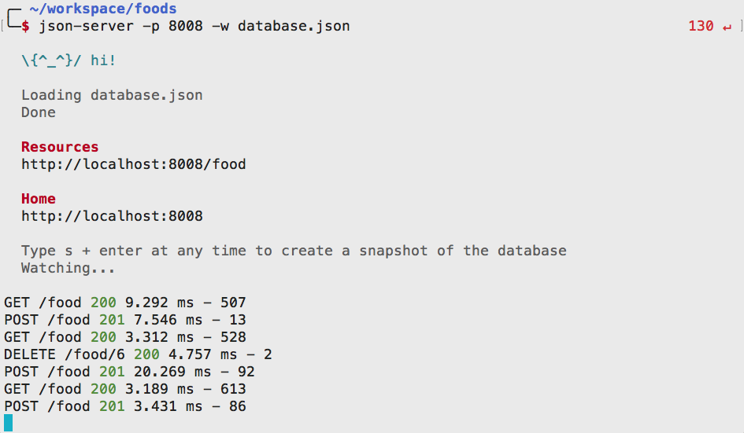

# API: Make Your Data Stick Around With Peristent Storage

Up to this point, you've created and interacted with data within the context of your application code. However, you may have noticed that any changes to that data (updates, deletions, additions) go away when you close the browser or refresh the page.

In this chapter, you are going to use a tool called `json-server` to store your application's data in JSON format on your file system instead. This will allow the data to persist from browser session to browser session.

Visit the Github [repo for json-server](https://github.com/typicode/json-server) if you want to learn more details.

## Why are you Learning this?

Further in the course, you will be learning how to build powerful, professional database systems. This chapter gets you started on how to think about structuring, and storing that data later on.

## API

What is an API? It's an acronym for _Application Programming Interface_. To best decribe it, reverse the words. It's an interface provided to developers to program an application.

* Video: [What is an API?](https://www.youtube.com/watch?v=s7wmiS2mSXY)
* Video: [What Is an API? Learn the Basics in 3 Minutes](https://www.youtube.com/watch?v=Rha1_St_9kw)
* Video: [What is an API? - Application Programming Interface](https://www.youtube.com/watch?v=B9vPoCOP7oY)

## Setup

### Install JSON Server

```sh
npm install -g json-server
```

### Create the API

You are going to create an API (application programming interface) that you will use to store and retrieve information your favorite foods.

```sh
mkdir -p ~/workspace/javascript/exercises/food-api/api
cd $_
touch database.json
```

Next, pre-populate your API with some of your favorite foods by defining them as objects with properties. Each object should have the following properties. The value of each property is specified in parenthesis.

1. id (_integer_) - An incrementing unique identifier
1. name (_string_) - The name of the food
1. category (_string_) - The category of the food item
1. ethnicity (_string_) - The ethnicity, or country of origin, of the food

Each of these objects will be stored in an array. Below you will find an example of what should be in your `database.json` file. Notice that **all** of the key names are surrounded by double quotes. This is necessary when data in stored in JSON format.

What is JSON? It's short for JavaScript Object Notation, and your instructor will discuss this with you. Here are some resources you can use to learn more.

* Video: [JSON - Beginners Guide to learning JSON with JavaScript](https://www.youtube.com/watch?v=qACmtQFEWOw)
* Video: [JSON explained in less than 10 minutes](https://www.youtube.com/watch?v=_I9KgdRvyQA)
* Article: [JSON - Introduction](https://www.w3schools.com/js/js_json_intro.asp)
* Tool: [Online JSON editor](https://jsoneditoronline.org/)
* Tool: [JSON Formatter](https://chrome.google.com/webstore/detail/json-formatter/bcjindcccaagfpapjjmafapmmgkkhgoa) - This will display JSON beautifully in the browser

> Example data in `database.json`

```json
{
    "food": [
    {
        "id": 1,
        "name": "Linguine",
        "category": "pasta",
        "ethnicity": "italian"
    },
    {
        "id": 2,
        "name": "Massaman curry",
        "category": "curry",
        "ethnicity": "thai"
    },
    {
        "id": 3,
        "name": "Green curry",
        "category": "curry",
        "ethnicity": "thai"
    },
    {
        "id": 4,
        "name": "Ravioli Funghi",
        "category": "pasta",
        "ethnicity": "italian"
    },
    {
        "id": 5,
        "name": "Tuscan Soup",
        "category": "vegetarian",
        "ethnicity": "italian"
    }
    ]
}
```

Now that the food resource is configured and you have some data, you can start your API with the following command.

**_Make sure you are in the `api` directory of your project._**

```sh
json-server -p 8088 -w database.json
```

Go to Chrome and go to the following URL.

[http://localhost:8088/food](http://localhost:8088/food)

You will see a JSON representation of all of your favorite foods.

## API Output

Each request that your browser makes to the API will be output in the terminal. Here's an example of what it looks like, and what everything means.



You see a list of requests above. Each line shows the following information.

1. HTTP Verb _(e.g. GET, POST, DELETE)_
1. Resource _(e.g. /food/6)_
1. Status code _(`200` means ok, `201` means something was created)_
1. Time to complete request in milliseconds
1. Size of response in bytes

## Filtering Data

Now filter the food to only show Italian dishes

[http://localhost:8088/food?ethnicity=italian](http://localhost:8088/food?ethnicity=italian)

Or curry dishes.

[http://localhost:8088/food?category=curry](http://localhost:8088/food?category=curry)

## Using Postman for API Queries

Postman is a valuable tool for software developers who want to explore any API resources. When you are building your own API for a group project, or when you are building one for a personal project or your capstone, Postman will help you test the API before you start writing your application code.

1. Visit the [Postman apps page](https://www.getpostman.com/apps) and download the application for your OS.
1. Watch the wonderful [Postman Beginner Tutorial](https://www.youtube.com/playlist?list=PLhW3qG5bs-L-oT0GenwPLcJAPD_SiFK3C) series on YouTube.

## Practice

Practice using Postman to perform GET, POST, PUT, and DELETE operations on your new food API.

1. GET all curry dishes. Use the [filter feature](https://github.com/typicode/json-server#filter).
1. Use POST to create some of your favorite foods.
1. Perform a GET operation using the [`q` URL parameter](https://github.com/typicode/json-server#full-text-search) to find any entries that have the pattern of `ol` in them.
1. GET all foods and [sort](https://github.com/typicode/json-server#sort) them by ethnicity.
1. Delete a food from the API by using the DELETE method, and putting in the URL of a specific resource (e.g. `http://localhost:8008/food/2`)

### How to use Postman to POST


