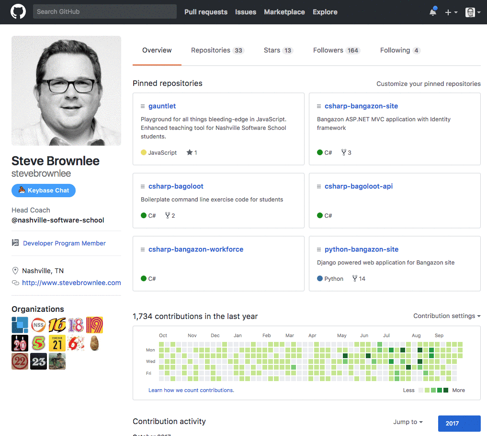
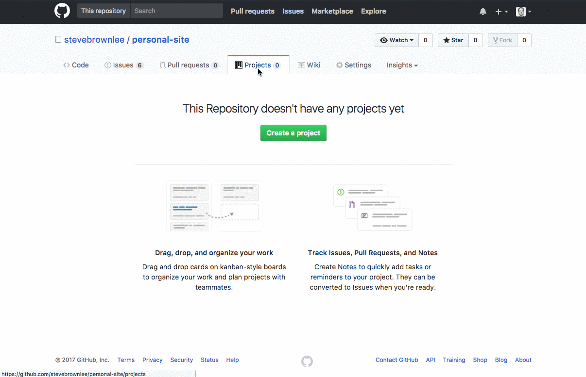

# Git

A distributed version control system for keeping a history of your code.

## Creating a Personal Site Repository

1. Create a directory to store your application's code. Replace *githubusername* with your actual Github username.
    ```sh
    cd
    mkdir -p workspace/githubusername.github.io
    ```
1. `cd` to that directory
1. Type in the `git init` command
1. You now have a git repository

The magic is the `.git` directory that gets create when the `git init` command is executed. To see this directory you can use `ls -la`, which shows hidden files and directories. Operating systems will not show files and directories that begin with a period by default. They are considered hidden, or system assets.

## Making your First Commit

1. Create an HTML file with `touch index.html`
1. Create a CSS file with `styles.css`

Since git tracks all changes - unless you tell it to ignore some files, which we will cover later - your two new files will be recognized as new, untracked files by git.

Type `git status` to see the status of all files in your new repository.


Next, Tell git that you want to start tracking those files with `git add .` command. The period means "add all untracked files from this directory, and any sub-directories".

Then type `git status` again and git will have a new messages that those two files are ready to be committed.


Next, you need to commit your changes. Every time you make a commit, git will keep track of how the code looked at that moment in time, in case you ever need to go back to a previous version. You commit your changes with the following command.

```sh
git commit -m "A descriptive message about what changes you made in this commit"
```

Once you make your commit, do a `git status` one more time, and git will tell you that there's nothing left to commit.


+ `git log` to see all of your commits for this repo. `q` to quit git log (if log is long enough)

# Backing Up and Sharing Code on Github

A software as a service (SASS) that allows your to back up your repository to the cloud and share it with other software developers.

## Pushing to Github

When you are ready to share your code with your teammates, or the general public, you can push your repository to Github. Think of Github as an external drive you plug into your laptop to use as backup. Instead of it backing up the entire hard drive, you will back things up, one project at a time, only when you want to.

### Create Github Repository

The first thing you need to do is create a new repository on Github's platform that you will use to backup the code on your laptop. Once the repository is created, you will need to copy the connection string for it.

1. Since this is for your personal site, the name of the repository, you need to follow a special pattern. For example, my username is `stevebrownlee`, so I would type `stevebrownlee.github.io` into the **Repository name** field.
1. Click the button to create the repository.
1. Copy the connection string to your clipboard.



### Add the Connection String Locally

Now you tell your local repository where you would like it to send the code when you're ready to back it up.

```sh
git remote add origin paste-connection-string-here
```

Now it's time to do the backup. You use the `git push origin master` command to do that.

```sh
git push origin master
```


Now that the code has successfully been backed up, go back to your browser, and refresh the page. You will see that your remote repository backup now has your two files in it.


### Viewing Your New Site

Go to Chrome and enter in your site's URL, e.g. `https://stevebrownlee.github.io`. You should see a blank page, because there is no content in your `index.html`.

### Building Your Personal Site

Your instruction team will provide you with some initial tickets that you will use to build the first version of your personal website. Make sure you add your lead instructor to the list of collaborators on your Github repository so that the tickets can be copied to your project.

Once the issues are copied, add them to your backlog.

### Setting up a Project with a Backlog

1. Open your personal site repository on Github.
1. Click the *Projects* tab.
1. Click *Create a project*.
1. Name your project **_Personal site_**.
1. Add the following columns to your project.
    1. Backlog
    1. Doing
    1. Done



## Additional Reading

+ [git - the simple guide](http://rogerdudler.github.io/git-guide/)
