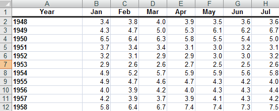

# Working with Data

As software developers, our job is to work with data. We need to take raw data, and present it to humans in a way that they can understand it, and make decisions with it. Raw data is completely unusable, because modern systems are built on what's called tabular data, or normalized data.

In essence, spreadsheets.

We've all seen a spreadsheet before. Columns represent the values for each type of data we're collecting, and the rows represent the collection of **all** the data for each segment of our observations. In the spreadsheet below, we see data about rainfall over a ten year span.



In JavaScript, we can't create spreadsheeets, but we can represent their structure using arrays and objects.

## Arrays

Each row of data in the spreadsheet above is an array. A collection of data values.

```js
const _1948 = [3.4, 3.8, 4.0, 3.9, 3.5, 3.6, 3.6]
const _1949 = [4.3, 4.7, 5.0, 5.3, 6.1, 6.2, 6.7]
const _1950 = [6.5, 6.4, 6.3, 5.8, 5.5, 5.4, 5.0]
const _1951 = [3.7, 3.4, 3.4, 3.1, 3.0, 3.2, 3.1]
const _1952 = [5.8, 6.4, 6.7, 7.4, 7.4, 7.3, 7.5]
```

Then we can create a new array to store each row so that we have one collection that we can reference to get the raw data.

```js
const RainfallDatabase = [_1948, _1949, _1950, _1951, _1952]
```

This kind of storage is useful if we want to use functions to filter, average, summarize, or mean the data.

```js
/*
    Copy this entire code example into a new Quokka file
*/

// Individual arrays holding monthly data for each year
const _1948 = [3.4, 3.8, 4.0, 3.9, 3.5, 3.6, 3.6]
const _1949 = [4.3, 4.7, 5.0, 5.3, 6.1, 6.2, 6.7]
const _1950 = [6.5, 6.4, 6.3, 5.8, 5.5, 5.4, 5.0]
const _1951 = [3.7, 3.4, 3.4, 3.1, 3.0, 3.2, 3.1]
const _1952 = [5.8, 6.4, 6.7, 7.4, 7.4, 7.3, 7.5]

// Outer array holding each year's array of data
const RainfallDatabase = [_1948, _1949, _1950, _1951, _1952]

// Find out how much total rain has fallen over last 10 years
let totalRainfall = 0

// This iterates the outer array
for (let i = 0; i < RainfallDatabase.length; i++) {
    const yearlyData = RainfallDatabase[i]

    // This iterates each individual array of numbers
    for (let j = 0; j < yearlyData.length; j++) {
        const monthlyData = yearlyData[j]
        totalRainfall = totalRainfall + monthlyData
    }
}

console.log(totalRainfall)
```

But if we want to look at specific years, we don't have a way of identifying a single set of data, e.g. get all rainfall for 1952.

## Objects and Arrays for Data

Let's combine objects, which will allow us to provide key names in order to identify the data, and arrays, which will hold the data sets themselves.

```js
const RainfallDatabase = {
  "1948" : [3.4, 3.8, 4.0, 3.9, 3.5, 3.6, 3.6],
  "1949" : [4.3, 4.7, 5.0, 5.3, 6.1, 6.2, 6.7],
  "1950" : [6.5, 6.4, 6.3, 5.8, 5.5, 5.4, 5.0],
  "1951" : [3.7, 3.4, 3.4, 3.1, 3.0, 3.2, 3.1],
  "1952" : [5.8, 6.4, 6.7, 7.4, 7.4, 7.3, 7.5]
}
```

We still have all the data, and although the calculations needed to perform the total rainfall for all 10 years would have different syntax, we can still do it.

You can look at total rainfall per year since each set of data has a key (i.e. 1948, 1949, 1950, etc...).

```js
// Paste this new code into a Quokka file
const RainfallDatabase = {
  "1948" : [3.4, 3.8, 4.0, 3.9, 3.5, 3.6, 3.6],
  "1949" : [4.3, 4.7, 5.0, 5.3, 6.1, 6.2, 6.7],
  "1950" : [6.5, 6.4, 6.3, 5.8, 5.5, 5.4, 5.0],
  "1951" : [3.7, 3.4, 3.4, 3.1, 3.0, 3.2, 3.1],
  "1952" : [5.8, 6.4, 6.7, 7.4, 7.4, 7.3, 7.5]
}

// Iterate the keys of the object
for (const year in RainfallDatabase) {
    // Get current yearly array of rainfall
    const yearlyData = RainfallDatabase[year]

    // Reset yearly rainfall total to 0
    let yearlyAmount = 0

    // Look at each month and add to yearly total
    for (let i = 0; i < yearlyData.length; i++) {
        const monthlyData = yearlyData[i]
        yearlyAmount = yearlyAmount + monthlyData
    }

    console.log(`${year} had ${yearlyAmount} inches of rainfall`)
}
```


## Videos to Watch

1. [Iterate Through an Array with a For Loop](https://www.youtube.com/watch?v=IIiZcu3JSsQ)
1. Watch all 6 episodes of [Advanced JavaScript - Introduction to Arrays](https://www.youtube.com/watch?v=UqWN8LXUldc&list=PLvZkOAgBYrsSMNbUiupQpQahsdyjaY6EM)
1. [Learn Javascript Programming #4: For Loops](https://youtu.be/BxFi7vVZx4s?t=1384)
1. [Javascript - How to Access Javascript Object Property Names Using A for in LOOP](https://www.youtube.com/watch?v=fDBuAnu0fvo)


## Practice: See what Steve has been up to

Create a new project directory. Set up the standard files. Then copy the contents of [Github data](./github_data.js) file that contains data about 30 of Steve Brownlee's events.

Use your knowledge of array iteration, and object property dot notation to answer the following questions about the data.

1. How many total commits were made in all of Steve's events?
1. How many of each event type are there? (PullRequestEvent, PushEvent, etc)
1. List all Github users who submitted a pull request that was approved by Steve.
1. List all repositories on which Steve had an event, and show how many events were on each one.
1. Which event had the most number of commits?
1. Which programming langugages were affected by Steve's events?
1. What programming language was the most affected by Steve's events?
