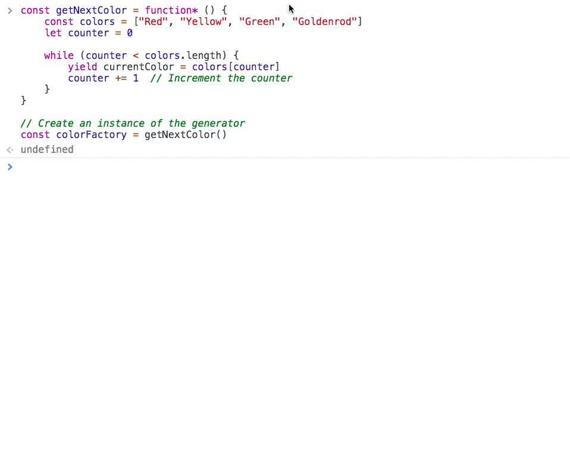

# Factory & Generator Functions

## Factory Function

Ref: [What Are Factory Functions in JavaScript](https://www.sitepoint.com/factory-functions-javascript/)

First, a factory function is just a regular function. No syntactical difference. We've coined certain functions as factory functions simply because they return new objects.

```js
// Not a factory function. Primitive type returned.
const add = function (first, second) {
    return first + second
}
```

```js
// This is a factory function. It returns a new object every time.
const generateTrashCan = function (volume = 10) {
    return Object.create(null, {
        "type": {
            enumerable: true,
            value: "Trash Can"
        },
        "volume": {
            enumerable: true,
            value: 10
        },
        "color": {
            enumerable: true,
            value: "Black"
        }
    })
}
```

## Generator Functions

Ref: [MDN Generator Functions](https://developer.mozilla.org/en-US/docs/Web/JavaScript/Reference/Global_Objects/Generator)

A generator function does have a specific syntax. You put an asterisk after the `function` keyword. You use generator functions when you need to retrieve the next item in a series of values at any time. It maintains its state across each execution, where non-generator functions do not.

The following function will return `Red` every time because once it executes, the memory used is released and all variables are eradicated.

```js
// Non-generator function
const getNextColor = function () {
    const colors = ["Red", "Yellow", "Green", "Goldenrod"]
    let counter = 0

    const currentColor = colors[counter] // Red
    counter += 1  // Increment the counter
    return currentColor
}

console.log(getColor())  // Red
console.log(getColor())  // Red
```

Conversely, the variables in a generator function do not get released between executions.

```js
const getNextColor = function* () {
    const colors = ["Red", "Yellow", "Green", "Goldenrod"]
    let counter = 0

    while (counter < colors.length) {
        yield currentColor = colors[counter]
        counter += 1  // Increment the counter
    }
}

// Create an instance of the generator
const colorFactory = getNextColor()
```



## Combining Generator and Factory Functions

A good, practical use case for these types of objects is for when you need to create a new object, on demand, that has a unique identifier. Let's look at an example.

```js
// A generator that never ends!
const blogIdGenerator = function* () {
    let uniqueId = 1

    while (true) {
        yield uniqueId
        uniqueId += 1
    }
}

// Create instance of generator
const blogIdFactory = blogIdGenerator()

// Factory function that returns a blog article object
const blogObjectFactory = function (title, entry, ...tags) {
    return Object.create(null, {
        "id": { value: blogIdFactory.next().value, enumerable: true },
        "title": { value: title, enumerable: true },
        "body": { value: entry, enumerable: true },
        "tags": { value: tags, enumerable: true },
        "published": { value: Date.now(), enumerable: true }
    })
}

// Create a blog article about your first day at NSS
const firstDay = blogObjectFactory("My first day at NSS", "I felt completely lost", "nss", "life changes", "software")

// Create a blog article about your instructor
const instructor = blogObjectFactory("Our instructor", "This guy is a jerk", "nss", "teachers", "loser")
```


## Videos to Watch

1. [Javascript Generators](https://www.youtube.com/watch?v=QO07THdLWQo)
1. [JavaScript ES6 - Iterators and Generators](https://www.youtube.com/watch?v=lbBZXw2hKH4)

## Practice - Colored Reindeer

In this exercise, you start with a collection of reindeer names. Your task is to add each reindeer name to an HTML `article` element with an `id` of `colored-reindeer`.

In your JavaScript file, paste in the following array.

```js
var reindeer = ["Dasher", "Dancer", "Prancer", "Vixen", "Comet", "Cupid", "Donner", "Blitzen"]
```

Your job is to...

1. Create a new object that represents a reindeer - the object will include the reindeer's name and its color. Use a generator function to attach each of the following colors, in order, to the reindeer. Use a factory function to generate the reindeer object.

    ```js
    ["Blue", "Red", "Orange", "Purple", "Hazel", "Aquamarine", "Periwinkle", "Azure", "Fuchsia", "Chocolate", "Amber", "Amaranth"]
    ```
1. Place each object in an array named `coloredReindeer`.

    ```js
    // Each object produced by the factory function
    [{ "name": "Dasher", "color": "Blue" }, etc...]
    ```
1. Iterate over the `coloredReindeer` array and insert a new `<section>` element in the `colored-reindeer` element that displays the reindeer name, with a font color corresponding to the color in the object.

    ```html
    <!-- Example of what your HTML should look like -->
    <article id="colored-reindeer">
        <section style="color: Blue">Dasher</section>
        <section style="color: Red">Dancer</section>
        etc...
    </article>
    ```

> **Pro tip:** Remember to make your code modular. The JavaScript for generating the data should be in one file, and the JavaScript for manipulating the DOM should be in a different file.
