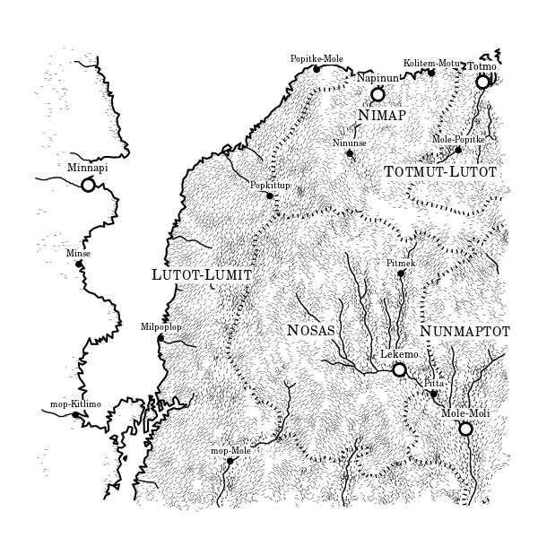
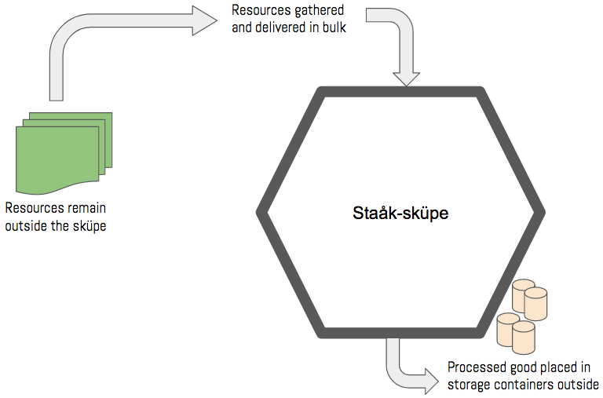
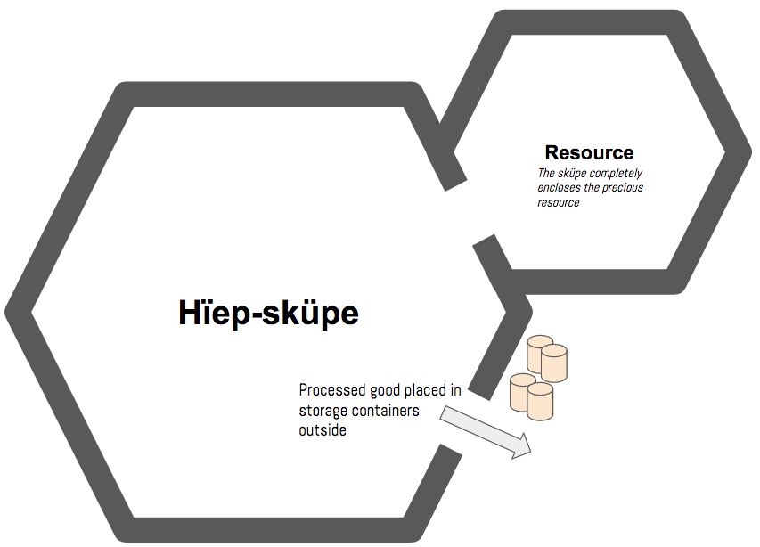

# Scope in JavaScript

When we use the word scope in programming, we are talking about some code's accessibility to **other** code. In JavaScript, this is driven by the curly braces. The curly braces build a virtual wall around the code which prevents any code that is outside the wall from seeing it.

Yet the code inside the walls has a special power. It can see outside the walls and access, or modify, that code - as long as that code, itself, is not contained in an equal, or lower scope. More on that in a bit.

To use the true power of [block scopes in JavaScript](https://developer.mozilla.org/en-US/docs/Web/JavaScript/Reference/Statements/block), you need to use the `let` and `const` keywords for declaring variables. If you use `var`, block scope no longer applies, because those variables declared with `var` get [hoisted](https://www.sitepoint.com/demystifying-javascript-variable-scope-hoisting/). Always use `let` and `const` for variable declarations to avoid unintended side-effects of hoisting.

## Scopes You Know

You've already encountered several type of scope definitions in the course so far.

### For Loop Scope

`for` loops define a scope because they use curly braces to define what code will be executed on each iteration.

```js
for (let i = 0; i <=10; i++)
{ // Beginning of `for` scope

    /*
        Code outside of this scope has no idea that
        the `tenPlus` variable even exists. 
        Only the code inside the block can access it.
    */
    const tenPlus = i + 10

    // Still inside the `for` block, so `tenPlus` is accessible
    if (tenPlus > 100) {
        console.log("Your number was too high")
    }

} // End of `for` scope

/*
    This will throw an exception stating that `tenPlus`
    is not defined. This is external code to the `for`
    loop's scope, and is therefore not capable of accessing
    anything inside it
*/
console.log(tenPlus)  
```

## If Scope

```js
let dog = "Great Dane"
let monthlyFoodCost = 0

if (dog === "Great Dane")
{  // Beginning of `if` scope

    /*
        This code can look out into the "outer" scope
        and modify a variable defined out there.
    */
    const monthlyFoodCost += 23.00

}  // End of `if` scope
```

## Function Scope

JavaScript functions also have a block scope, but they also have something called *lexical scope*, also known as *static scope*. We will cover lexical scope later, so for now, we just look at it's block scope.

```js
const userWord = document.getElementById("word").innerHTML

function containsVowels (wordParameter)
{  // Beginning of `function` scope

    /*
        The `doesItHaveOne` variable can only be accessed
        within the curly braces of this function. The match()
        method on a string will return `null` if there
        are no matches, otherwise, an array will be returned.
    */
    const doesItHaveOne = wordParameter.match(/aeiou/gi)

    return doesItHaveOne === null

}  // End of `function` scope

const itContainedVowels = containsVowels(userWord)

console.log(itContainedVowels) // true or false
console.log(doesItHaveOne) // doesItHaveOne is undefined
```

## Introducing Block Scope

You can isolate any code you want to make inaccessible simply by surrounding it in curly braces. It doesn't matter what scope you are currently in - global, if, for, function - any code surrounded by the braces is inaccessible.

```js
// In global scope
const product = "Mirror"

{
    const order = []
    order.push(product) // This is fine. `product` variable in outer scope
}

/*
    Nope... 
    Undefined exception thrown. Can't look into inner scopes.
*/
order.clear() 
```

## Videos to Watch

1. [Keeping Track of "This" in JavaScript](https://www.youtube.com/watch?v=JduQUNn7L4w)
1. []()
1. []()
1. []()
1. []()


## Lexscopistan

> **Objective:** This exercise will have you creating many different _kinds_ of scope and several levels of nesting (i.e. scopes within scopes). It should provide you with many opportunities to access variable in an outer scope, and see how you are prevented from accessing variables in an inner scope.

Welcome to Lexscopistan. A country filled with rich forests, steep mountains, fertile plains, and powerful rivers.



The people of Lexscopistan are primarily a nomadic people, with only a handful of permanent settlements and cities. It's capital is Nimap on the northern coast, with a port on the Sea of Mole-Lomit.

Lexscopistanians excel at being able to construct, tear down, and quickly move small, modular settlements they call *sküpes*. The purpose of a sküpe is to process natural resources - timber, minerals, game for meat & furs, water, and crops.

Lexscopistanians set up a sküpe in 1-3 days, including a large, modular wooden barricade surrounding it. This protects them from wild predators and strong winds. Nothing can penetrate this barricade, as it is made out of wood from the *likmura* tree, reknowned for its strength and longevity once treated.

Inside, the Lexscopistanians erect workshops, forges, and living spaces to be used while they gather and process a resource. Right outside the barricade, always on the southern side, large storage containers are used to store the processed goods. Each storage container can hold 21 bushels of food, 150 gallon of water, 15 logs of wood, 567 kilograms of minerals & gems, or 85 furs.

There are two types of sküpes.

## **Staåk-sküpe**



This type is smaller, and more mobile, and is used to very quickly gather renewable resources like water and game. An staåk-sküpe usually only stays constructed in a single location for a few days before it is deconstructed and moved.

Staåk-sküpes are equipped with 10 storage containers.


## **Hïep-sküpe**



This type is larger, sturdier, and is used to not only enclose the workshops and living spaces for Lexscopistanians, but also the resource they are gathering. A hïep-sküpe is used for processing timber and minerals which can take weeks, or sometimes, months to gather and process.

Staåk-sküpes are equipped with 30 storage containers.

## Resource Collecting Application

Your job is to build code representations of resources and sküpes to process those resources. Let's look at an example.

### Staåk-sküpe Operations

```js
// A field containing four types of crops to process
// It exists outside of the staåk sküpe.
let agriculturalField = [
    {
        "type": "Corn",
        "plants": 368
    }, 
    {
        "type": "Wheat",
        "plants": 452
    }, 
    {
        "type": "Kale",
        "plants": 212
    }, 
    {
        "type": "Turnip",
        "plants": 84
    }
]

/*
    Create a sküpe function to process each tree.

    Lexscopistanian food processors can produce 1 bushel of a
    crop for every 22 plants
*/
const cropStaakSkupe = function (rawCrops) {
    /*
        Use the array map() method to build up a new array
        populated with processed crops. Remember that the map
        method iterates over an array, one item at a time, 
        and runs the logic in the provided function on each 
        iteration.
    */
    const processedCrops = rawCrops.map(
        /*
            Arrow function with an expression body
            https://mzl.la/1rrAsL3
        */
        currentCrop => {
            /*
                For each crop, return a new object representing
                the bushels to store in the containers
            */
            return {
                "type": currentCrop.type,
                "bushels": Math.floor(currentCrop.plants / 22)
            }
        }
    )

    /*
        processedCrops is only available within this 
        function's block scope
    */
    return processedCrops
}

/*
    Staåk sküpes have 10 storage containers. Is there are more
    efficient way to generate the storage container objects than
    manually writing the code for all 10?
*/
const CropStorageContainers = [
    { "id": 1, "type": "Crop", "bushels": [] },
    { "id": 2, "type": "Crop", "bushels": [] },
    { "id": 3, "type": "Crop", "bushels": [] },
    { "id": 4, "type": "Crop", "bushels": [] },
    { "id": 5, "type": "Crop", "bushels": [] },
    { "id": 6, "type": "Crop", "bushels": [] },
    { "id": 7, "type": "Crop", "bushels": [] },
    { "id": 8, "type": "Crop", "bushels": [] },
    { "id": 9, "type": "Crop", "bushels": [] },
    { "id": 10, "type": "Crop", "bushels": [] }
]

let allBushels = cropStaakSkupe(agriculturalField)

/*
    Now that the crops have been processed into bushels, you
    need to place them in the storage containers. Keep in mind
    that storage containers can hold 21 bushels of food, each.

    1. Iterate over the `allBushels` array
    2. Look at each object, and get the value of the `bushels`
       property 
    3. Do a `for` loop that iterates up to that value
    4. Insert a new object into a storage container. The object
       should describe the type of bushel.

         e.g. { "crop": "Wheat" }

    5. Make sure you keep count of how many bushels are in the
       container, and once it reaches 22, start placing the 
       objects in the next container.
*/
allBushels.forEach(
    /*
      Write your function for placing bushels into containers here
    */
)
```


### Hïep-sküpe Operations

Hïep-sküpes contain the resource they are processing inside the barricade, so their representation in code looks a bit different.

```js
const gemHiepSkupe = function () { // No parameter needed
                                   // Resource contained inside


    /*
        The gem mine does not exist outside the barricade of the
        hïep-sküpes. The Lexscopistanians build the barricade
        around their facility AND the resource.

        a.k.a.
        Instead of being located in an outer scope to the
        function, the gem mine is enclosed by the scope of 
        the `gemHiepSkupe`.
    */
    const GemMine = [
        {
            "type": "Onyx",
            "kilograms": 453
        },
        {
            "type": "Amethyst",
            "kilograms": 523
        },
        {
            "type": "Bloodstone",
            "kilograms": 242
        },
        {
            "type": "Emerald",
            "kilograms": 169
        }
    ]

    /*
        Instead of processing the entirety of the resources in
        bulk - which is what the staak-skupe does - this sküpe
        will return an object that has a method for processing
        each type of mineral.

        We're exposing the functionality of this skupe to code
        in the outer scope, so that the order in which minerals
        are processed can be customized.

        Hïep-sküpes workshops can process 5 kilograms of a
        mineral with each work order.
    */
    return {
        "process": function (requestedMineral) {
            /*
                Subtract 5 from the total kilograms available in
                the gem mine, but make sure you stop when there
                are no minerals left.
            */
            if ( /* There are more than 5 of the mineral remaining */ ) {
                /*
                    You can reference the `GemMine` variable here
                    because it lives in an outer scope:
                      e.g. GemMine[requestedMineral]
                */
            }
        }
    }
}

/*
    The SkupeManager variable represents the object with the
    `process` method on it.
*/
const SkupeManager = gemHiepSkupe()

/*
    Process the gems in any order you like until there none
    left in the gem mine.
*/


/*
    Create 30 storage containers, which is how many a hïep-sküpe
    is equipped with.
*/


/*
    Place the gems in the storage containers, making sure that
    once a container has 567 kilograms of gems, you move to the
    next one.
*/
```


