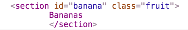

# Query & Manipulate the Browser DOM with JavaScript

## Query DOM

There are 2 main methods on the `document` object in JavaScript that you will be using for querying information from the Document Object Model (DOM) of your HTML.

1. **querySelector** - This is the method you will be using the most. It lets you use CSS selectors to select DOM elements.
1. **getElementById** - This will return 1 DOM element or undefined.

> **See for yourself:** The code below is in a [DOM Query JSFiddle](https://jsfiddle.net/chortlehoort/m3twofe2/) that you can run yourself. Just make sure you have your dev tools open to see the output.

```html
<html>
    <article>
        <section id="banana" class="fruit">
        Bananas
        </section>

        <section id="tomato" class="fruit">
        Tomato
        </section>

        <section id="cuttingBoard" class="tool">
        Cutting board
        </section>
    </article>
</html>
```

### querySelector

There are two elements that have a class name of `fruit`. To get a reference to the first element, use the following code.

```js
const firstFruit = document.querySelector(".fruit")
```


To get a reference to both, use the following code.

```js
const allFruit = document.queryAllSelector(".fruit")
```


### By Id

To get a DOM element by its `id` attribute.

```js
const bananaElement = document.getElementById("banana")
```



## Updating DOM Element Content

To update the contents of a DOM element, you simply need to assign a value to the `innerHTML` property of that element.

If I wanted to change the text inside the DOM element with the `id` of `banana`, this would be the code.

```js
const bananaElement = document.getElementById("banana")

bananaElement.innerHTML = "Mango"
```

## String Templates

Up to this point, you've used `+` to concatenate strings together. Modern JavaScript allows you to use a feature called string templates to build a string by inserting variables directly into the string itself with a special syntax.

```js
// Old way
const monkey = "Coco"
const dolphin = "Winter"

console.log("We saw " + monkey + " the monkey, and " + dolphin + " the dolphin today")
```

```js
// New way
const monkey = "Coco"
const dolphin = "Winter"

// That first character in the string is called a backtick. It's by the esc key.
console.log(`We saw ${monkey} the monkey, and ${dolphin} the dolphin today`)
```

## Videos to Watch

1. [JavaScript Tutorial For Beginners #33 - Traversing the DOM](https://www.youtube.com/watch?v=SowaJlX1uKA)
1. [Javascript Tutorial Part 8: Javascript getElementById](https://www.youtube.com/watch?v=Rk3bekL3TLc)
1. [JavaScript: Browser - querySelector(), querySelectorAll()](https://www.youtube.com/watch?v=k69s-XlnVnE)
1. [JavaScript Tutorial for Beginners - 30 - Replace content using innerHTML](https://www.youtube.com/watch?v=dlaYyZ6vW48)

## Practice - Boy Bands and Vegetables

### Setup

```bash
mkdir -p ~/workspace/exercises/javascript/boybands && cd $_
touch index.html
touch boybands.js
```

### Requirements

Paste the following code into the `<body>` of the HTML file.

```html
<div id="boy-bands">
</div>

<div id="vegetables">
</div>
```

Paste the following code into your JavaScript file.

```js
let bands = ["Boyz II Men", "NSync", "New Kids on the Block", "98 Degrees", "One Direction"];
let vegetables = ["Carrots", "Kale", "Zucchini", "Broccoli", "Squash"];

// Get a reference to the appropriate DOM element for bands
const bandElement = document.getElementById(???);

// Get a reference to the appropriate DOM element for vegetables
const veggieElement = ???;

// Execute a for loop that will iterate over the arrays
for (let loopTracker = 0; loopTracker < ???; loopTracker += 1) {

  // Get a reference to the current item in the bands array
  const currentBand = ???;

  // Update the innerHTML value of the DOM element for bands

  // Get a reference to the current item in the vegetables array
  const currentVeggie = ???;

  // Update the innerHTML value of the DOM element for vegetables
}
```

Update the code to iterate the two arrays provided (`bands` and `vegetables`) and output each element in the arrays into their corresponding HTML `<div>` element. Ensure that each item is in a block element (e.g. li, div, p, etc...)

## Practice - Home Inventory

### Setup

```bash
mkdir -p ~/workspace/exercises/javascript/inventory-dom && cd $_
touch index.html
touch inventory.js
```

### Requirements

Paste the following code into the `<body>` of the HTML file.

```html
<html>
    <head>
        <title>My Home Inventory</title>
    </head>

    <body>
        <article class="inventory">

        </article>
    </body>

    <!-- Insert your script tag here -->
</html>
```

Paste the following code into your JavaScript file.

```js
const HomeInventory = JSON.parse(localStorage.getItem("homeInventory"))
```

Your task is to iterate over each object in your home inventory database, and insert a new `section` tag in the `article` tag to represent each item. Each section should follow the format below.

```html
<section class="furniture">
    <h2 class="furniture__name">
        Shaker Writing Desk
    </h2>
    <div class="furniture__location">
        Location: Bedroom
    </div>
    <div class="furniture__description">
        This antique desk is special because I found and purchased it with my wife at an Ohio Amish auction.
    </div>
</section>
```

### Optional Stretch Goal

Have a CSS class for each `type` of object in your inventory. Styles of your choice.
