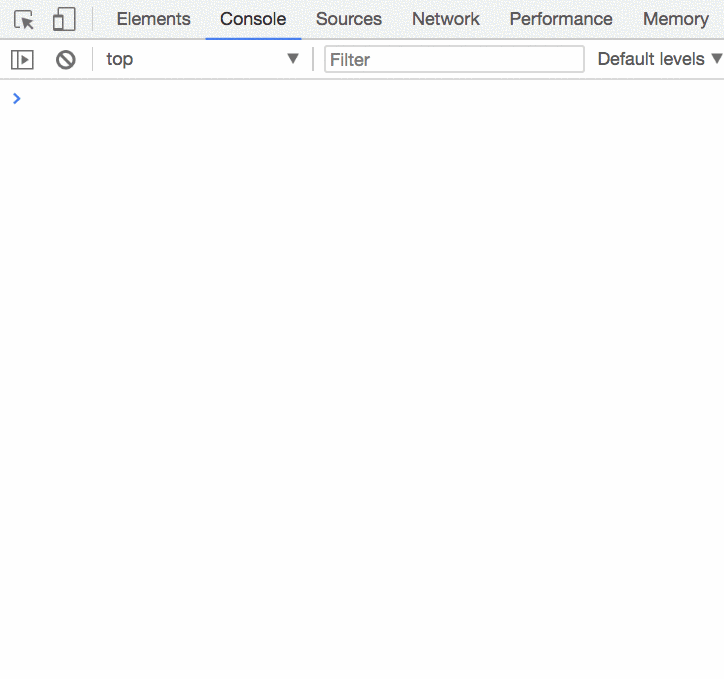
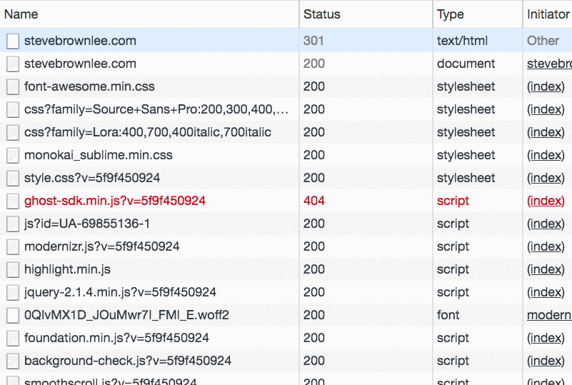

# Data and Metadata

Data is the raw information that we, as software developers, use to do our jobs. That data can take many forms.

Here's some of the most common forms of data.

1. Objects (key/value stores)
1. Arrays (general collections of related dta)
1. Unstructured (human generated data)
1. Sets (collections of unique values)

This is not an inaccurate representation of how your web browser views data that it receives from a request you made.


It's a meaningless stream of letters, numbers, and other symbols. Much like if you tried to read a book about computer maintenance written in Welsh.


However, if you know the rules of the Welsh language and are given context about what that passage is talking about, then you have all the information you need to do something with the data. Browsers are the same.

When that stream of data is received by the browser, it knows what kind of data it is by reading the metadata. Metadata is simply data about data.

To see how your browser knows what to do with this data stream...

```txt
<html><head><title>Wat?</title></head><body>I hav no ideah wat u r sayun ta me <script src="./scripts/derp.js"></script></body></html>
```

Versus this data stream...

```txt
div{margin:0;padding:0} .hidden{display:none;}
```

Versus this data stream...

```txt
o.property = new Proxy(Object.defineProperty, { apply: function (_target, _this, _args) { _target(_this, _args[0], { value: _args[1], writable: true, enumerable: true }) return _this } });
```

Open your Chrome dev tools and click on the Network section at the top. You will see a list of all of the files that the website you are looking at needs to provide the experience it wants to deliver.



If you click on one of the files that is marked as a stylesheet, you will see all of the metadata that was provided about the data - also knows as __Headers__ in the web development world. The most important of those is the `content-type` header.



It is that metadata that tells the browser what the data stream is. Now, the browser can interpret it.

> "Oh, this random sequence of letters, numbers, and symbols is a stylesheet! I'll use my CSS engine to parse the document, and apply the syling rules to the HTML.
