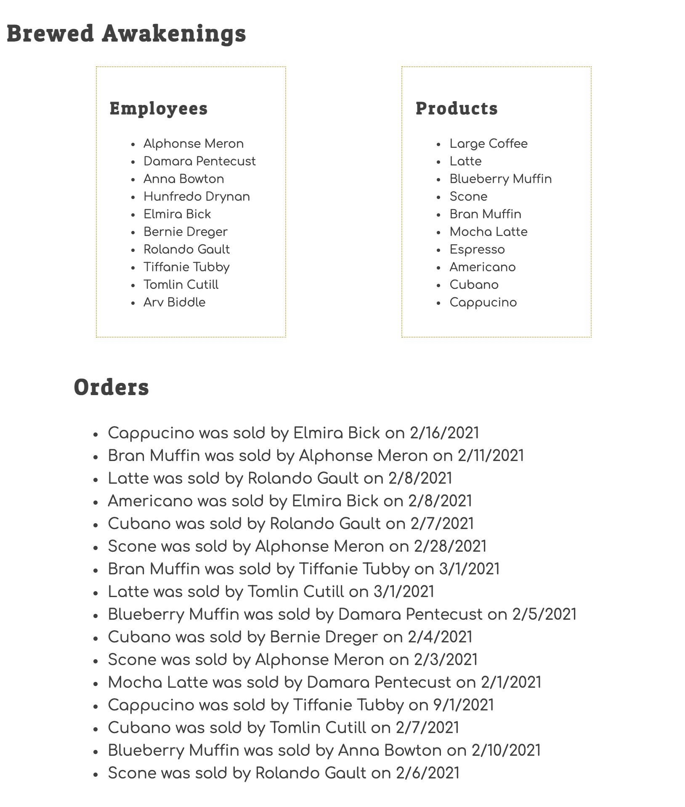

# Fixing Brewed Awakenings Receipts

Brewed Awakenings is a local coffee shop that wants a web site that shows which products they are selling, and which employee is selling them. Here's all of the information they want on their web site.

1. A list of employees.
1. A list of products.
1. A list of orders that shows which product was sold, and which employee sold it.

Here's what the output of the application should look like.



## Setup

Run the following command in your terminal.

```sh
/bin/bash -c "$(curl -fsSL https://raw.githubusercontent.com/nashville-software-school/client-side-mastery/srb-split-glassdale/book-3-deshawns-dog-walking/chapters/scripts/brewed-setup.sh)"
```

That script will create the `workspace/brewed-awakenings` directory for you. Just `cd` to that directory and open it in Viual Studio Code.

Then run the `serve` command and open the URL in Chrome.

## Bugs to Fix

This table shows you how many bugs there are in each module.

| Main | CityList | Walkers | Assignments | CSS |
|---|---|---|---|---|
| 1 | 3 | 3 | 3 | 3 |

Refer to the videos in the previous chapter to use your Chrome Dev Tools, and the debugger to find and fix the issues.

Do not use any `console.log()` statements.