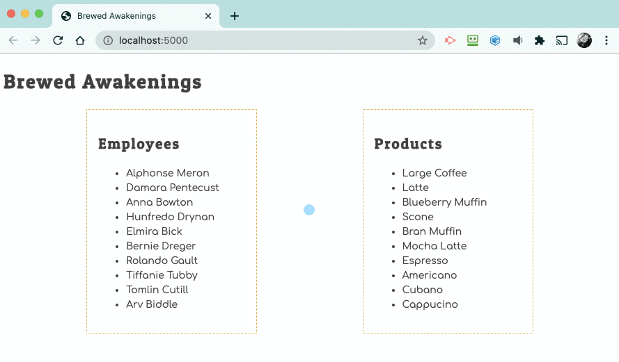

# Displaying Number of Products Sold

Using code from the last project as an example, attempt adding a click event listener that presents an alert box showing how many products an employee has sold when their name is clicked.

If you find yourself creeping up on 30 minutes of trying to get the code to work, it's time to go to a peer, or an instructor for assistance.

As always, you can peek at [most of the solution](./code/employeeSales.js).