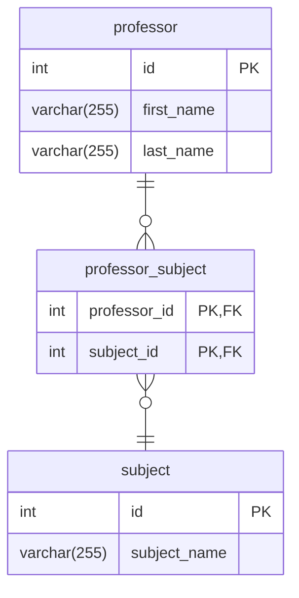

# Brewed Awakenings is Expanding!

Your challenge in this chapter is to build a correct ERD that supports the following facets of the Brewed Awakenings business as it expands to multiple locations. You will need to think about how these new requirements affect the current relationships between your tables.

Remember the two questions to ask. Look at two main resources in the diagram and ask...

1. Can X be assigned to many of Y?
2. Can Y be assigned to many of X?

If the answer to only one of the questions is **yes**, then you have a one-to-many relationship. If the answer to _both_ of the questions is **yes**, then you have a [many-to-many relationship](https://community.dbdiagram.io/t/tutorial-many-to-many-relationships/412#h-2-use-the-associative-join-table-3) and need an intersection _(join)_ table to store that more complex relationship.

#### Visual Example of Join Table

* A professor can be assigned to many subject.
* A subject can be taught by many professors.

## New Requirements

1. The owners have opened up 4 more locations, and plan to build even more.
1. Some products are sold at all locations, but some products are only sold at certain locations.
1. Employees can transfer between locations during busy schedules.
1. Customers can enter in their credit card numbers to be stored for future purchases.
1. Customers can rate products from 1-5 on the mobile application.
1. Customers can write out recommendations for each location.