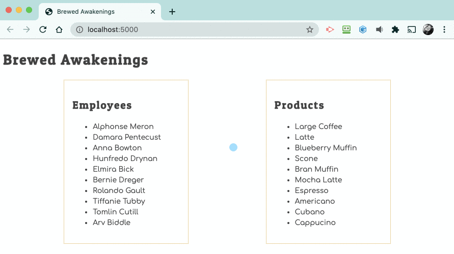

# Viewing Product Prices on Click

Using code from the last project as an example, attempt adding a click event listener that presents an alert box showing the price of a product when it is clicked by the user.

If you find yourself creeping up on 30 minutes of trying to get the code to work, it's time to go to a peer, or an instructor for assistance.

As always, you can peek at [most of the solution](./code/productPrice.js).