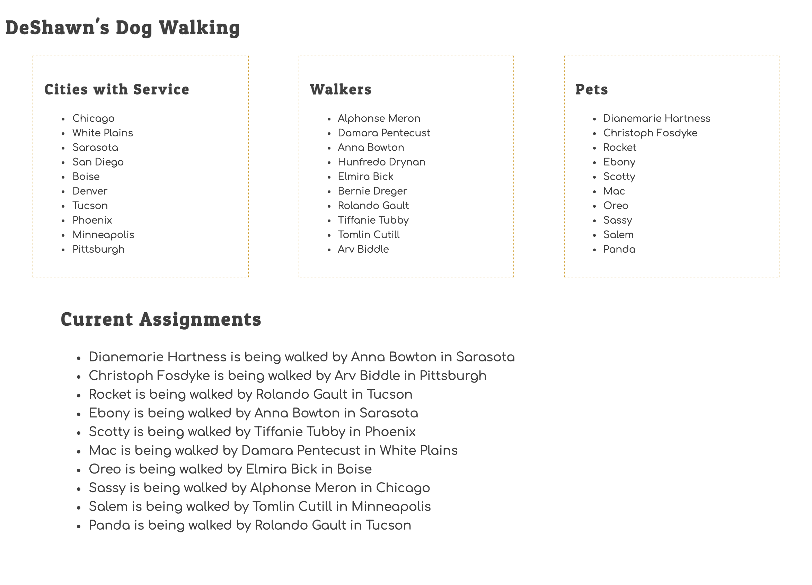
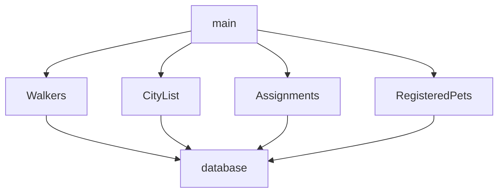
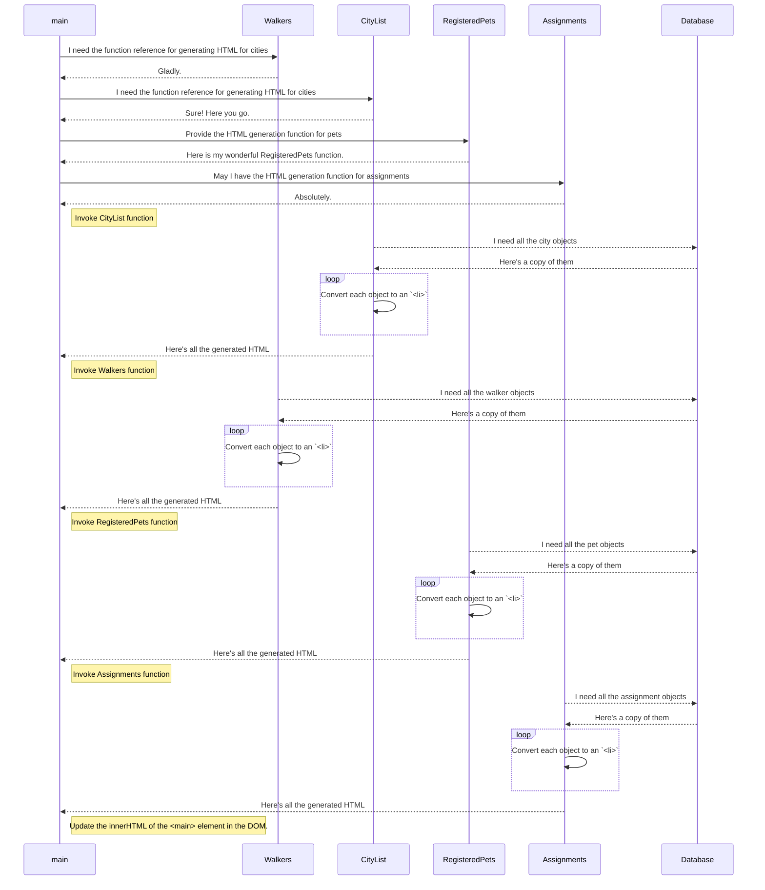

# Fixing DeShawn's Application

DeShawn hired some consulting agency from overseas to build a simple application that displayed the following information.

1. A list of cities where his service is provided.
1. A list of dog walkers that are currently working for him.
1. A list of pets that are currently being given walks by his employees.
1. A full list of current assignments.

Unfortunately, the overseas developer had an unfortunate noodle-related accident, and the only version that DeShawn has is filled with bugs. Your job is to fix the bugs.

Here's what the output of the application should look like.



## Setup

Run the following command in your terminal.

```sh
/bin/bash -c "$(curl -fsSL https://raw.githubusercontent.com/nashville-software-school/client-side-mastery/master/book-3-deshawns-dog-walking/chapters/scripts/deshawn-setup.sh)"
```

That script will create the `workspace/dog-walking` directory for you. Just `cd` to that directory and open it in Visual Studio Code.

## Dependency Graph

You are required to have a dependency graph for every project, and in this book, the graph becomes a bit more complex as there are many modules. Your working memory will be stretched, which is why the visual representations are very important.

Examine all of the imports and exports that exist in this project and build a dependency graph for it. Once you are done, you can expand the hint below and see if yours matches.

<details>
    <summary>Expand when you are done</summary>


</details>

## Sequence Diagram

Here is the visual algorithm for the DeShawn's Dog Walking project when it first runs and generates the HTML that you see in the browser.



## Bugs to Fix

Time to fix the bugs that exist in this project.

Run the `serve` command in the project directory and open the provided URL in Chrome.

This table shows you how many bugs there are in each module.

| Main | CityList | Walkers | Assignments | CSS |
|---|---|---|---|---|
| 1 | 3 | 3 | 3 | 3 |

Refer to the videos in the previous chapter to use your Chrome Dev Tools, and the debugger to find and fix the issues.

Do not use any `console.log()` statements.