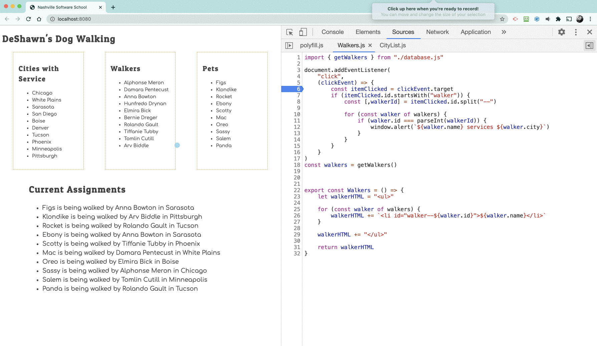
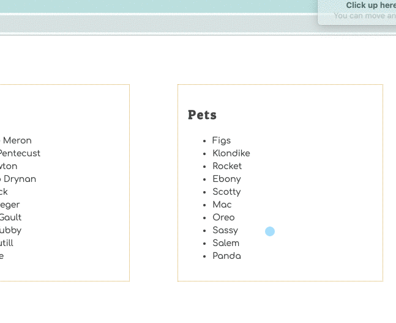

# Event Listener to Show Service Area

Time for your first event listener. You are going to use your debugger to step through the code to see how it all works.

Add the following code after the import statement in the Walkers module.

> #### `workspace/dog-walking/scripts/Walkers.js`

```js
document.addEventListener(
    "click",
    (clickEvent) => {
        const itemClicked = clickEvent.target
        if (itemClicked.id.startsWith("walker")) {
            const [,walkerId] = itemClicked.id.split("--")

            for (const walker of walkers) {
                if (walker.id === parseInt(walkerId)) {
                    window.alert(`${walker.name} services ${walker.city}`)
                }
            }
        }
    }
)
```

Inside the `for..of` loop in the existing code, update the line of code to be the following code.

```js
walkerHTML += `<li id="walker--${walker.id}">${walker.name}</li>`
```

Refresh your browser to load the new code.

Then click on some of the walkers. You should see the name of the city the walker works in appear in an alert box.


## Step Through the Code

Open the `Walker.js` file in your developer tools.

1. Open your dev tools.
1. Click on the Sources tab.
1. Use the keyboard shortcut of `ctrl+p` on Windows or `cmd+p` on Mac.
1. Type in the name of the file and select it.
1. Put a breakpoint on the following line of code.
    ```js
    const itemClicked = clickEvent.target
    ```
1. Click on a walker.
1. Use the step over icon to run each line of code and examine what the values of the variables are.



## Optional Challenge

> All challenges are completely optional. It's up to you if you want to take the time to figure it out, or move on to the next chapter.


Using the event listener code provided as an example, see if you can update the **`RegisteredPets`** module to capture when a user clicks on a pet. When the user does click a pet, display an alert that says who is currently walking it.



| | |
|:---:|:---|
| <h1>&#x1F4A1;</h1> |  _Make sure you import the walkers state into the module._ |
| <h1>&#x1F4A1;</h1> |  _You will need _another_ `for..of` loop inside a `for..of` loop. It's called a nested loop._ |
| <h1>&#x1F4A1;</h1> |  _You can avoid the nested `for..of` loop by using the `.find()` [array method](https://javascript.info/array-methods#find-and-findindex)._ |

Seriously, do not waste a significant amount of time on challenges. They are for fun. If you try getting this one to work for a while, but just get stumped, please visit an instructor.

You can also take a peek at [most of the solution](./code/dogWalker.js).