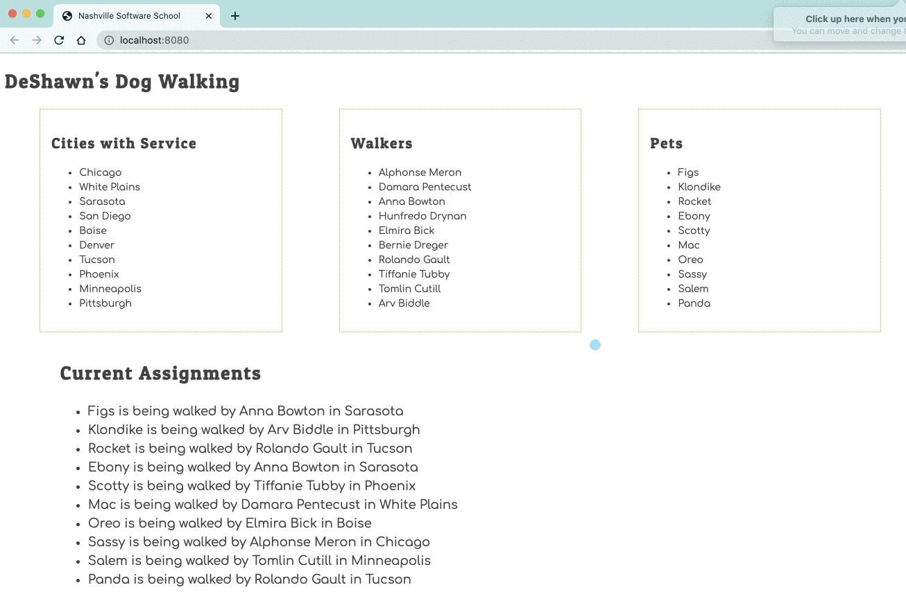

# Event Listener to Show Service Area

Time for your first event listener. You are going to use your debugger to step through the code to see how it all works.

Add the following code after the import statement in the Walkers module.

> #### `workspace/dog-walking/scripts/Walkers.js`

```js
document.addEventListener(
    "click",
    (clickEvent) => {
        const itemClicked = clickEvent.target
        if (itemClicked.id.startsWith("walker")) {
            const [,walkerId] = itemClicked.id.split("--")

            for (const walker of walkers) {
                if (walker.id === parseInt(walkerId)) {
                    window.alert(`${walker.name} services ${walker.city}`)
                }
            }
        }
    }
)
```

Inside the `for..of` loop in the existing Walkers function

```js
export const Walkers = () => {
  let walkerHTML = "<ul>";

  for (const walker of walkers) {
    walkerHTML += `<li id="walker--${walker.id}">${walker.name}</li>`;
  }

  walkerHTML += "</ul>";

  return walkerHTML;
};
```

update the code in the `for...of` loop, to be the following code.

```js
walkerHTML += `<li id="walker--${walker.id}">${walker.name}</li>`
```

Refresh your browser to load the new code.

Then click on some of the walkers. You should see the name of the city the walker works in appear in an alert box.



## Discussion

Talk with your teammates about how the `${walker.id}` value that you interpolated into the list item's `id` attribute is captured and used in the click event listener code.

Yes, this means you! Stop trying to do all of this by yourself. If you still are isolating yourself, you are being...

1. Unprofessional
1. Egotistical
1. Driven by fear
1. Unhelpful to your teammates